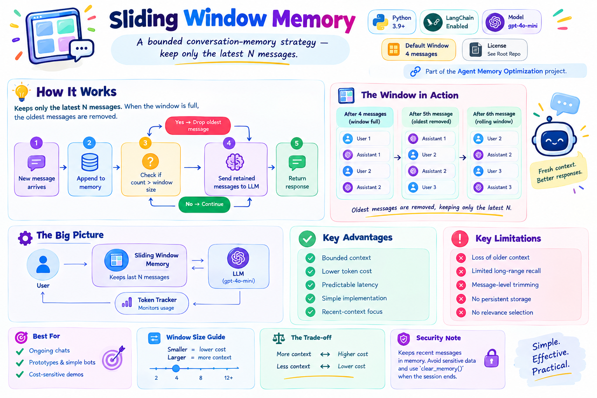
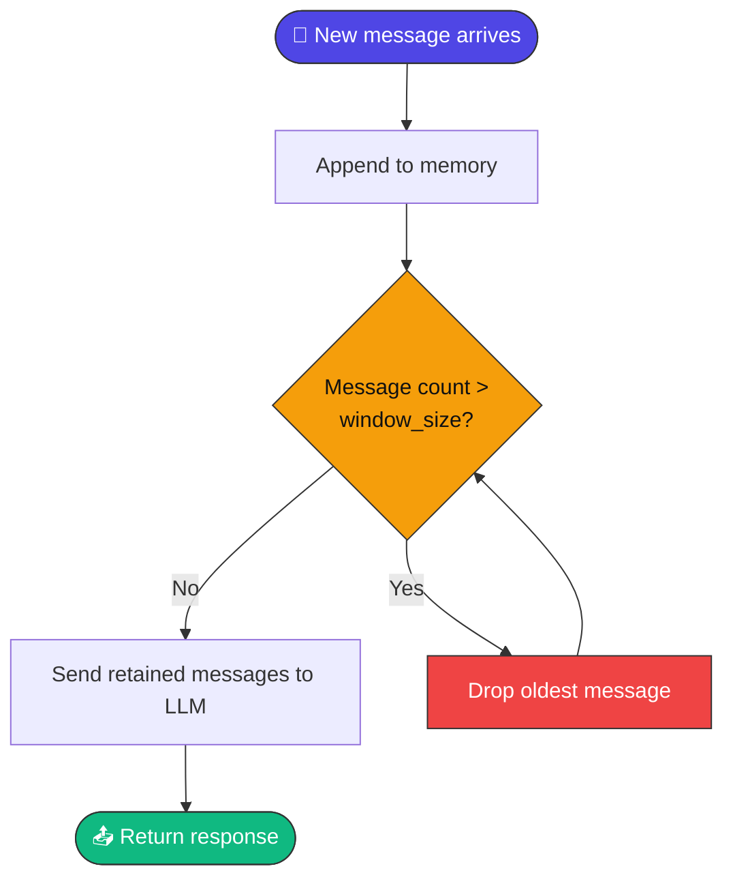
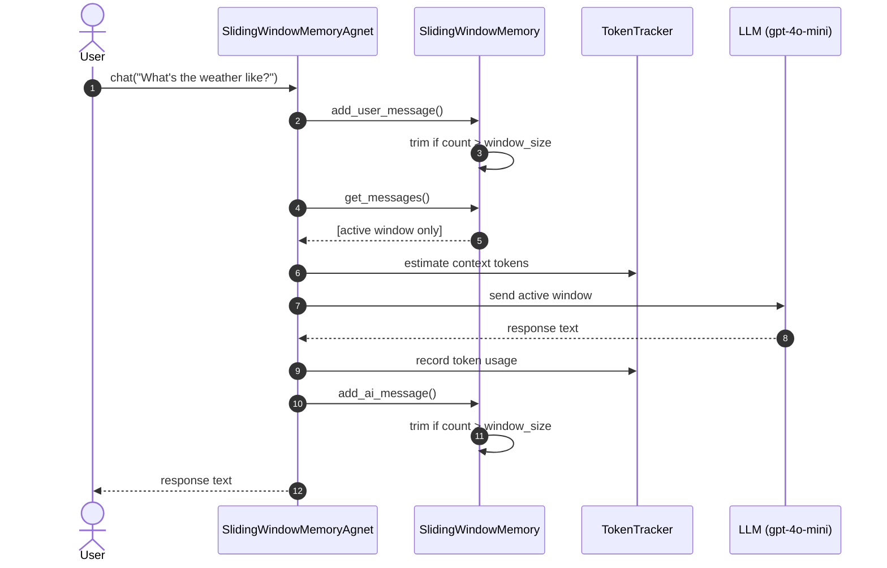
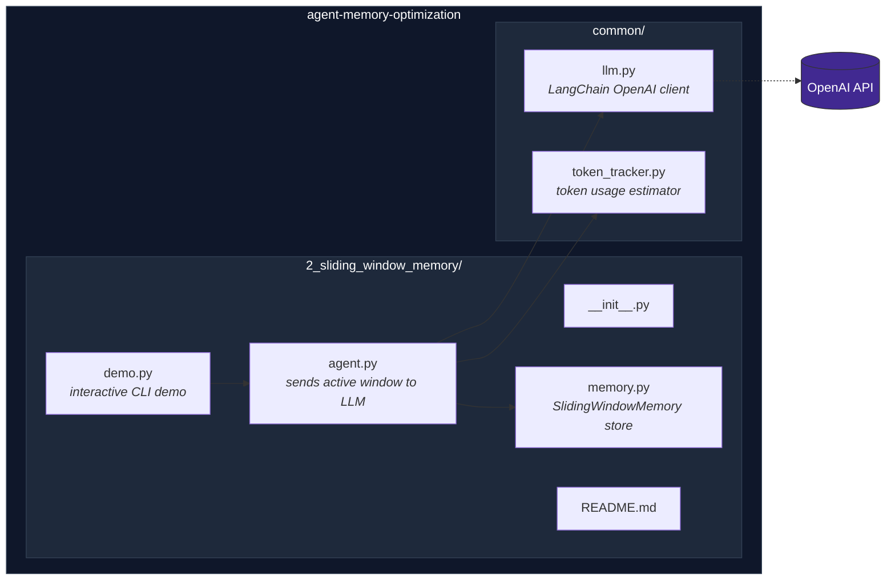
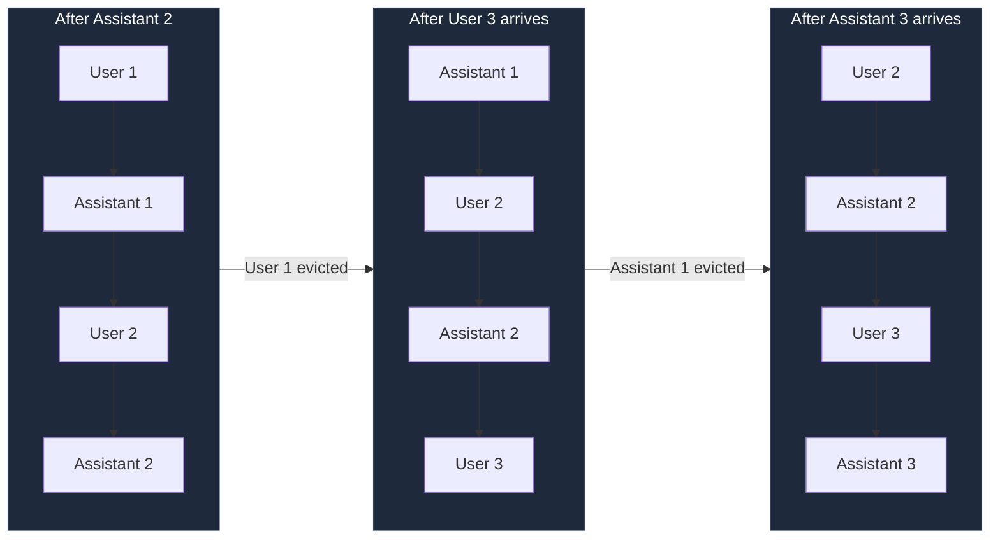
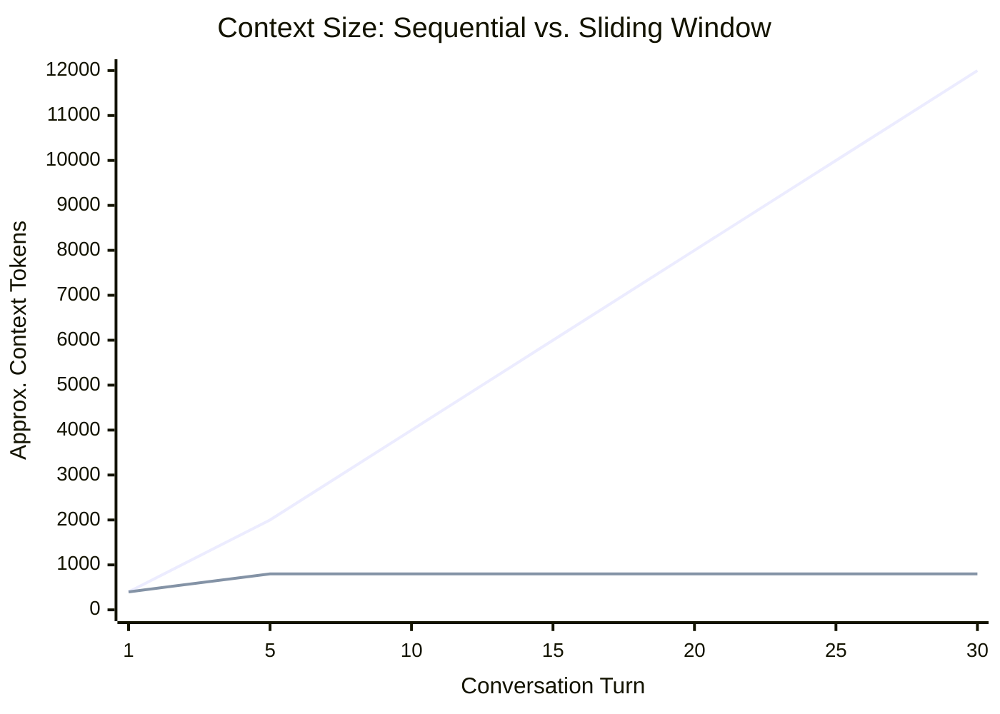
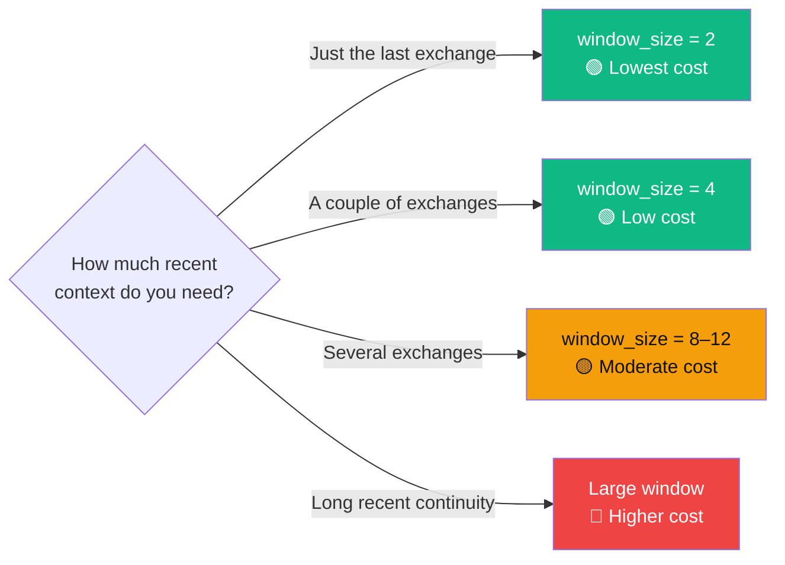
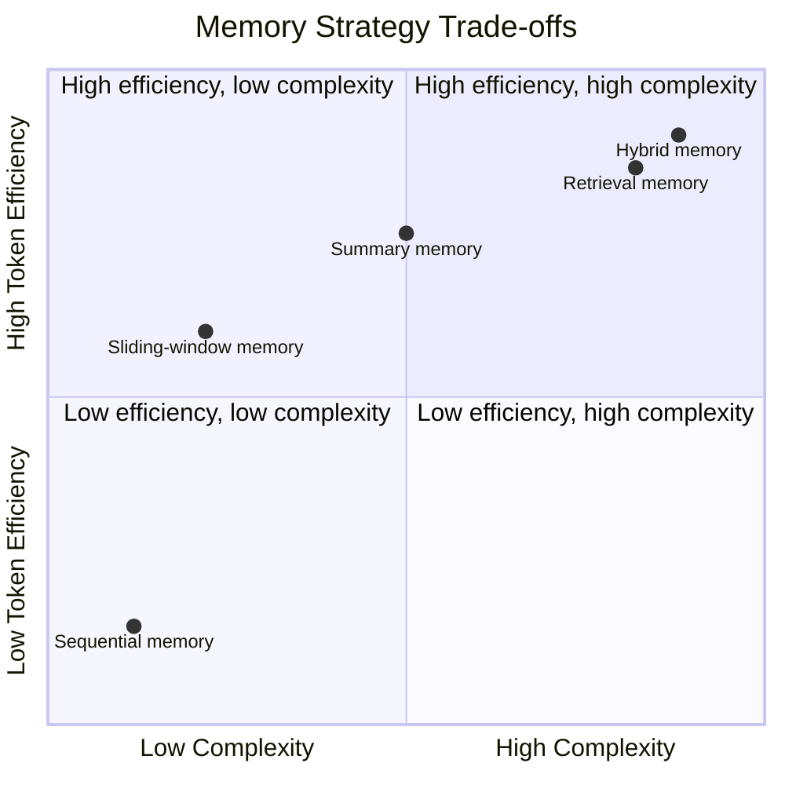

<div align="center">

# 🪟 Sliding Window Memory

### A bounded conversation-memory strategy — keep only the latest `N` messages.

[](https://www.python.org/)
[](https://www.langchain.com/)
[](https://platform.openai.com/docs/guides/text-generation)
[](#-understanding-the-window)
[](#-license)

*Part of the [Agent Memory Optimization](https://github.com/paras160500/agent-memory-optimization) project.*


</div>

---

## 📖 Table of Contents

- [Overview](#-overview)
- [How It Works](#️-how-it-works)
- [Architecture](#-architecture)
- [Characteristics](#-characteristics)
- [Advantages & Limitations](#️-advantages--limitations)
- [Project Structure](#-project-structure)
- [Requirements](#-requirements)
- [Installation](#-installation)
- [Running the Demo](#-running-the-demo)
- [Usage as a Python Module](#-usage-as-a-python-module)
- [Understanding the Window](#-understanding-the-window)
- [Memory API](#-memory-api)
- [Agent API](#-agent-api)
- [Token Tracking](#-token-tracking)
- [Complexity & Scaling](#-complexity--scaling)
- [Choosing a Window Size](#-choosing-a-window-size)
- [Comparison with Other Memory Strategies](#-comparison-with-other-memory-strategies)
- [When to Use Sliding Window Memory](#-when-to-use-sliding-window-memory)
- [Security & Privacy Notes](#-security--privacy-notes)
- [References](#-references)

---

## 🔍 Overview

**Sliding-window memory** prevents the prompt from growing indefinitely. Once the configured window is full, the **oldest messages are removed** as new ones arrive — giving a practical balance between recent conversational context and predictable token usage.

> 💡 **Core idea:** *Keep only the latest `N` messages and discard older messages from the active context.*

---

## ⚙️ How It Works

The `SlidingWindowMemory` class stores LangChain `HumanMessage` and `AIMessage` objects in chronological order. After each message is added, the memory checks its size and trims if necessary:



> ⚠️ The window is measured in **individual messages**, not conversation turns. A `window_size` of `4` can hold up to four messages — e.g. two user messages and two assistant responses.

### 🔁 Sequence of a Windowed Chat



---

## 🏗️ Architecture



---

## 📊 Characteristics

| Aspect | Behavior |
| --- | --- |
| 🧩 Memory strategy | Fixed-size recent-message window |
| 📦 Storage format | LangChain `HumanMessage` and `AIMessage` objects |
| 📏 Window unit | Individual messages |
| 🔢 Default window size | `4` messages |
| 📈 Context growth | Bounded by the configured window size |
| 💾 Persistence | In-memory only; lost when the process ends |
| 🔢 Token monitoring | Estimates context tokens and records API usage |
| 🤖 Default model | `gpt-4o-mini` |
| 🎯 Best suited for | Ongoing chats with bounded context, prototypes, cost-sensitive demos |

---

## ⚖️ Advantages & Limitations

<table>
<tr>
<td valign="top" width="50%">

### ✅ Advantages

- **Bounded context** — the prompt does not grow without limit
- **Lower token cost** — messages outside the window are never resent
- **Predictable latency** — request size stays roughly constant
- **Simple implementation** — just a list and a trimming operation
- **Recent-context focus** — the model always sees the latest exchange

</td>
<td valign="top" width="50%">

### ⚠️ Limitations

- **Loss of older context** — anything outside the window is invisible to the model
- **Limited long-range recall** — names, requirements, or decisions can be forgotten
- **Message-level trimming** — an odd window size can split a user/assistant exchange
- **No persistent storage** — nothing survives process end
- **No relevance selection** — recent messages are kept even when an older one matters more

</td>
</tr>
</table>

---

## 📁 Project Structure

```
2_sliding_window_memory/
├── README.md
├── __init__.py
├── agent.py       # Agent that sends only the active window to the LLM
├── demo.py        # Interactive command-line demonstration
└── memory.py      # SlidingWindowMemory implementation
```

The agent also uses shared modules from the repository root:

```
common/
├── llm.py           # Creates the configured LangChain OpenAI chat model
└── token_tracker.py # Estimates and reports token usage
```

---

## 📋 Requirements

- 🐍 Python 3.9 or later
- 🔑 An OpenAI API key
- 📦 The dependencies listed in the repository's `requirements.txt`

The implementation uses [LangChain](https://www.langchain.com/) message types and `langchain-openai` for model access.

---

## 🚀 Installation

**1. Clone the repository and move into its root directory:**

```bash
git clone https://github.com/paras160500/agent-memory-optimization.git
cd agent-memory-optimization
```

**2. Create and activate a virtual environment:**

```bash
python -m venv .venv
source .venv/bin/activate
```

> On Windows PowerShell:
> ```powershell
> .venv\Scripts\Activate.ps1
> ```

**3. Install the dependencies:**

```bash
pip install -r requirements.txt
```

**4. Create a `.env` file in the repository root:**

```
OPENAI_API_KEY=your_openai_api_key_here
```

The shared LLM helper loads this variable with `python-dotenv` and creates a `gpt-4o-mini` chat model with `temperature=0`.

---

## ▶️ Running the Demo

Run the demo from the **repository root**:

```bash
python -m 2_sliding_window_memory.demo
```

> ⚠️ **Note:** If your Python environment does not accept a package name that begins with a number in module execution, run the demo using the repository's preferred package/import arrangement, or rename the directory to a valid Python package identifier such as `sliding_window_memory`.

The demo uses a four-message window by default:

```text
============================================================
SLIDING WINDOW MEMORY
============================================================

Window size : 4 messages
Type 'exit' to stop.
```

Enter `exit` or `quit` to stop the session. After each response, the demo prints the active message count and token statistics. At the end, it prints cumulative session usage.

---

## 🐍 Usage as a Python Module

> ⚠️ **Note:** The source currently exposes the agent class with the name `SlidingWindowMemoryAgnet` (a typo for `Agent`). See [Agent API](#-agent-api) for details.

```python
from 2_sliding_window_memory.agent import SlidingWindowMemoryAgnet

agent = SlidingWindowMemoryAgnet(window_size=4)

print(agent.chat("My name is Alex."))
print(agent.chat("What is my name?"))
```

If the directory is renamed to a Python-valid package name, update the import accordingly:

```python
from sliding_window_memory.agent import SlidingWindowMemoryAgnet
```

Create a smaller or larger context window by changing `window_size`:

```python
agent = SlidingWindowMemoryAgnet(window_size=8)
```

---

## 🪟 Understanding the Window

With `window_size=4`, the memory can contain **at most four individual messages**. Once a fifth message arrives, the oldest one is dropped:



| Event | Active messages |
| --- | --- |
| User sends message 1 | User 1 |
| Assistant responds | User 1, Assistant 1 |
| User sends message 2 | User 1, Assistant 1, User 2 |
| Assistant responds | User 1, Assistant 1, User 2, Assistant 2 |
| User sends message 3 | Assistant 1, User 2, Assistant 2, User 3 |
| Assistant responds | User 2, Assistant 2, User 3, Assistant 3 |

> 🔍 This is why a message-level window can temporarily contain an assistant response **without** the user message that originally preceded it.

For applications that must preserve complete user/assistant pairs, use an **even** window size and implement pair-aware trimming, or change the memory policy to trim by turns rather than individual messages.

---

## 🧠 Memory API

| Method | Description |
| --- | --- |
| `SlidingWindowMemory(window_size: int = 4)` | Creates an empty memory store with a maximum size of `window_size` messages |
| `add_user_message(message: str)` | Appends a `HumanMessage` and trims older messages if necessary |
| `add_ai_message(message: str)` | Appends an `AIMessage` and trims older messages if necessary |
| `get_messages() -> list` | Returns the currently retained messages in chronological order |
| `get_message_count() -> int` | Returns the number of messages currently retained in the window |
| `clear()` | Removes all retained messages |

---

## 🤖 Agent API

| Method | Description |
| --- | --- |
| `SlidingWindowMemoryAgnet(window_size: int = 4)` | Creates an agent with a language model, a `SlidingWindowMemory` instance, and a `TokenTracker` |
| `chat(user_message: str) -> str` | Adds the message, sends only the active window to the model, records usage, stores the response, and returns it |
| `get_memory()` | Returns the messages currently retained in the active window |
| `get_token_tracker()` | Returns the token tracker used to inspect current and cumulative usage |
| `clear_memory()` | Clears the active window and resets token statistics |

> 📝 **Naming note:** `Agnet` is the spelling used by the current source code — it appears to be a typo for `Agent`. Update the source and imports consistently if you decide to rename it.

---

## 🔢 Token Tracking

The agent uses the shared `TokenTracker` to report two categories of information:

- **Estimated context tokens** — an estimate of the messages currently sent to the model
- **Actual API usage** — input, output, and total tokens reported by the model provider when usage metadata is available

Inspect the reports programmatically:

```python
tracker = agent.get_token_tracker()

print(tracker.get_current_report())
print(tracker.get_total_report())
```

---

## 📈 Complexity & Scaling

Appending a message is **constant-time**, and trimming copies at most the active window when the limit is exceeded. The amount of context sent to the model is **bounded by the configured window**, so request size does not grow with the total number of messages exchanged during the session.



*(Top line: unbounded sequential memory. Bottom line: sliding window, capped by `window_size`.)*

A **larger window** preserves more context but increases token usage and latency. A **smaller window** reduces cost and latency but increases the chance the model loses important conversational information.

---

## 🎚️ Choosing a Window Size



| Window size | Context retained | Cost and latency | Suitable for |
| --- | --- | --- | --- |
| `2` | One recent user/assistant exchange | Lowest | Short commands and simple tests |
| `4` | ~Two exchanges | Low | Demonstrations and lightweight chat |
| `8–12` | Several recent exchanges | Moderate | General conversational prototypes |
| Large windows | More recent context | Higher | Applications where recent continuity matters more than cost |

> 📏 Because the window counts **messages**, not tokens, two windows of the same size can consume very different numbers of tokens if their messages have different lengths.

---

## 🔬 Comparison with Other Memory Strategies



| Strategy | Retained information | Token efficiency | Complexity | Typical use case |
| --- | --- | --- | --- | --- |
| Sequential memory | Entire conversation | 🔴 Low | 🟢 Low | Short demos and debugging |
| **Sliding-window memory** | Most recent messages | 🟡 Medium–High | 🟢 Low | Bounded conversational context |
| Summary memory | Condensed older context | 🟢 High | 🟡 Medium | Long conversations |
| Retrieval memory | Relevant historical items | 🟢 High | 🔴 High | Knowledge-heavy assistants |
| Hybrid memory | Recent turns + selected history | 🟢 High | 🔴 High | Production conversational agents |

---

## 🎯 When to Use Sliding Window Memory

**Good fit when:**
- ✅ The application needs predictable prompt size
- ✅ Recent conversation matters more than complete history
- ✅ You're building a prototype or a simple conversational bot
- ✅ Token cost and latency need to stay bounded
- ✅ A full retrieval or summarization system would add unnecessary complexity

**Consider a different strategy when:**
- ❌ The agent must recall facts from any point in a long conversation
- ❌ User preferences need to persist across the whole session
- ❌ Questions may reference older context that has fallen out of the window

---

## 🔒 Security & Privacy Notes

> ⚠️ The memory object retains recent messages in process memory.

- Do not send confidential or personally identifiable information to the model unless your application is designed and approved to handle it.
- Call `clear_memory()` when a session should be discarded.
- Add durable storage, access controls, and retention policies before using this pattern in production.

---

## 📄 License

Refer to the [root repository](https://github.com/paras160500/agent-memory-optimization) for the project's license and contribution guidelines.

---

## 🔗 References

| # | Resource |
| --- | --- |
| 1 | [Agent Memory Optimization repository](https://github.com/paras160500/agent-memory-optimization) |
| 2 | [`SlidingWindowMemory` implementation](https://github.com/paras160500/agent-memory-optimization/blob/main/2_sliding_window_memory/memory.py) |
| 3 | [`SlidingWindowMemoryAgnet` implementation](https://github.com/paras160500/agent-memory-optimization/blob/main/2_sliding_window_memory/agent.py) |
| 4 | [Sliding-window memory interactive demo](https://github.com/paras160500/agent-memory-optimization/blob/main/2_sliding_window_memory/demo.py) |
| 5 | [LangChain official website](https://www.langchain.com/) |
| 6 | [OpenAI text generation documentation](https://platform.openai.com/docs/guides/text-generation) |

<div align="center">

---

**⭐ Part of the [Agent Memory Optimization](https://github.com/paras160500/agent-memory-optimization) project ⭐**

</div>