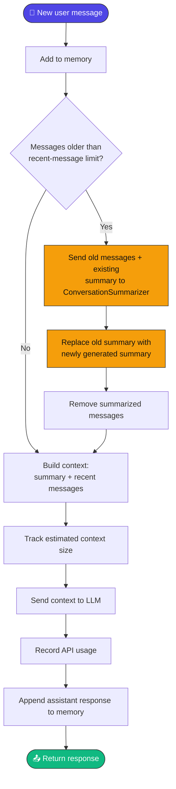
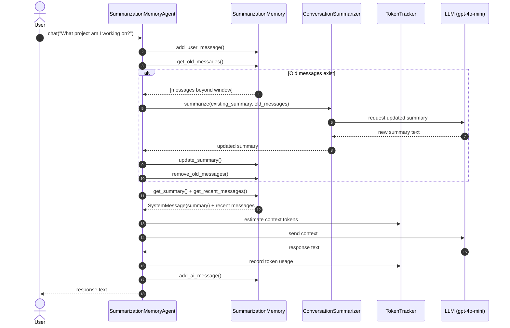
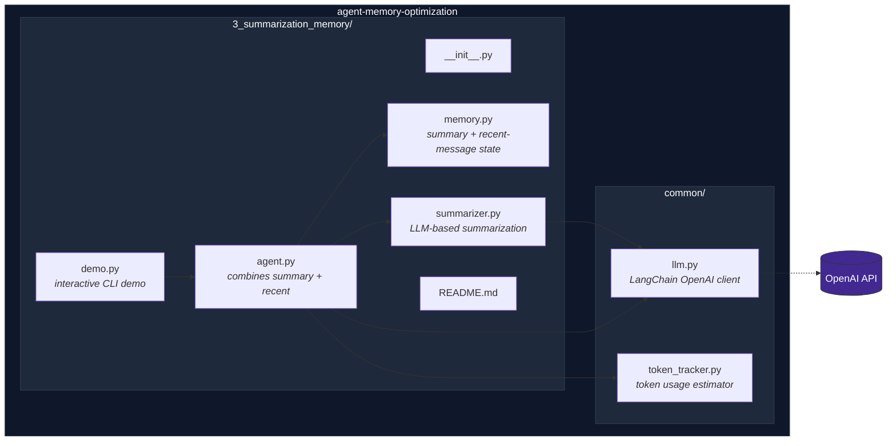
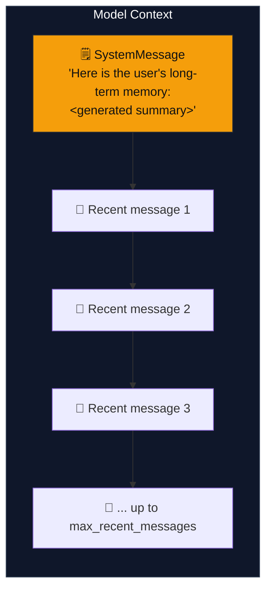
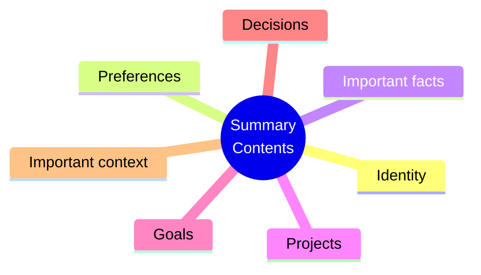
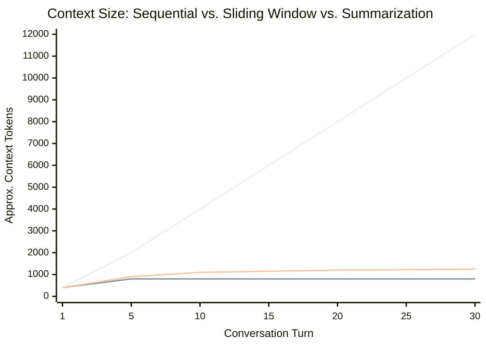
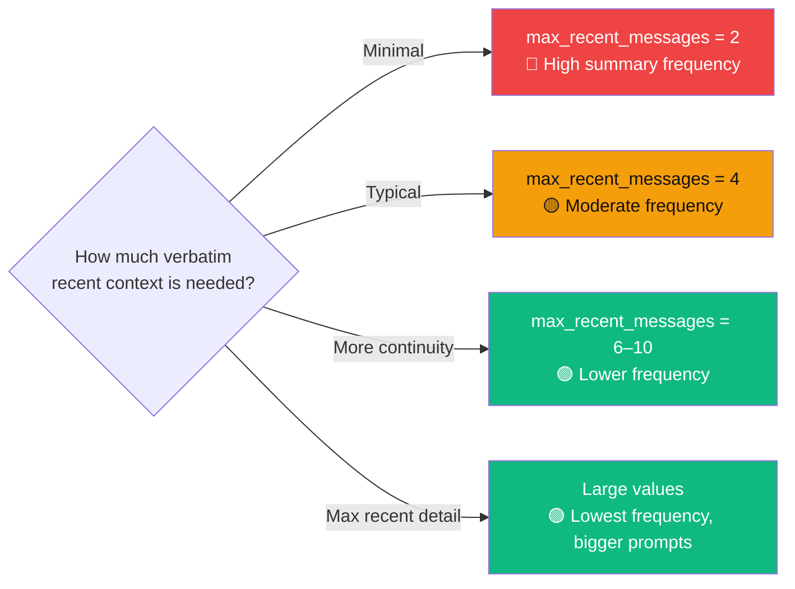
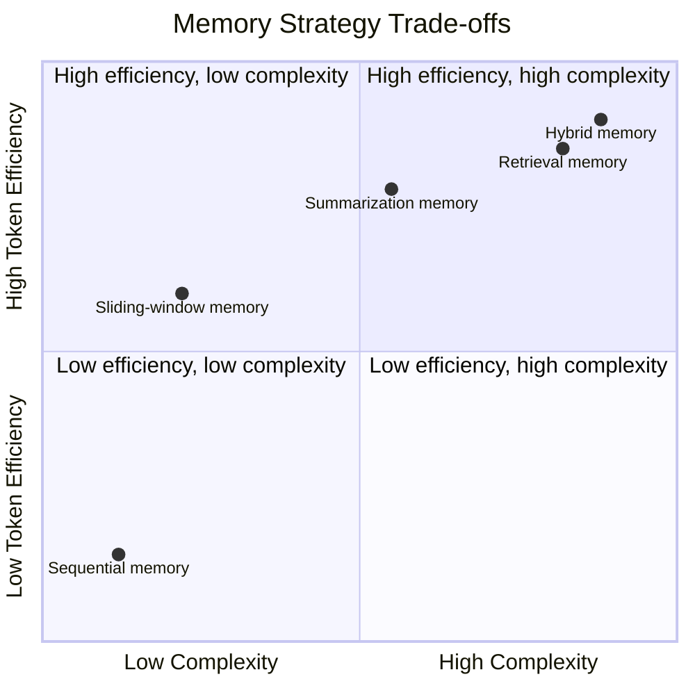

<div align="center">

# 🧾 Summarization Memory

### Compress older history into a summary. Keep the newest messages verbatim.

[](https://www.python.org/)
[](https://www.langchain.com/)
[](https://platform.openai.com/docs/guides/text-generation)
[](#-choosing-max_recent_messages)
[](#-license)

*Part of the [Agent Memory Optimization](https://github.com/paras160500/agent-memory-optimization) project.*

</div>

---

## 📖 Table of Contents

- [Overview](#-overview)
- [How It Works](#️-how-it-works)
- [Architecture](#-architecture)
- [Context Construction](#-context-construction)
- [Characteristics](#-characteristics)
- [Advantages & Limitations](#️-advantages--limitations)
- [Project Structure](#-project-structure)
- [Requirements](#-requirements)
- [Installation](#-installation)
- [Running the Demo](#-running-the-demo)
- [Usage as a Python Module](#-usage-as-a-python-module)
- [Memory API](#-memory-api)
- [Summarizer API](#-summarizer-api)
- [Agent API](#-agent-api)
- [Message-Level Retention](#-message-level-retention)
- [Complexity & Scaling](#-complexity--scaling)
- [Choosing `max_recent_messages`](#-choosing-max_recent_messages)
- [Comparison with Other Memory Strategies](#-comparison-with-other-memory-strategies)
- [When to Use Summarization Memory](#-when-to-use-summarization-memory)
- [Token Tracking](#-token-tracking)
- [Security & Privacy Notes](#-security--privacy-notes)
- [References](#-references)

---

## 🔍 Overview

**Summarization memory** is designed for conversations that are too long to retain in full. Instead of sending the entire history to the language model, the agent periodically **summarizes messages that fall outside a recent-message window**. The resulting summary becomes long-term conversational memory, while the newest messages stay available in their original form.

> 💡 **Core idea:** *Compress older conversation history into a summary and keep the most recent messages unchanged.*

The `SummarizationMemoryAgent` maintains **two types of context**:

| Context type | Description |
| --- | --- |
| 🗒️ **Long-term summary** | A model-generated summary of older conversation messages |
| 💬 **Recent messages** | The newest messages, retained in their original LangChain format |

---

## ⚙️ How It Works



### 🔁 Sequence of a Summarized Chat Turn



---

## 🏗️ Architecture



---

## 🧩 Context Construction

When a summary exists, the agent sends a `SystemMessage` followed by the recent raw messages:



When no summary exists yet, the context contains **only** the recent messages. The summary is generated from older messages *before* they're removed — so the recent-message list stays bounded while the summary carries forward selected historical information.

The summarizer is explicitly instructed to preserve:



---

## 📊 Characteristics

| Aspect | Behavior |
| --- | --- |
| 🧩 Memory strategy | Generated summary plus recent raw messages |
| 🗒️ Summary content | Identity, preferences, facts, projects, goals, decisions, important context |
| 🔢 Recent-message default | `4` messages (memory class and agent constructor) |
| ⚠️ Demo configuration | `3` recent messages — see [note below](#demo-configuration-note) |
| 📦 Storage format | Summary string plus LangChain `HumanMessage`/`AIMessage` objects |
| 🚨 Summary trigger | Whenever stored messages exceed the recent-message limit |
| 💾 Persistence | In-memory only; lost when the process ends |
| 🔢 Token monitoring | Estimates active context tokens and records API usage |
| 🤖 Default model | `gpt-4o-mini` |
| 🎯 Best suited for | Longer conversations where full raw history is too expensive |

---

## ⚖️ Advantages & Limitations

<table>
<tr>
<td valign="top" width="50%">

### ✅ Advantages

- **Supports longer conversations** — older turns are compressed, not discarded
- **Lower context growth** — active prompt = summary + a few recent messages
- **Preserves important facts** — identity, preferences, projects, goals, decisions
- **Maintains recent detail** — the latest messages stay uncompressed
- **Simple architecture** — no vector database or retrieval pipeline needed

</td>
<td valign="top" width="50%">

### ⚠️ Limitations

- **Summary information loss** — details can be omitted, misunderstood, or over-compressed
- **Additional model calls** — summarization adds an extra LLM request
- **Summary drift** — repeated updates can gradually lose or distort details
- **Message-level retention** — the recent-message limit counts messages, not turns
- **No persistent storage** — summary and messages vanish at process end
- **No relevance retrieval** — older info survives only if the summarizer keeps it

</td>
</tr>
</table>

---

## 📁 Project Structure

```
3_summarization_memory/
├── README.md
├── __init__.py
├── agent.py        # Agent that combines summary and recent messages
├── demo.py         # Interactive command-line demonstration
├── memory.py       # Summary and recent-message state management
└── summarizer.py   # LLM-based conversation summarization
```

The agent also uses shared modules from the repository root:

```
common/
├── llm.py           # Creates the configured LangChain OpenAI chat model
└── token_tracker.py # Estimates and reports token usage
```

---

## 📋 Requirements

- 🐍 Python 3.9 or later
- 🔑 An OpenAI API key
- 📦 The dependencies listed in the repository's `requirements.txt`

The implementation uses [LangChain](https://www.langchain.com/) message types and `langchain-openai` for model access.

---

## 🚀 Installation

**1. Clone the repository and move into its root directory:**

```bash
git clone https://github.com/paras160500/agent-memory-optimization.git
cd agent-memory-optimization
```

**2. Create and activate a virtual environment:**

```bash
python -m venv .venv
source .venv/bin/activate
```

> On Windows PowerShell:
> ```powershell
> .venv\Scripts\Activate.ps1
> ```

**3. Install the project dependencies:**

```bash
pip install -r requirements.txt
```

**4. Create a `.env` file in the repository root:**

```
OPENAI_API_KEY=your_openai_api_key_here
```

The shared LLM helper loads this variable with `python-dotenv` and creates a deterministic `gpt-4o-mini` chat model with `temperature=0`.

---

## ▶️ Running the Demo

Run the demo from the **repository root** using the package/import arrangement supported by the repository:

```bash
python -m 3_summarization_memory.demo
```

> ⚠️ **Note:** Because `3_summarization_memory` begins with a number, some Python environments do not accept it as a conventional module name. If module execution fails, rename the directory to a valid package identifier such as `summarization_memory`, update the relative imports if needed, and run `python -m summarization_memory.demo`.

The demo starts an interactive chat session. Enter `exit` or `quit` to stop.

```text
============================================================
SUMMARIZATION MEMORY
============================================================

Recent messages kept : 4
Type exit to quit
```

After each response, the demo prints token information for the retained messages and displays the current long-term summary.

### ⚠️ Demo configuration note

The current demo code initializes the agent with `max_recent_messages=3`:

```python
agent = SummarizationMemoryAgent(max_recent_messages=3)
```

However, its display text says `Recent messages kept : 4`. The implementation uses the constructor value, so the **active limit is 3 messages** unless the demo is updated to use `max_recent_messages=4`.

---

## 🐍 Usage as a Python Module

```python
from summarization_memory.agent import SummarizationMemoryAgent

agent = SummarizationMemoryAgent(max_recent_messages=4)

print(agent.chat("My name is Alex."))
print(agent.chat("I am building a customer-support bot."))
print(agent.chat("What project am I working on?"))
```

> If the source directory is kept under its current name (`3_summarization_memory`) and your environment supports the repository's import arrangement, use the corresponding package import. Otherwise, rename it to a valid Python package name such as `summarization_memory`.

Change the number of recent raw messages retained in the active context:

```python
agent = SummarizationMemoryAgent(max_recent_messages=6)
```

**Inspect the memory state:**

```python
memory = agent.get_memory()

print("Summary:")
print(memory.get_summary())

print("Recent messages:")
for message in memory.get_recent_messages():
    print(f"{message.type}: {message.content}")
```

**Clear the summary, recent messages, and token statistics:**

```python
agent.clear_memory()
```

---

## 🧠 Memory API

| Method | Description |
| --- | --- |
| `SummarizationMemory(max_recent_messages: int = 4)` | Creates an empty memory store with an empty summary and configurable recent-message count |
| `add_user_message(message: str)` | Appends a `HumanMessage` |
| `add_ai_message(message: str)` | Appends an `AIMessage` |
| `update_summary(summary: str)` | Replaces the stored long-term summary |
| `get_summary() -> str` | Returns the current long-term summary |
| `get_recent_messages() -> list` | Returns the newest `max_recent_messages` messages |
| `get_old_messages() -> list` | Returns messages older than the recent-message limit (empty if not exceeded) |
| `remove_old_messages()` | Removes messages outside the recent-message window |
| `clear()` | Resets both the summary and all stored messages |

---

## ✍️ Summarizer API

| Method | Description |
| --- | --- |
| `ConversationSummarizer()` | Creates a summarizer with the shared language model configuration |
| `summarize(existing_summary: str, messages) -> str` | Converts old messages to text and asks the LLM for an updated summary; returns only the summary text |

**The prompt instructs the model to preserve:**

- 🪪 User identity
- 🎯 User preferences
- 📌 Important facts
- 📁 Projects
- 🏁 Goals
- ✅ Decisions
- 🧩 Important context

---

## 🤖 Agent API

| Method | Description |
| --- | --- |
| `SummarizationMemoryAgent(max_recent_messages: int = 4)` | Creates an agent with a language model, a `SummarizationMemory`, a `ConversationSummarizer`, and a `TokenTracker` |
| `chat(user_message: str) -> str` | Adds the message, summarizes older messages when required, builds context, calls the LLM, stores the response, and returns it |
| `get_memory()` | Returns the complete `SummarizationMemory` object |
| `get_token_tracker()` | Returns the token tracker for current and cumulative usage |
| `clear_memory()` | Clears the summary and recent messages, then resets token statistics |

---

## 🔀 Message-Level Retention

`max_recent_messages` counts **individual messages**, not complete conversational turns. With `max_recent_messages=4`, the active raw memory can contain two user messages and two assistant responses.

Because summarization occurs **after** the new user message is added, the old-message set can end on a user message before the assistant has responded. This is normal for the current implementation — applications requiring complete user/assistant pairs may prefer pair-aware trimming.

---

## 📈 Complexity & Scaling

The active context size is bounded by the summary plus the configured number of recent messages — more scalable than sending the complete history on every request.



*(Top: unbounded sequential memory. Middle: fixed sliding window. Bottom: summarization — slightly larger than a pure window due to the summary, but far below unbounded growth.)*

> ⚠️ **Trade-off:** Summarization adds an **extra model call** whenever old messages exist. A conversation can therefore use *more total requests* than sequential or sliding-window memory, even though each regular response context is smaller. Total cost depends on summarization frequency, the length of old messages, the size of the generated summary, and token pricing.

---

## 🎚️ Choosing `max_recent_messages`



| Value | Retained raw context | Summary frequency | Suitable for |
| --- | --- | --- | --- |
| `2` | One recent user/assistant exchange | High | Short commands and compact prompts |
| `4` | ~Two exchanges | Moderate | General prototypes and demonstrations |
| `6–10` | Several recent exchanges | Lower | Conversations needing more local continuity |
| Large values | More uncompressed context | Lower | Apps where recent detail is especially important |

A **smaller** value reduces the active prompt but triggers summarization more often. A **larger** value preserves more verbatim context but increases regular request size.

---

## 🔬 Comparison with Other Memory Strategies



| Strategy | Retained information | Token efficiency | Long-range recall | Complexity | Typical use case |
| --- | --- | --- | --- | --- | --- |
| Sequential memory | Entire conversation | 🔴 Low | Excellent until context limits | 🟢 Low | Short demos and debugging |
| Sliding-window memory | Most recent messages | 🟡 Medium–High | 🔴 Low | 🟢 Low | Bounded recent context |
| **Summarization memory** | Summary + recent messages | 🟢 High | 🟡 Moderate (depends on summary quality) | 🟡 Medium | Long conversational sessions |
| Retrieval memory | Relevant historical items | 🟢 High | 🟢 High for retrievable info | 🔴 High | Knowledge-heavy assistants |
| Hybrid memory | Summary + recent turns + retrieved items | 🟢 High | 🟢 High | 🔴 High | Production conversational agents |

---

## 🎯 When to Use Summarization Memory

**Good fit when:**
- ✅ Conversations can grow longer than the model's practical context budget
- ✅ Older information should remain available in compressed form
- ✅ Recent messages need to remain verbatim
- ✅ You want a simpler alternative to vector retrieval
- ✅ You can tolerate occasional summarization calls and possible information loss

**Consider a different strategy when:**
- ❌ Only recent context matters → a **sliding window** is simpler and cheaper
- ❌ Specific older facts must be found accurately → **retrieval memory** is more reliable
- ❌ It's a short demo where exact history and simplicity beat token cost → **sequential memory**

---

## 🔢 Token Tracking

The agent uses the shared `TokenTracker` to report:

- 📏 Estimated tokens in the active context sent to the response model
- 📥 Cumulative input tokens reported by the model provider
- 📤 Cumulative output tokens reported by the model provider
- 📊 Total tokens, request count, and peak context size

```python
tracker = agent.get_token_tracker()

print(tracker.get_current_report())
print(tracker.get_total_report())
```

> ⚠️ **Note:** The tracker measures the *response* context built by the agent. Summarizer calls are separate model calls and may **not** be included in the agent's `TokenTracker` totals, because `ConversationSummarizer` invokes its model independently without recording that usage in the agent tracker.

---

## 🔒 Security & Privacy Notes

> ⚠️ The summary can contain personal information and important user context — treat it with the **same protection as the original conversation**.

- Do not send confidential or personally identifiable information to the model unless your application is designed and approved to handle it.
- Add retention policies, access controls, encryption, and persistent-storage safeguards before adapting this in-memory example for production.
- Call `clear_memory()` when a session should be discarded.
- Remember that clearing this object does **not** undo data already sent to an external model provider or stored in provider logs according to the provider's policies.

---

## 📄 License

Refer to the [root repository](https://github.com/paras160500/agent-memory-optimization) for the project's license and contribution guidelines.

---

## 🔗 References

| # | Resource |
| --- | --- |
| 1 | [Agent Memory Optimization repository](https://github.com/paras160500/agent-memory-optimization) |
| 2 | [`SummarizationMemory` implementation](https://github.com/paras160500/agent-memory-optimization/blob/main/3_summarization_memory/memory.py) |
| 3 | [`SummarizationMemoryAgent` implementation](https://github.com/paras160500/agent-memory-optimization/blob/main/3_summarization_memory/agent.py) |
| 4 | [`ConversationSummarizer` implementation](https://github.com/paras160500/agent-memory-optimization/blob/main/3_summarization_memory/summarizer.py) |
| 5 | [Summarization memory interactive demo](https://github.com/paras160500/agent-memory-optimization/blob/main/3_summarization_memory/demo.py) |
| 6 | [LangChain official website](https://www.langchain.com/) |
| 7 | [OpenAI text generation documentation](https://platform.openai.com/docs/guides/text-generation) |

<div align="center">

---

**⭐ Part of the [Agent Memory Optimization](https://github.com/paras160500/agent-memory-optimization) project ⭐**

</div>