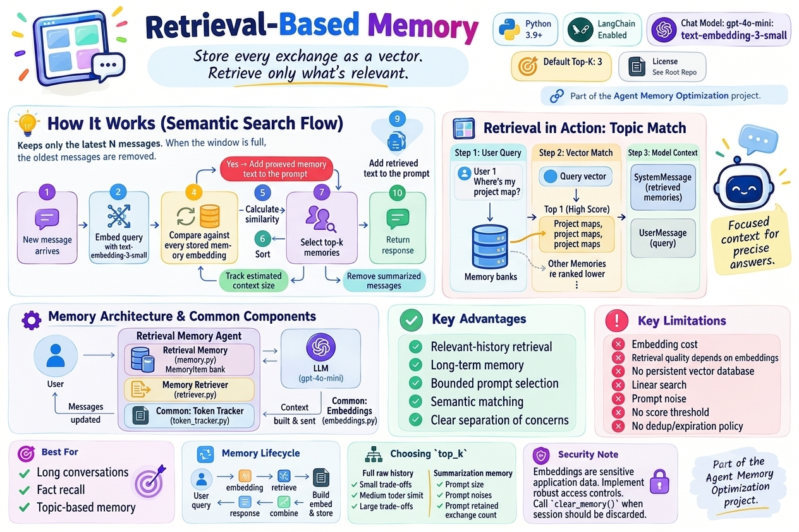
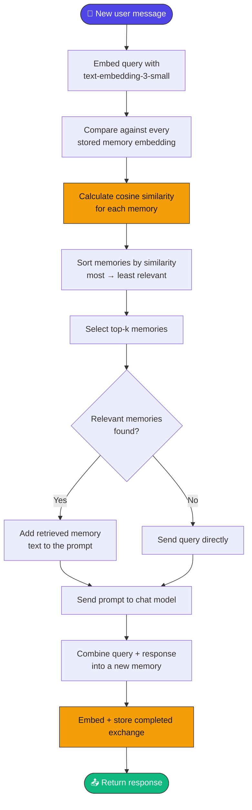
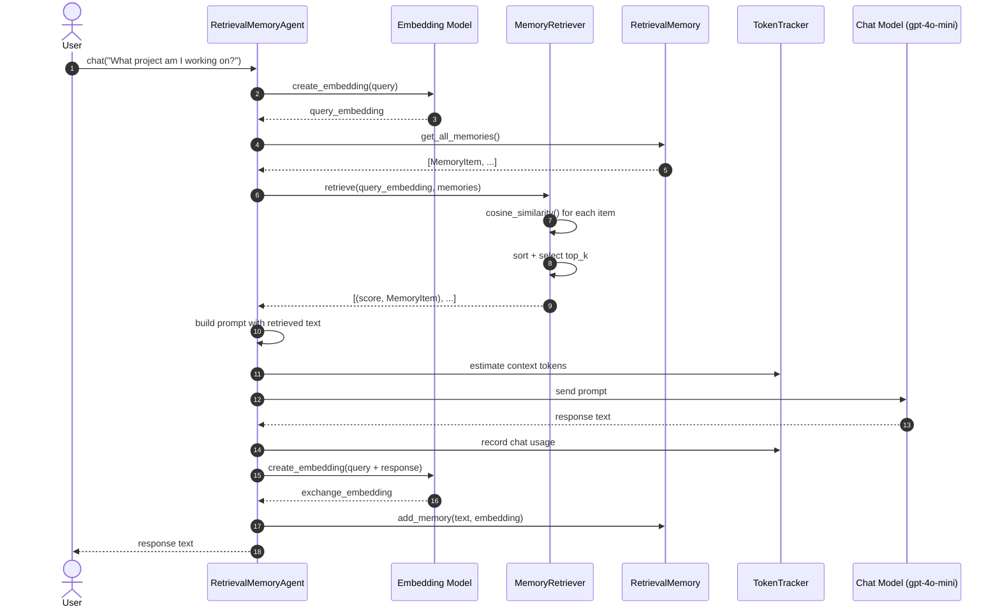
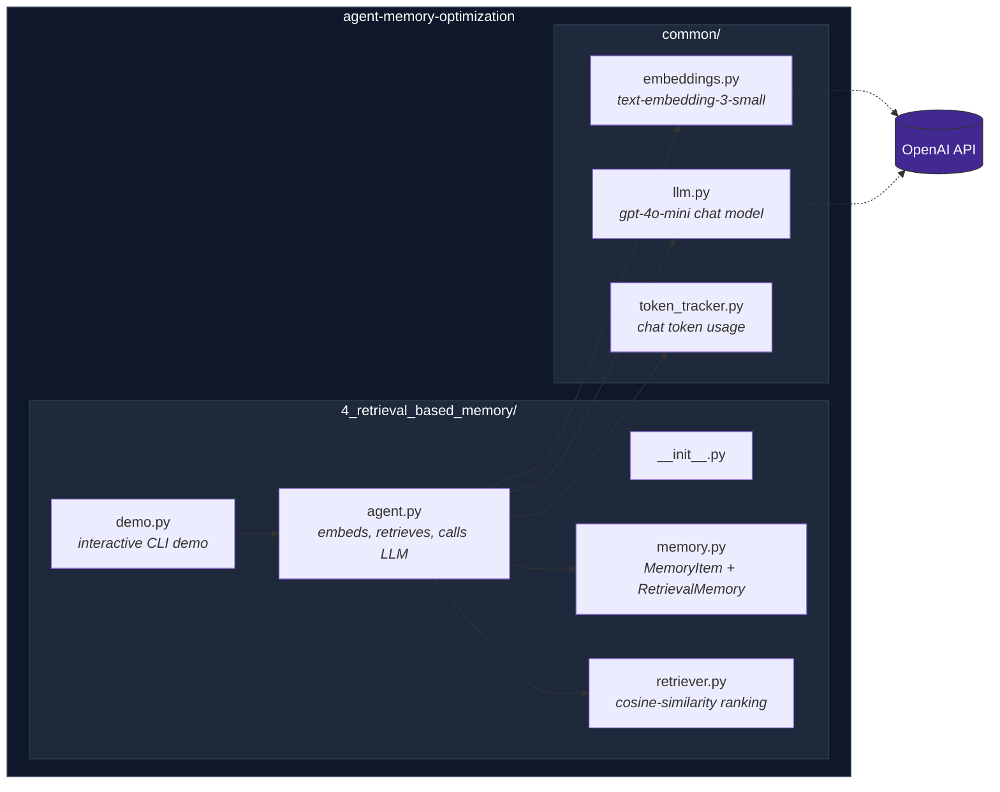
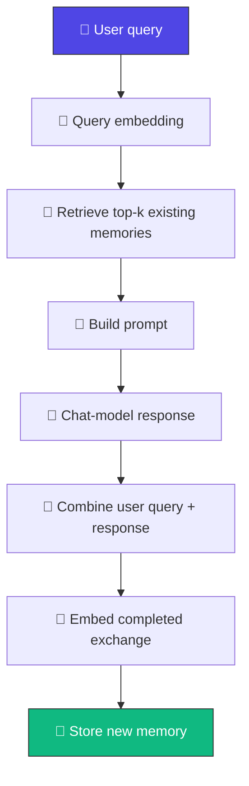
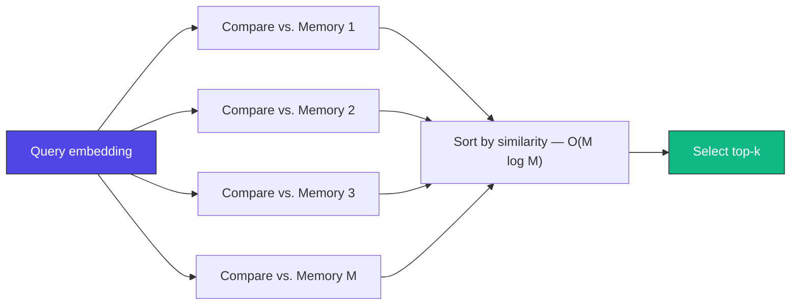
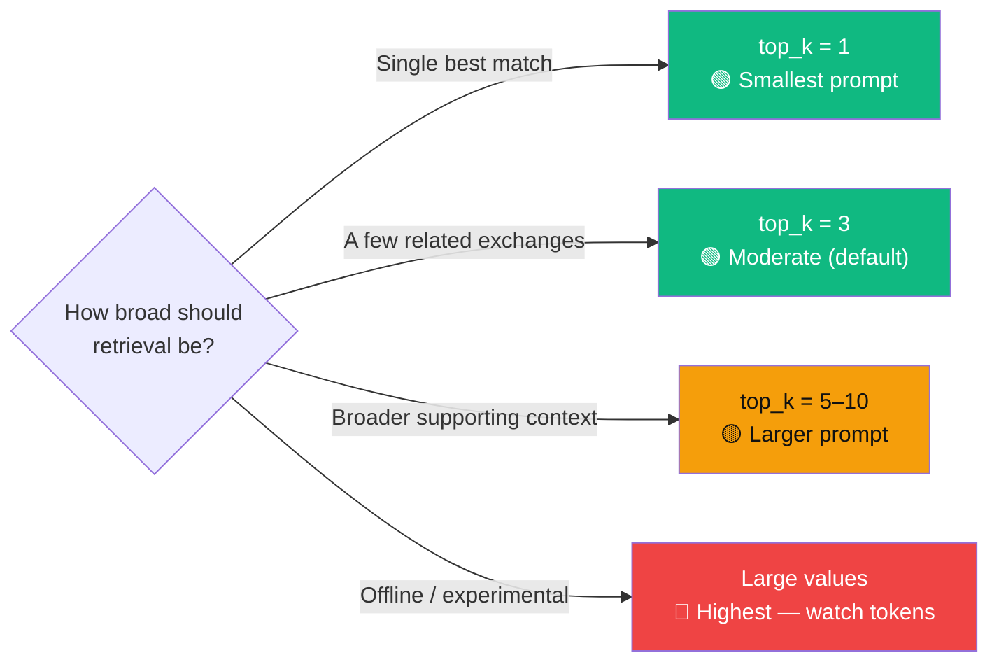
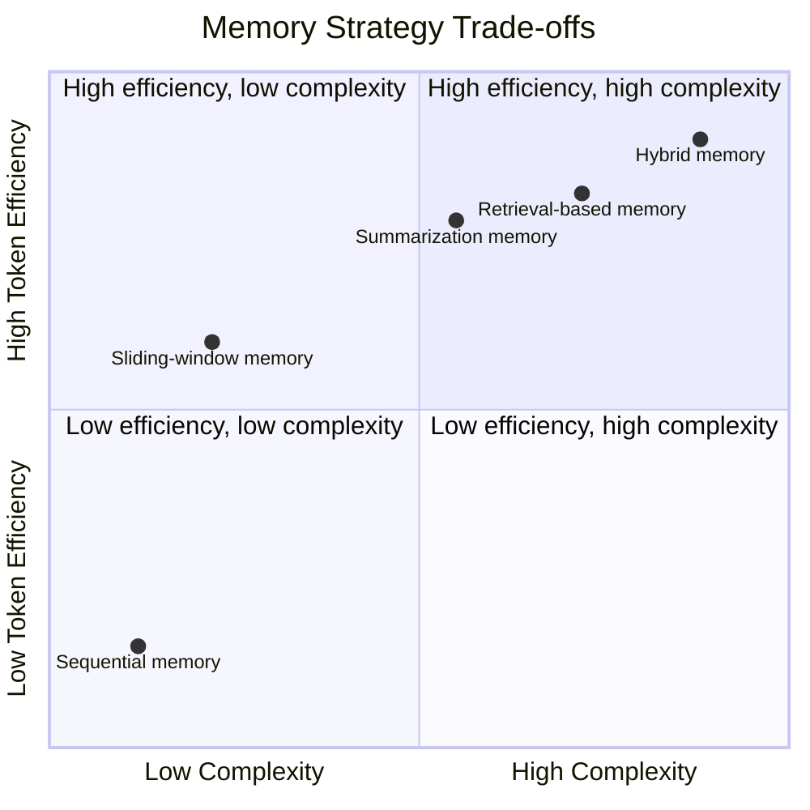

<div align="center">

# 🔎 Retrieval-Based Memory

### Store every exchange as a vector. Retrieve only what's relevant.

[](https://www.python.org/)
[](https://www.langchain.com/)
[](https://platform.openai.com/docs/guides/text-generation)
[](https://platform.openai.com/docs/guides/embeddings)
[](#-choosing-top_k)
[](#-license)



*Part of the [Agent Memory Optimization](https://github.com/paras160500/agent-memory-optimization) project.*

</div>

---

## 📖 Table of Contents

- [Overview](#-overview)
- [How It Works](#️-how-it-works)
- [Architecture](#-architecture)
- [Prompt Construction](#-prompt-construction)
- [Memory Lifecycle](#-memory-lifecycle)
- [Characteristics](#-characteristics)
- [Advantages & Limitations](#️-advantages--limitations)
- [Project Structure](#-project-structure)
- [Requirements](#-requirements)
- [Installation](#-installation)
- [Running the Demo](#-running-the-demo)
- [Usage as a Python Module](#-usage-as-a-python-module)
- [Memory API](#-memory-api)
- [Retriever API](#-retriever-api)
- [Agent API](#-agent-api)
- [Complexity & Scaling](#-complexity--scaling)
- [Choosing `top_k`](#-choosing-top_k)
- [Comparison with Other Memory Strategies](#-comparison-with-other-memory-strategies)
- [When to Use Retrieval-Based Memory](#-when-to-use-retrieval-based-memory)
- [Token & API Usage](#-token--api-usage)
- [Security & Privacy Notes](#-security--privacy-notes)
- [References](#-references)

---

## 🔍 Overview

**Retrieval-based memory** is a semantic memory strategy: past exchanges are stored as **vector embeddings**, and only the most relevant memories are pulled into the prompt for each new query — instead of sending the complete conversation history.

> 💡 **Core idea:** *Store conversation memories as vectors and retrieve the most relevant items when needed.*

Each completed user/assistant exchange becomes a `MemoryItem` containing its text, its embedding, and a memory type. Rather than growing the prompt with every turn, the **memory collection** grows in the background while the **active prompt** stays small and focused.

---

## ⚙️ How It Works



### 🔁 Sequence of a Retrieval-Augmented Chat Turn



---

## 🏗️ Architecture



---

## 🧩 Prompt Construction

When matching memories are available, the agent builds a prompt like this:

```text
You are an AI assistant with retrieval-based memory.
Relevant memories from previous conversations:
- User : ...
  Assistant : ...
- User : ...
  Assistant : ...
Use these memories when they are relevant.

User:
<current user message>
```

When no memories exist, the current user message is sent directly as the prompt.

> 📝 Retrieval scores are used **only for ranking** — the model receives memory *text*, never the numeric similarity values.

### 📐 Cosine Similarity

```
similarity = (query · memory) / (||query|| × ||memory||)
```

Higher values indicate greater directional similarity between the vectors. If either vector has zero magnitude, the method returns `0.0` instead of dividing by zero.

---

## 🔄 Memory Lifecycle



> ⚠️ The current user message is **not** available as a stored memory during its own retrieval step — it only becomes retrievable on a later request.

---

## 📊 Characteristics

| Aspect | Behavior |
| --- | --- |
| 🧩 Memory strategy | Semantic retrieval over embedded conversation exchanges |
| 📦 Stored unit | One completed user/assistant exchange |
| 📐 Similarity metric | Cosine similarity |
| 🔢 Default retrieval count | `top_k=3` |
| 🧮 Embedding model | `text-embedding-3-small` |
| 📏 Embedding dimensions | `1536` |
| 🤖 Chat model | `gpt-4o-mini` |
| 💾 Storage | In-memory Python list |
| 🔍 Retrieval scope | All stored memories, ranked by similarity |
| ⏳ Persistence | None; memories are lost when the process ends |
| 🎯 Best suited for | Long conversations, fact recall, topic-based memory |

---

## ⚖️ Advantages & Limitations

<table>
<tr>
<td valign="top" width="50%">

### ✅ Advantages

- **Relevant-history retrieval** — the model gets memories tied to the *current* query
- **Long-term memory** — info stays retrievable after leaving the immediate context
- **Bounded prompt selection** — only the top `k` memories are added
- **Semantic matching** — related wording can surface a memory without exact keywords
- **Clear separation of concerns** — storage and retrieval evolve independently

</td>
<td valign="top" width="50%">

### ⚠️ Limitations

- **Embedding cost** — every query and every stored exchange needs an embedding call
- **Retrieval quality depends on embeddings** — a relevant memory can be missed
- **No persistent vector database** — vectors live only in process memory
- **Linear search** — every retrieval scans the full memory collection
- **Prompt noise** — retrieved memories may be similar but not actually useful
- **No score threshold** — always returns up to `top_k`, even with low similarity
- **No dedup/expiration policy** — every exchange is stored until manually cleared

</td>
</tr>
</table>

---

## 📁 Project Structure

```
4_retrieval_based_memory/
├── __init__.py
├── agent.py        # Embeds queries, retrieves memories, and calls the LLM
├── demo.py         # Interactive command-line demonstration
├── memory.py       # MemoryItem and RetrievalMemory classes
└── retriever.py    # Cosine-similarity ranking and top-k selection
```

The agent also depends on shared modules from the repository root:

```
common/
├── embeddings.py    # Configures text-embedding-3-small
├── llm.py           # Configures the gpt-4o-mini chat model
└── token_tracker.py # Estimates and reports chat-model token usage
```

---

## 📋 Requirements

- 🐍 Python 3.9 or later
- 🔑 An OpenAI API key
- 📦 The dependencies listed in the repository's `requirements.txt`
- 🌐 Network access for chat-completion and embedding requests

The implementation uses [LangChain](https://www.langchain.com/) for model and embedding integrations and [NumPy](https://numpy.org/) for cosine-similarity calculations.

---

## 🚀 Installation

**1. Clone the repository and move into its root directory:**

```bash
git clone https://github.com/paras160500/agent-memory-optimization.git
cd agent-memory-optimization
```

**2. Create and activate a virtual environment:**

```bash
python -m venv .venv
source .venv/bin/activate
```

> On Windows PowerShell:
> ```powershell
> .venv\Scripts\Activate.ps1
> ```

**3. Install the project dependencies:**

```bash
pip install -r requirements.txt
```

**4. Create a `.env` file in the repository root:**

```
OPENAI_API_KEY=your_openai_api_key_here
```

The shared configuration uses this key for **both** the chat model and the embedding model.

---

## ▶️ Running the Demo

Run the demo from the **repository root** using the package/import arrangement supported by the repository:

```bash
python -m 4_retrieval_based_memory.demo
```

> ⚠️ **Note:** Because `4_retrieval_based_memory` begins with a number, some Python environments do not accept it as a conventional module name. If module execution fails, rename the directory to a valid package identifier such as `retrieval_based_memory`, update imports if needed, and run `python -m retrieval_based_memory.demo`.

The demo creates an agent with `top_k=3` and reports the configured embedding model:

```text
============================================================
RETRIEVAL_BASED MEMORY
============================================================

Top-K memories : 3
Embedding : text-embedding-3-small
Type exit to stop
```

Enter `exit` or `quit` to stop the session. After each response, the demo displays token information and the number of stored memories.

---

## 🐍 Usage as a Python Module

```python
from retrieval_based_memory.agent import RetrievalMemoryAgent

agent = RetrievalMemoryAgent(top_k=3)

print(agent.chat("My name is Alex and I am building a support bot."))
print(agent.chat("What project am I working on?"))
```

The second query can retrieve the earlier exchange because the stored memory contains the project information and is embedded for semantic search.

**Change the number of retrieved memories:**

```python
agent = RetrievalMemoryAgent(top_k=5)
```

**Inspect stored memories:**

```python
memory = agent.get_memory()

print(f"Stored memories: {memory.count()}")

for item in memory.get_all_memories():
    print(item.memory_type)
    print(item.text)
    print(f"Embedding dimensions: {len(item.embedding)}")
```

**Clear all stored memories and reset token statistics:**

```python
agent.clear_memory()
```

---

## 🧠 Memory API

**`MemoryItem`** — a dataclass containing one stored memory:

| Field | Type | Description |
| --- | --- | --- |
| `text` | `str` | The stored memory text |
| `embedding` | `list[float]` | The vector representation of the text |
| `memory_type` | `str` | A label such as `conversation` |

| Method | Description |
| --- | --- |
| `RetrievalMemory()` | Creates an empty in-memory collection of `MemoryItem` objects |
| `add_memory(text, embedding, memory_type="conversation")` | Creates a `MemoryItem` and appends it to the collection |
| `get_all_memories() -> list` | Returns every stored memory item |
| `count() -> int` | Returns the number of stored memories |
| `clear()` | Removes all stored memories |

---

## 🎯 Retriever API

| Method | Description |
| --- | --- |
| `MemoryRetriever(top_k: int = 3)` | Creates a retriever that returns at most `top_k` memories |
| `cosine_similarity(query_embedding, memory_embedding) -> float` | Computes cosine similarity between two vectors; returns `0.0` for zero-magnitude vectors |
| `retrieve(query_embedding, memories) -> list` | Scores every memory, sorts descending, returns `[(similarity_score, memory_item), ...]` capped at `top_k` |

---

## 🤖 Agent API

`RetrievalMemoryAgent(top_k: int = 3)` creates an agent with:

- 🤖 The shared `gpt-4o-mini` chat model
- 🧮 The shared `text-embedding-3-small` embedding model
- 🧠 A `RetrievalMemory` collection
- 🎯 A `MemoryRetriever` configured with `top_k`
- 🔢 A `TokenTracker` configured for `gpt-4o-mini`

| Method | Description |
| --- | --- |
| `create_embedding(text: str)` | Embeds text using the configured OpenAI embedding model |
| `chat(user_message: str) -> str` | Embeds the query, retrieves similar memories, builds the prompt, calls the chat model, records usage, stores the exchange, and returns the response |
| `get_memory()` | Returns the `RetrievalMemory` instance |
| `get_token_tracker()` | Returns the token tracker for chat-context and cumulative usage |
| `clear_memory()` | Clears all stored memories and resets token statistics |

---

## 📈 Complexity & Scaling

The current retriever performs a **full scan**: with `M` stored memories and `D`-dimensional embeddings, retrieval is approximately `O(M × D)` for similarity calculations, followed by sorting.



> ⚠️ This is fine for a small demo but becomes inefficient as the memory collection grows. A production implementation should consider a vector index such as **FAISS**, a managed vector database, metadata filters, score thresholds, batching, and persistence.

The active chat prompt is bounded by the *number* of retrieved memories, but each memory may contain a long conversation exchange — so `top_k` controls the **count** of results, not the exact token total.

---

## 🎚️ Choosing `top_k`



| Value | Retrieved memories | Prompt size | Suitable for |
| --- | --- | --- | --- |
| `1` | Single best match | Smallest | Focused fact lookup |
| `3` | A few related exchanges | Moderate | General prototypes and demos |
| `5–10` | Broader related context | Larger | Queries requiring multiple supporting memories |
| Large values | Many potentially related exchanges | Highest | Offline experiments with careful token monitoring |

A **larger** `top_k` can improve coverage but may introduce irrelevant context and increase prompt tokens. A **smaller** value keeps prompts focused but may omit useful supporting memories.

---

## 🔬 Comparison with Other Memory Strategies



| Strategy | Retrieval behavior | Long-range recall | Token efficiency | Complexity | Typical use case |
| --- | --- | --- | --- | --- | --- |
| Sequential memory | Sends every message | Excellent until context limits | 🔴 Low | 🟢 Low | Short demos and debugging |
| Sliding-window memory | Keeps recent messages | 🔴 Low | 🟡 Medium–High | 🟢 Low | Recent conversational continuity |
| Summarization memory | Compresses older messages | 🟡 Moderate (summary quality) | 🟢 High | 🟡 Medium | Long conversations with compressed history |
| **Retrieval-based memory** | Selects semantically similar exchanges | 🟢 High for retrievable info | 🟢 High | 🟡 Medium–High | Fact recall and topic-based assistants |
| Hybrid memory | Combines recent, summarized, and retrieved context | 🟢 High | 🟢 High | 🔴 High | Production conversational systems |

---

## 🎯 When to Use Retrieval-Based Memory

**Good fit when:**
- ✅ Relevant information may appear anywhere in a long conversation
- ✅ Users may refer to an older topic using different wording
- ✅ You want to retain many memories without sending all of them to the model
- ✅ The application needs topic-based or semantic recall
- ✅ You're prepared to add persistent vector storage as memory grows

**Consider a different strategy when:**
- ❌ The entire conversation should read as one coherent narrative → **summarization**
- ❌ Only recent turns matter → a **sliding window**
- ❌ The app needs strict chronological context or exact reconstruction of every prior turn → retrieval alone may be insufficient

---

## 🔢 Token & API Usage

The agent uses **two** model capabilities:

1. 🧮 **Embeddings** — one request per user query, one per completed exchange stored in memory
2. 🤖 **Chat completion** — one request per user query

> ⚠️ **Note:** The demo currently calls `print_current_report([])`, so its printed current-context count reflects an *empty* message list rather than the actual constructed prompt. The cumulative tracker also only records usage explicitly passed to it by the agent — **embedding usage is not tracked** by this class.

For accurate production cost accounting, track embedding requests and chat requests **separately**, including input and output tokens where provider metadata is available.

---

## 🔒 Security & Privacy Notes

> ⚠️ Stored embeddings and their associated text may reveal personal or confidential information. Treat embeddings as **sensitive application data** — they're derived from user content and can be linked back to stored memory text.

Before using this pattern in production, add:

- 🔐 Authentication and authorization
- 🗓️ Retention policies and deletion controls
- 🔒 Encryption and persistence safeguards
- 🏢 Tenant isolation where applicable

Do not send confidential or personally identifiable information to an external model provider unless your application is designed and approved to handle it.

Calling `clear_memory()` removes the in-memory collection but does **not** undo data already sent to an external model provider or stored according to provider policies.

---

## 📄 License

Refer to the [root repository](https://github.com/paras160500/agent-memory-optimization) for the project's license and contribution guidelines.

---

## 🔗 References

| # | Resource |
| --- | --- |
| 1 | [Agent Memory Optimization repository](https://github.com/paras160500/agent-memory-optimization) |
| 2 | [`RetrievalMemory` implementation](https://github.com/paras160500/agent-memory-optimization/blob/main/4_retrieval_based_memory/memory.py) |
| 3 | [`MemoryRetriever` implementation](https://github.com/paras160500/agent-memory-optimization/blob/main/4_retrieval_based_memory/retriever.py) |
| 4 | [`RetrievalMemoryAgent` implementation](https://github.com/paras160500/agent-memory-optimization/blob/main/4_retrieval_based_memory/agent.py) |
| 5 | [Retrieval-based memory interactive demo](https://github.com/paras160500/agent-memory-optimization/blob/main/4_retrieval_based_memory/demo.py) |
| 6 | [LangChain official website](https://www.langchain.com/) |
| 7 | [OpenAI embeddings documentation](https://platform.openai.com/docs/guides/embeddings) |
| 8 | [OpenAI text generation documentation](https://platform.openai.com/docs/guides/text-generation) |

<div align="center">

---

**⭐ Part of the [Agent Memory Optimization](https://github.com/paras160500/agent-memory-optimization) project ⭐**

</div>