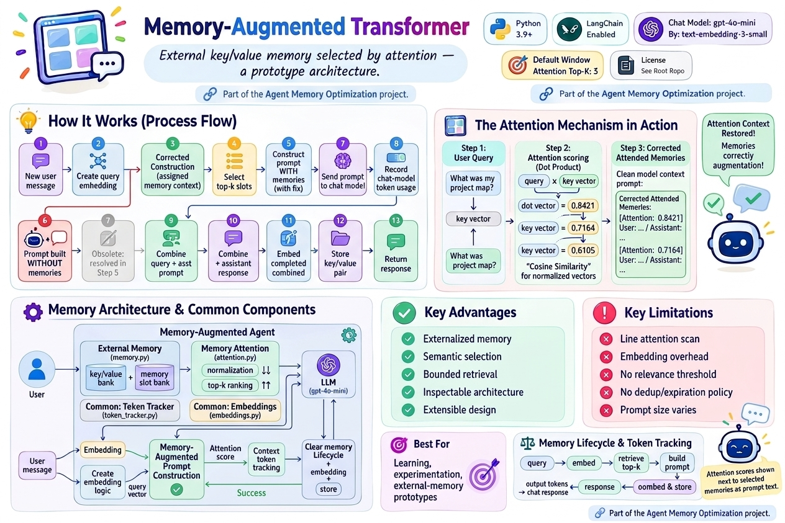
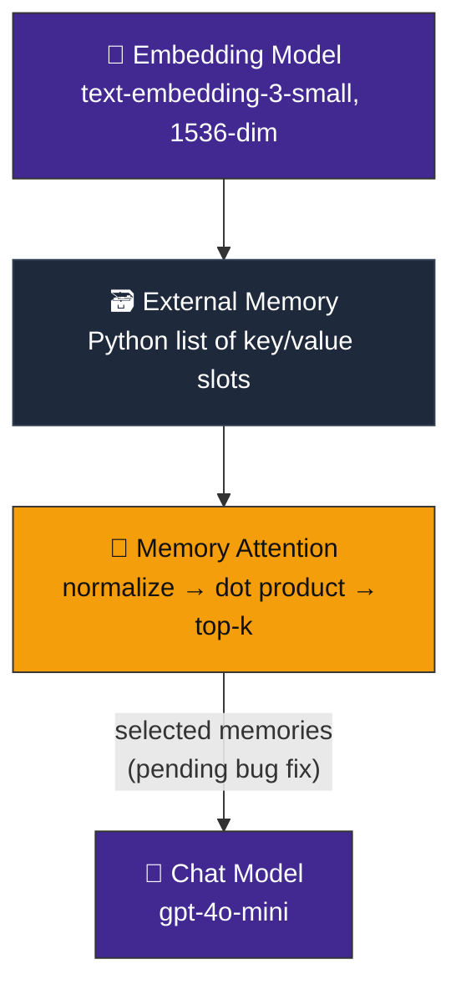
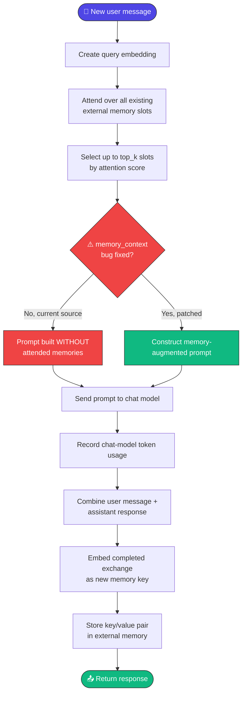
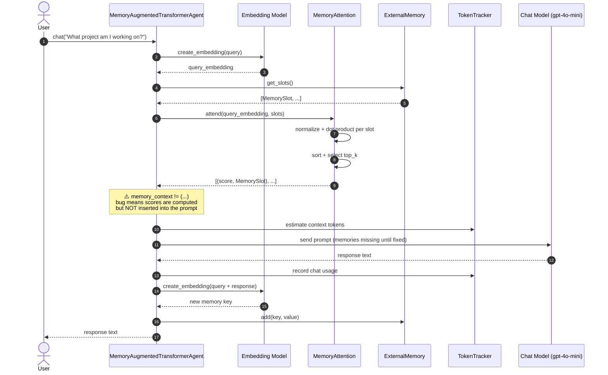
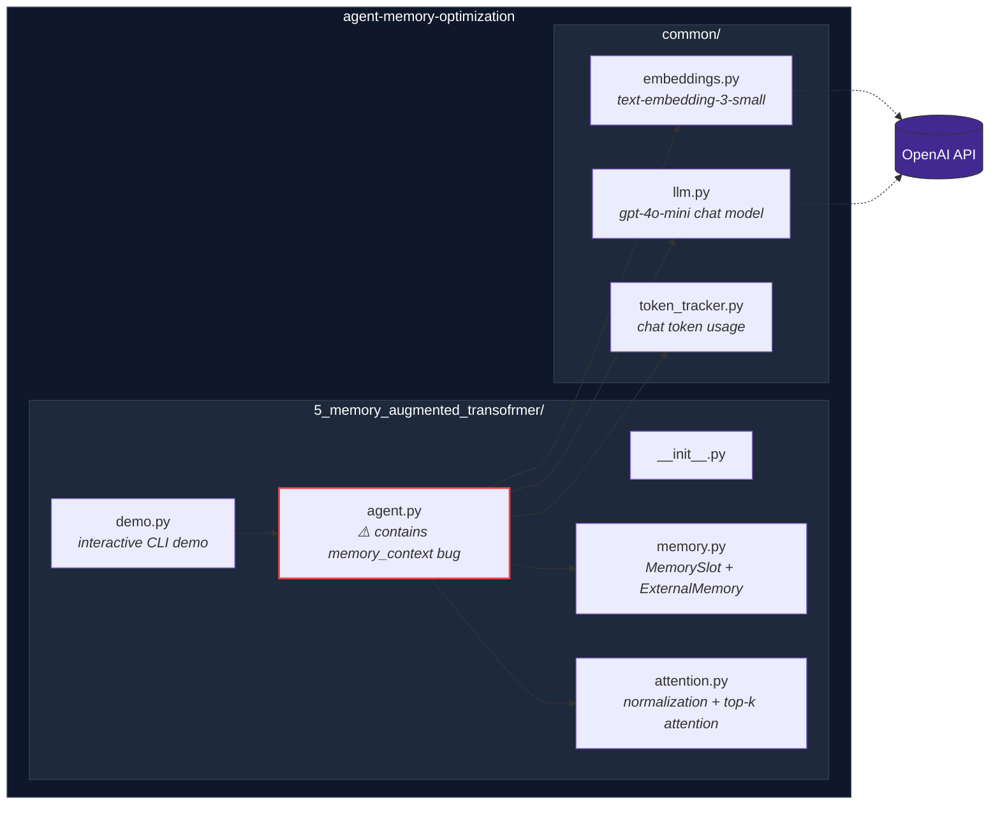
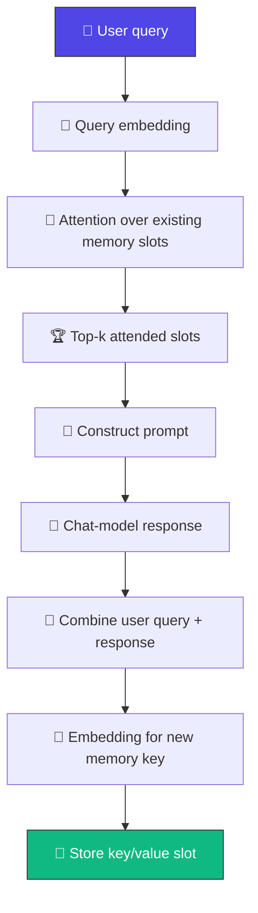
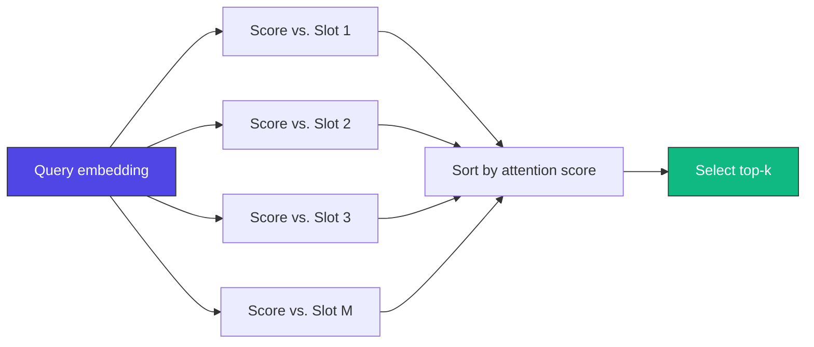
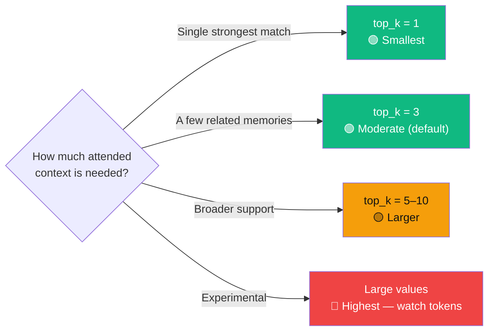
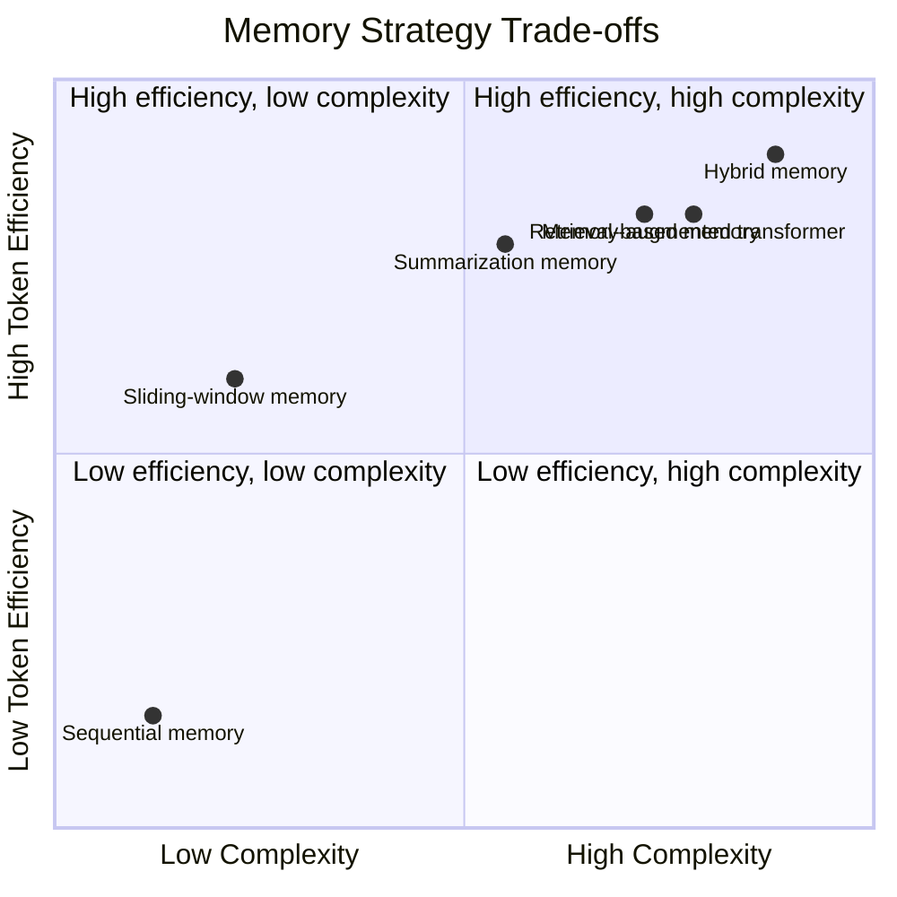

<div align="center">

# 🧬 Memory-Augmented Transformer

### External key/value memory selected by attention — a prototype architecture.

[](https://www.python.org/)
[](https://www.langchain.com/)
[](https://platform.openai.com/docs/guides/text-generation)
[](https://platform.openai.com/docs/guides/embeddings)
[](#-important-implementation-note)
[](#-license)

*Part of the [Agent Memory Optimization](https://github.com/paras160500/agent-memory-optimization) project.*



</div>

---

## 🚨 Important Implementation Note

> **The current `agent.py` has a bug that silently disables memory augmentation.**

```python
# ❌ Current code — this is a comparison, not an assignment!
memory_context != (
    f"[Attention : {score:.4f}]"
    f"{slot.value}\n"
)
```

The `!=` operator **compares** values — it does not append or assign text. As a result, `memory_context` stays empty and retrieved memories never make it into the prompt, even though attention scoring runs correctly.

**The fix:**

```python
# ✅ Fixed code
memory_context += (
    f"[Attention: {score:.4f}] "
    f"{slot.value}\n"
)
```

This README documents **both** the intended architecture and the current source behavior. Apply this one-line fix before evaluating memory recall.

---

## 📖 Table of Contents

- [Overview](#-overview)
- [How It Works](#️-how-it-works)
- [Architecture](#-architecture)
- [Intended Prompt Construction](#-intended-prompt-construction)
- [Memory Lifecycle](#-memory-lifecycle)
- [Characteristics](#-characteristics)
- [Advantages & Limitations](#️-advantages--limitations)
- [Project Structure](#-project-structure)
- [Requirements](#-requirements)
- [Installation](#-installation)
- [Running the Demo](#-running-the-demo)
- [Usage as a Python Module](#-usage-as-a-python-module)
- [Memory API](#-memory-api)
- [Attention API](#-attention-api)
- [Agent API](#-agent-api)
- [Complexity & Scaling](#-complexity--scaling)
- [Choosing `top_k`](#-choosing-top_k)
- [Comparison with Other Memory Strategies](#-comparison-with-other-memory-strategies)
- [When to Use This Pattern](#-when-to-use-this-pattern)
- [Token & API Usage](#-token--api-usage)
- [Security & Privacy Notes](#-security--privacy-notes)
- [References](#-references)

---

## 🔍 Overview

This is a prototype **memory-augmented conversational agent** that uses an external memory store and **attention-style retrieval** to select relevant past interactions.

> 💡 **Core idea:** *Augment the model's input with memories selected by attention over an external memory store.*

Each completed conversation exchange becomes an embedding-backed **memory slot**. For every new query, the agent embeds the query, scores all stored memory keys via dot-product attention, selects the top `k` slots, and is *intended* to feed those attended memories to the language model as extra context.

---

## ⚙️ How It Works

The implementation has **four main components**:



### 🔁 Request Flow



> ⚠️ The current query is stored **only after** the response is generated, so it cannot retrieve itself during the same request.

### 🔁 Sequence of a Chat Turn (as currently implemented)



---

## 🏗️ Architecture



> 📁 Note the directory name is `5_memory_augmented_transofrmer` (typo in "transformer") in the current source. Rename to `memory_augmented_transformer` for standard Python module execution.

---

## 🧩 Intended Prompt Construction

Once the `memory_context` bug is fixed, the agent constructs a prompt like this:

```text
You are an AI assistant with an external memory.
The following memories were selected using attention over the external memory.
[Attention: 0.8421] User: ...
Assistant: ...
[Attention: 0.7164] User: ...
Assistant: ...

Use the attended memories when relevant.
User:
<current user message>
```

When there are no memory slots, the current user message is used directly as the prompt.

> 📝 Attention scores are shown next to each selected memory as **prompt text** — the model never receives the raw internal vector keys.

### 📐 Attention Score

```
attention_score(query, key) = normalize(query) · normalize(key)
```

For normalized vectors, this dot product is mathematically equivalent to **cosine similarity**.

---

## 🔄 Memory Lifecycle



The memory **key** is generated from the combined text:

```text
User : <user message>
Assistant : <assistant response>
```

Both sides of the interaction are stored as one retrievable value.

---

## 📊 Characteristics

| Aspect | Behavior |
| --- | --- |
| 🧩 Memory strategy | External key/value memory with attention-style retrieval |
| 📦 Stored unit | Completed user/assistant exchange |
| 🔑 Memory key | Embedding vector for the completed exchange |
| 📄 Memory value | Plain-text user query and assistant response |
| 📐 Attention score | Dot product of normalized query and key vectors |
| 🔢 Default retrieval count | `top_k=3` |
| 🧮 Embedding model | `text-embedding-3-small` |
| 📏 Embedding dimensions | `1536` |
| 🤖 Chat model | `gpt-4o-mini` |
| 💾 Storage | In-memory Python list |
| ⏳ Persistence | None; memory is lost when the process ends |
| 🎯 Best suited for | Learning, experimentation, external-memory prototypes |

---

## ⚖️ Advantages & Limitations

<table>
<tr>
<td valign="top" width="50%">

### ✅ Advantages

- **Externalized memory** — conversation state lives outside the model's immediate context
- **Semantic selection** — vector similarity instead of exact text matching
- **Bounded retrieval** — only the top `k` slots are *intended* to enter the prompt
- **Inspectable architecture** — keys, values, scores, and counts are all directly accessible
- **Extensible design** — the in-memory list can later become an indexed/persistent backend

</td>
<td valign="top" width="50%">

### ⚠️ Limitations

- 🐛 **Current prompt-construction bug** — memories aren't included until `!=` → `+=` is fixed
- **Linear attention scan** — every query compares against every stored slot
- **In-memory only** — everything disappears at process exit
- **Embedding overhead** — every query and exchange needs an embedding call
- **No relevance threshold** — up to `top_k` returned even with weak scores
- **No metadata filtering** — no filter by user, session, type, time, or permissions
- **No memory management policy** — no dedup, expiration, prioritization, or deletion
- **Prompt size still varies** — `top_k` bounds count, not token length

</td>
</tr>
</table>

---

## 📁 Project Structure

```
5_memory_augmented_transofrmer/
├── __init__.py
├── agent.py        # Chat agent with external-memory attention
├── attention.py    # Vector normalization and top-k attention
├── demo.py         # Interactive command-line demonstration
└── memory.py       # MemorySlot and ExternalMemory classes
```

The agent also uses shared modules from the repository root:

```
common/
├── embeddings.py    # Configures text-embedding-3-small
├── llm.py           # Configures the gpt-4o-mini chat model
└── token_tracker.py # Estimates and reports chat-model token usage
```

---

## 📋 Requirements

- 🐍 Python 3.9 or later
- 🔑 An OpenAI API key
- 📦 The dependencies listed in the repository's `requirements.txt`
- 🌐 Network access for embedding and chat-model requests

The implementation uses [LangChain](https://www.langchain.com/) for model integrations and [NumPy](https://numpy.org/) for vector normalization and dot-product calculations.

---

## 🚀 Installation

**1. Clone the repository and move into its root directory:**

```bash
git clone https://github.com/paras160500/agent-memory-optimization.git
cd agent-memory-optimization
```

**2. Create and activate a virtual environment:**

```bash
python -m venv .venv
source .venv/bin/activate
```

> On Windows PowerShell:
> ```powershell
> .venv\Scripts\Activate.ps1
> ```

**3. Install the project dependencies:**

```bash
pip install -r requirements.txt
```

**4. Create a `.env` file in the repository root:**

```
OPENAI_API_KEY=your_openai_api_key_here
```

The shared configuration uses this key for **both** the chat model and the embedding model.

---

## ▶️ Running the Demo

Run the demo from the repository root using the package/import arrangement supported by the repository:

```bash
python -m 5_memory_augmented_transofrmer.demo
```

> ⚠️ **Note:** Because `5_memory_augmented_transofrmer` begins with a number, some Python environments do not accept it as a conventional module name. If module execution fails, rename the directory to a valid package identifier such as `memory_augmented_transformer`, update imports if needed, and run `python -m memory_augmented_transformer.demo`.

The demo initializes the agent with `top_k=3` and starts an interactive session:

```text
============================================================
MEMORY )AUGMENTED TRANSFORMER
============================================================

Tpye 'exit' to stop

Attention Top-k : 3
```

Enter `exit` or `quit` to stop the session. After every response, the demo displays token information and the number of external memory slots.

> 📝 The displayed banner contains minor spelling/formatting mistakes in the current source, including `MEMORY)AUGMENTED`, `Tpye`, and `Extrenal`. These are cosmetic and don't affect execution.

---

## 🐍 Usage as a Python Module

After renaming the directory to a Python-valid package name, use the agent as follows:

```python
from memory_augmented_transformer.agent import MemoryAugmentedTransformerAgent

agent = MemoryAugmentedTransformerAgent(top_k=3)

print(agent.chat("My name is Alex and I am building a support bot."))
print(agent.chat("What project am I working on?"))
```

> ⚠️ The second query is *intended* to attend to the first completed exchange. Apply the [`memory_context` fix](#-important-implementation-note) so the selected memory actually reaches the prompt.

**Change the number of attended memory slots:**

```python
agent = MemoryAugmentedTransformerAgent(top_k=5)
```

**Inspect external memory:**

```python
memory = agent.get_memory()

print(f"Memory slots: {memory.count()}")

for slot in memory.get_slots():
    print(slot.value)
    print(f"Key dimensions: {len(slot.key)}")
```

**Clear external memory and reset token statistics:**

```python
agent.clear_memory()
```

---

## 🧠 Memory API

**`MemorySlot`** — a dataclass representing one external memory entry:

| Field | Type | Description |
| --- | --- | --- |
| `key` | `list[float]` | Embedding vector used for attention scoring |
| `value` | `str` | Text supplied to the model when the memory is attended |

| Method | Description |
| --- | --- |
| `ExternalMemory()` | Creates an empty external memory store |
| `add(key: list[float], value: str)` | Creates a `MemorySlot` and appends it to the store |
| `get_slots() -> list` | Returns all stored memory slots |
| `count() -> int` | Returns the number of external memory slots |
| `clear()` | Removes all memory slots |

---

## 🎯 Attention API

| Method | Description |
| --- | --- |
| `MemoryAttention(top_k: int = 3)` | Creates an attention component that returns at most `top_k` memory slots |
| `normalize(vector)` | Converts a vector to a NumPy array and divides by its Euclidean norm; a zero vector is returned unchanged |
| `attention_score(query, key) -> float` | Normalizes query and key independently, then returns their dot product (≡ cosine similarity) |
| `attend(query_embedding, memory_slots) -> list` | Scores every slot, sorts descending, returns `[(attention_score, memory_slot), ...]` capped at `top_k`; empty list if no slots exist |

---

## 🤖 Agent API

`MemoryAugmentedTransformerAgent(top_k: int = 3)` creates an agent with:

- 🤖 The shared `gpt-4o-mini` chat model
- 🧮 The shared `text-embedding-3-small` embedding model
- 🗃️ An `ExternalMemory` store
- 🎯 A `MemoryAttention` component configured with `top_k`
- 🔢 A `TokenTracker` configured for `gpt-4o-mini`

| Method | Description |
| --- | --- |
| `create_embedding(text: str)` | Creates an embedding using the configured OpenAI embedding model |
| `chat(user_message: str) -> str` | Embeds the query, attends over external memory, builds the prompt, invokes the chat model, records usage, stores a new memory slot, and returns the response |
| `get_memory()` | Returns the `ExternalMemory` instance |
| `get_token_tracker()` | Returns the token tracker for chat-context and cumulative usage |
| `clear_memory()` | Clears all external memory slots and resets token statistics |

> 🐛 **With the current source bug**, attention results are calculated but not inserted into the prompt. Fix `memory_context` construction before relying on retrieved memory.

---

## 📈 Complexity & Scaling

The current attention implementation performs a **full scan** over `M` memory slots. With `D`-dimensional embeddings, scoring is approximately `O(M × D)`, followed by sorting.



> 🧩 **Notable detail:** the repository includes `faiss-cpu` in its dependency list, but this module does **not** use FAISS — it relies on a plain Python list and NumPy calculations. For larger collections, consider an approximate nearest-neighbor index (FAISS) or a managed vector database.

The active prompt contains at most `top_k` memory values, but prompt tokens depend on the length of those values — a small `top_k` doesn't guarantee a small prompt if stored exchanges are long.

---

## 🎚️ Choosing `top_k`



| Value | Attended slots | Context size | Suitable for |
| --- | --- | --- | --- |
| `1` | Single strongest match | Smallest | Focused fact lookup |
| `3` | A few related memories | Moderate | General prototypes and demos |
| `5–10` | Broader supporting context | Larger | Queries requiring multiple memories |
| Large values | Many candidate memories | Highest | Experiments with careful token monitoring |

A **larger** value can improve coverage but may introduce irrelevant memories and increase prompt size. A **smaller** value keeps the prompt focused but may omit useful context.

---

## 🔬 Comparison with Other Memory Strategies



| Strategy | Selection behavior | Long-range recall | Token efficiency | Complexity | Typical use case |
| --- | --- | --- | --- | --- | --- |
| Sequential memory | Sends every message | Excellent until context limits | 🔴 Low | 🟢 Low | Short demos and debugging |
| Sliding-window memory | Keeps recent messages | 🔴 Low | 🟡 Medium–High | 🟢 Low | Recent conversational continuity |
| Summarization memory | Compresses older messages | 🟡 Moderate (summary quality) | 🟢 High | 🟡 Medium | Long conversations with compressed history |
| Retrieval-based memory | Retrieves similar exchanges | 🟢 High for semantically similar info | 🟢 High | 🟡 Medium–High | Topic and fact recall |
| **Memory-augmented transformer** | Attends over external key/value slots | 🟢 High for attended memories | 🟢 High | 🟡 Medium–High | External-memory architecture experiments |

> 📝 This implementation is a **practical prototype** of external-memory attention. It does not modify transformer weights or implement a custom neural transformer layer — it performs embedding-based attention *before* constructing the language-model prompt.

---

## 🎯 When to Use This Pattern

**Good fit when:**
- ✅ You want to experiment with external memory and attention concepts
- ✅ Relevant information may appear anywhere in a long conversation
- ✅ You want to inspect attention scores for selected memories
- ✅ You need a clear path toward vector indexing or persistent memory
- ✅ You want to compare prompt augmentation against sequential, sliding-window, and summarization strategies

**Consider a different strategy when:**
- ❌ You only need semantic search → **retrieval-based memory** is simpler
- ❌ The conversation should read as one coherent long-term narrative → **summarization**
- ❌ You're moving to production → you'll usually need persistence, access control, score thresholds, metadata filtering, and robust memory lifecycle management regardless of which pattern you start from

---

## 🔢 Token & API Usage

Each user interaction can involve:

1. 🧮 One embedding request for the user query
2. 🤖 One chat-model request for the augmented prompt
3. 🧮 One embedding request for the completed user/assistant exchange

> ⚠️ The agent's `TokenTracker` estimates and records **chat-model** usage only — it does **not** record embedding usage, since embedding calls go through `OpenAIEmbeddings` and aren't passed to the tracker.
>
> The demo currently calls `print_current_report([])`, so its current-context report reflects an **empty** message list rather than the actual prompt. For accurate reporting, pass the constructed message list or update the demo to expose the prompt context before printing.

For production cost accounting, track embedding and chat usage **separately** and include provider usage metadata where available.

---

## 🔒 Security & Privacy Notes

> ⚠️ External memory values and embedding keys are derived from user conversations — treat **both** as sensitive application data. A vector key isn't the original text, but it's linked to the stored value and may expose information through the surrounding system.

Before production use, add:

- 🔐 Authentication and authorization
- 🏢 Tenant isolation
- 🗓️ Retention policies and deletion controls
- 🔒 Encryption and persistence safeguards
- 📝 Audit logging

Do not send confidential or personally identifiable information to an external model provider unless your application is designed and approved to handle it.

Calling `clear_memory()` removes the local in-memory slots but does **not** undo data already sent to an external model provider or stored under provider policies.

---

## 📄 License

Refer to the [root repository](https://github.com/paras160500/agent-memory-optimization) for the project's license and contribution guidelines.

---

## 🔗 References

| # | Resource |
| --- | --- |
| 1 | [Agent Memory Optimization repository](https://github.com/paras160500/agent-memory-optimization) |
| 2 | [`ExternalMemory` implementation](https://github.com/paras160500/agent-memory-optimization/blob/main/5_memory_augmented_transofrmer/memory.py) |
| 3 | [`MemoryAttention` implementation](https://github.com/paras160500/agent-memory-optimization/blob/main/5_memory_augmented_transofrmer/attention.py) |
| 4 | [`MemoryAugmentedTransformerAgent` implementation](https://github.com/paras160500/agent-memory-optimization/blob/main/5_memory_augmented_transofrmer/agent.py) |
| 5 | [Memory-augmented transformer interactive demo](https://github.com/paras160500/agent-memory-optimization/blob/main/5_memory_augmented_transofrmer/demo.py) |
| 6 | [LangChain official website](https://www.langchain.com/) |
| 7 | [OpenAI embeddings documentation](https://platform.openai.com/docs/guides/embeddings) |
| 8 | [OpenAI text generation documentation](https://platform.openai.com/docs/guides/text-generation) |

<div align="center">

---

**⭐ Part of the [Agent Memory Optimization](https://github.com/paras160500/agent-memory-optimization) project ⭐**

</div>