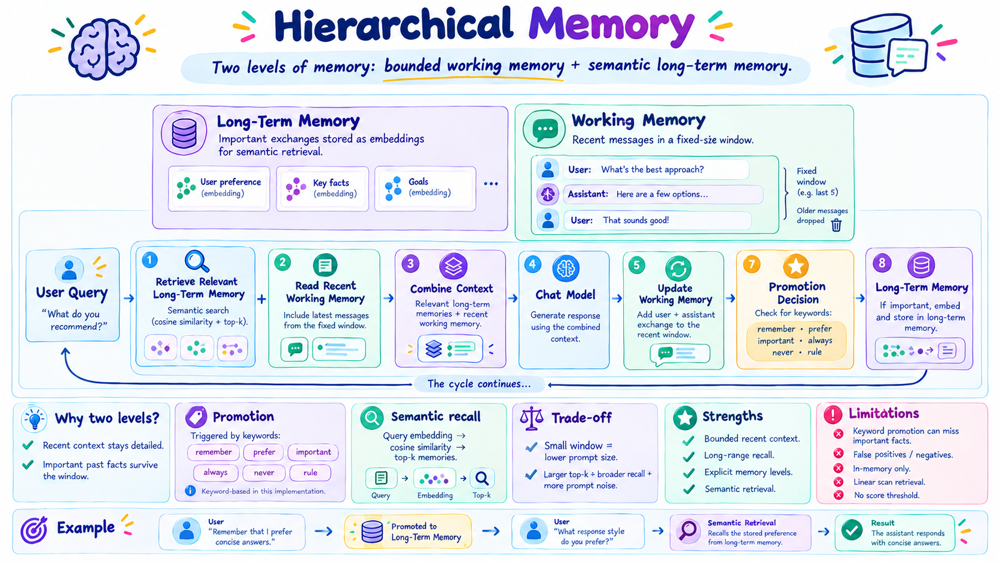
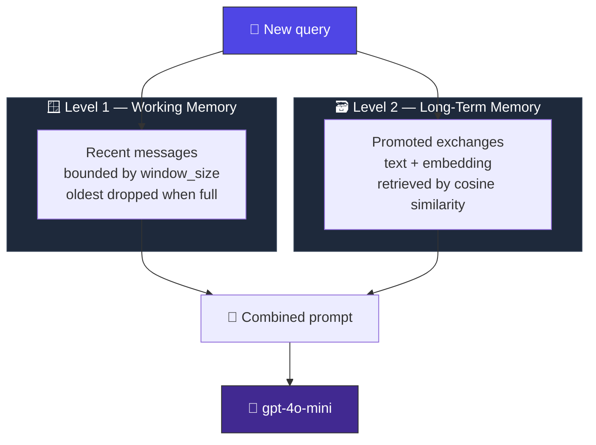
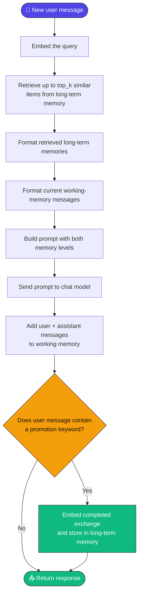
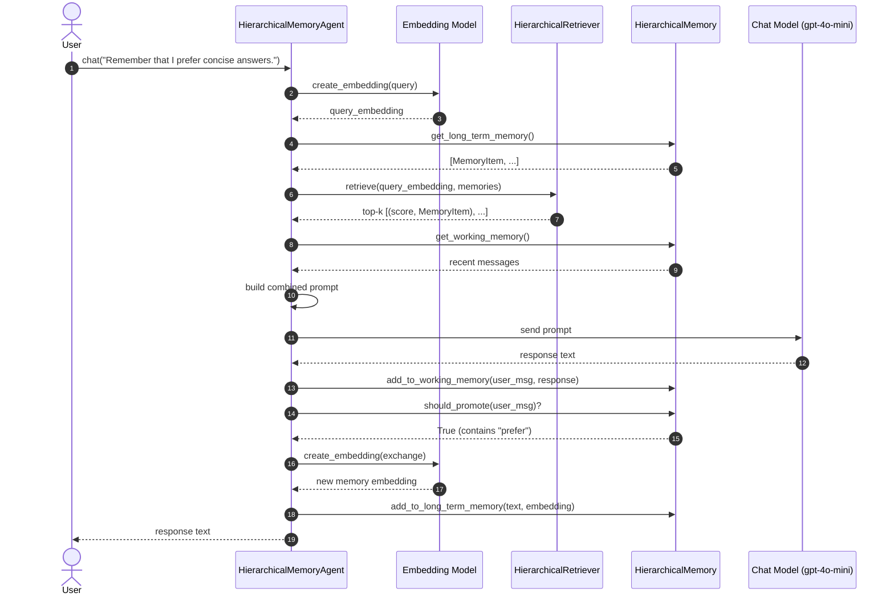
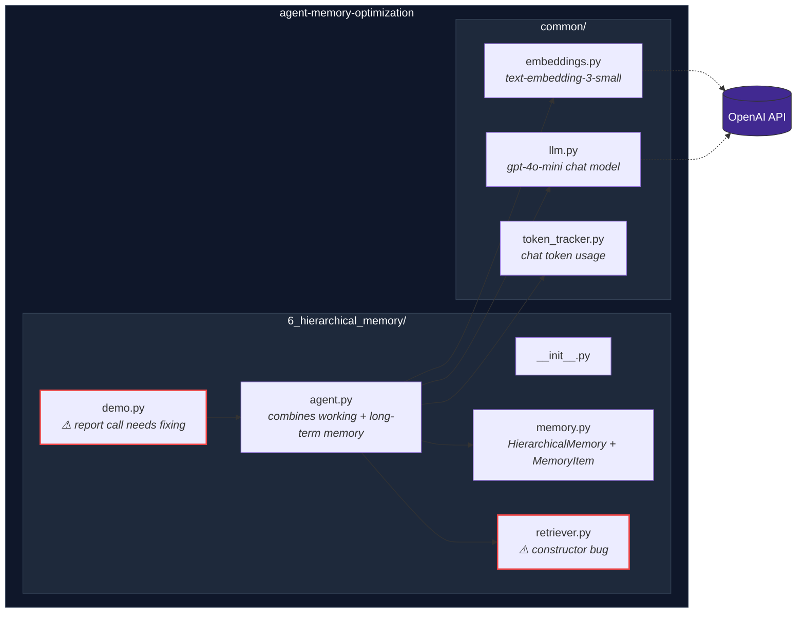
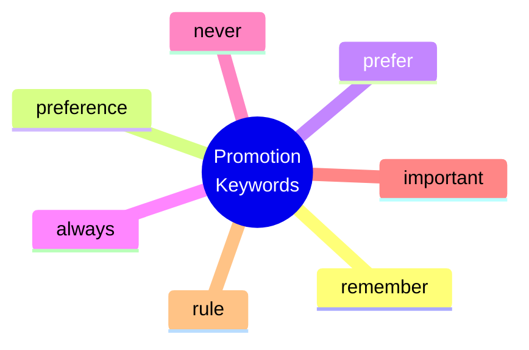
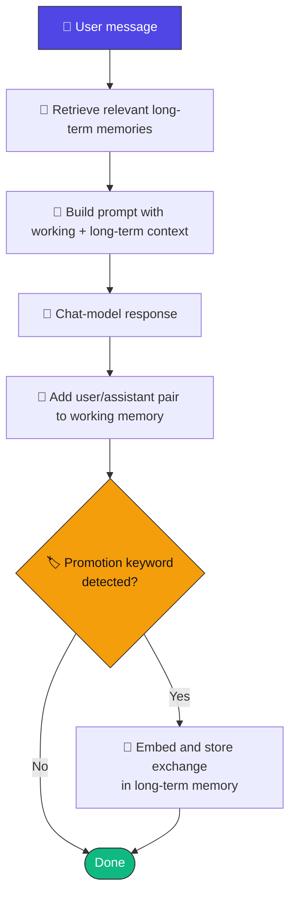
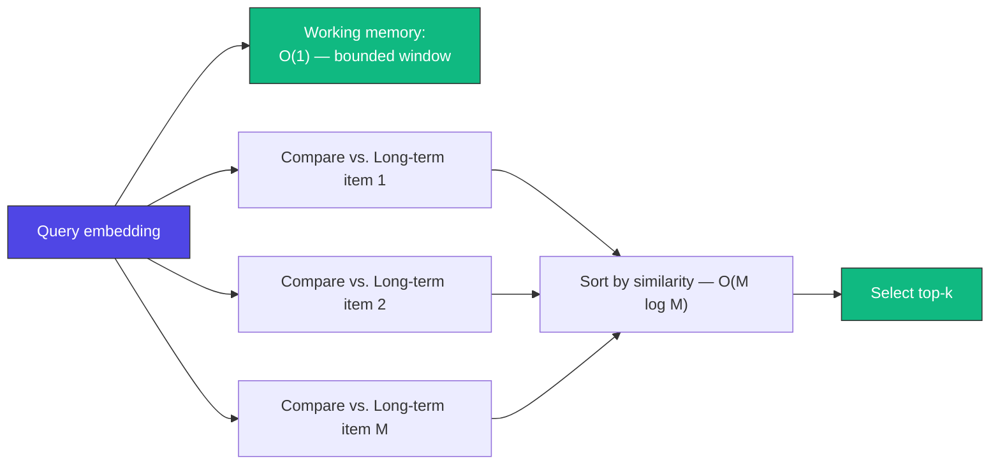
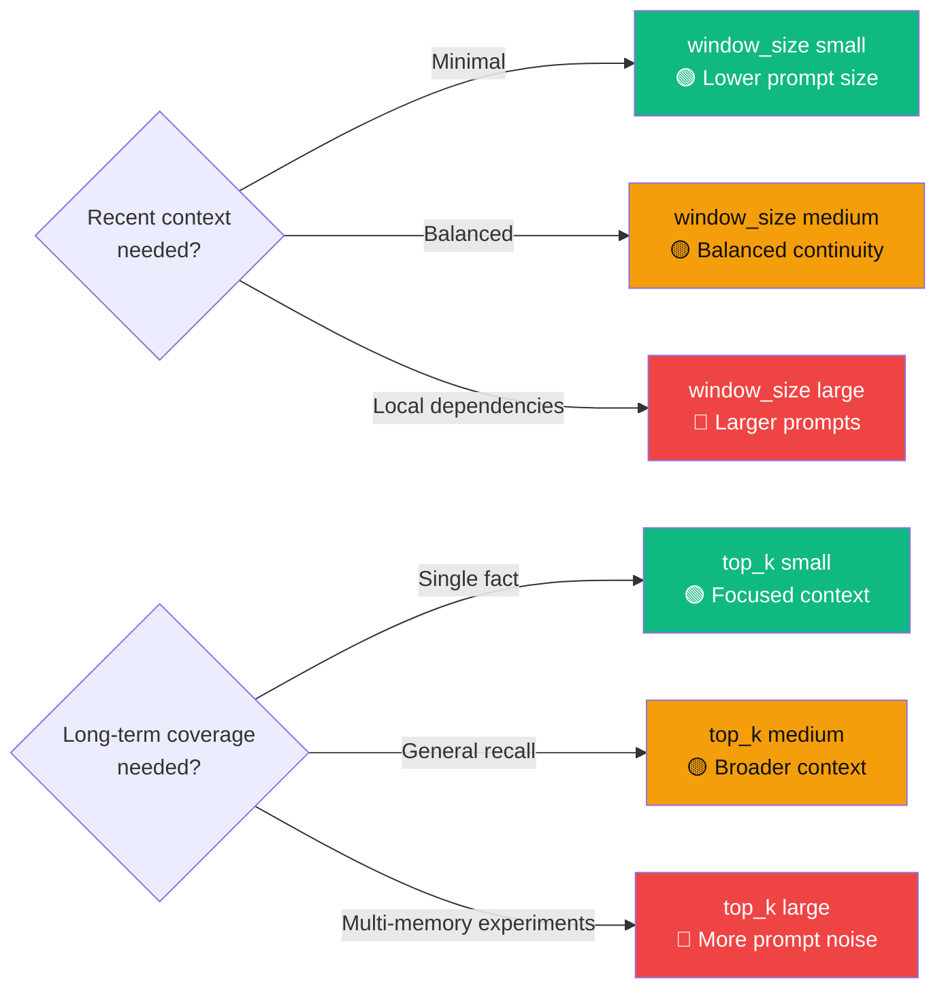
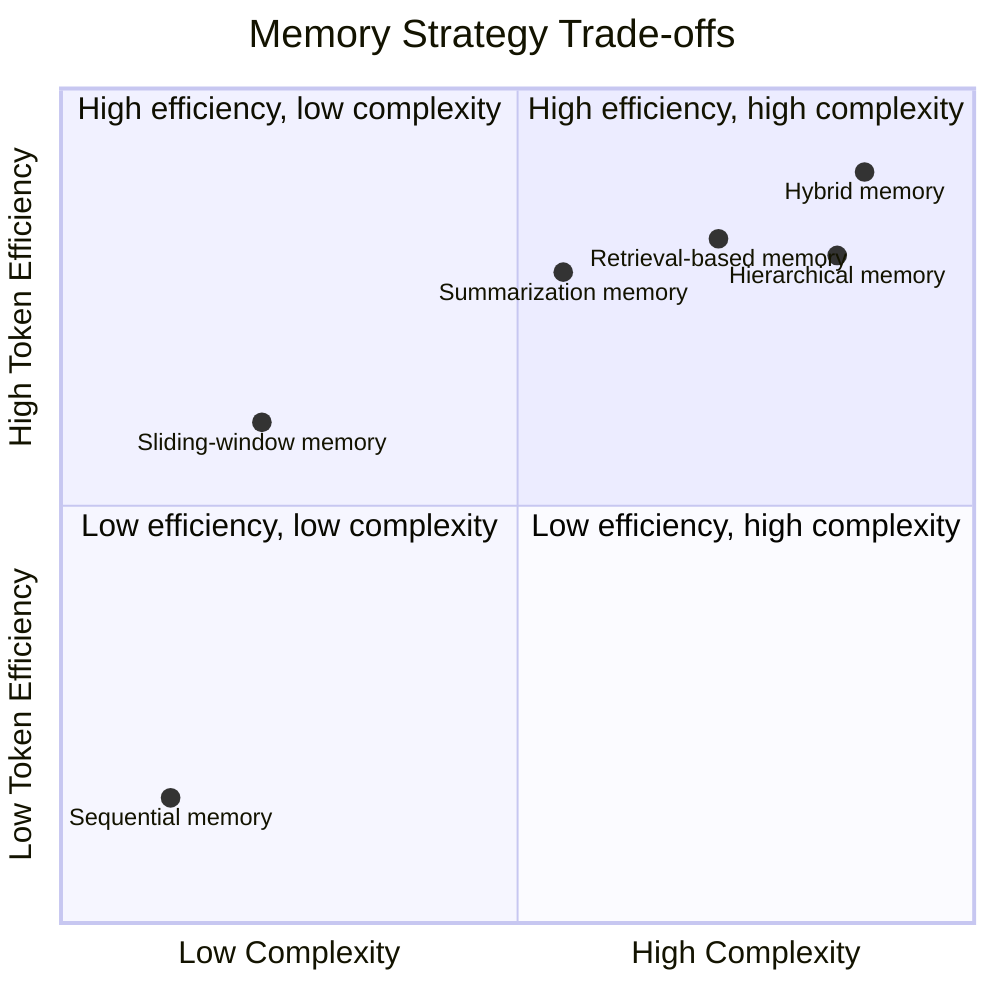

<div align="center">

# 🏛️ Hierarchical Memory

### Two levels of memory: bounded working memory + semantic long-term memory.

[](https://www.python.org/)
[](https://www.langchain.com/)
[](https://platform.openai.com/docs/guides/text-generation)
[](https://platform.openai.com/docs/guides/embeddings)
[](#-important-implementation-note)
[](#-license)

*Part of the [Agent Memory Optimization](https://github.com/paras160500/agent-memory-optimization) project.*




</div>

---

## 🚨 Important Implementation Note

> **The current `retriever.py` has a constructor bug that crashes agent creation.**

```python
# ❌ Current code — self.top_k is never actually assigned from the argument
class HierarchicalRetriever:
    def __init__(self, top_k: int = 3):
        self.top_k = self.top_k   # AttributeError: self.top_k doesn't exist yet
```

**The fix:**

```python
# ✅ Fixed code
class HierarchicalRetriever:
    def __init__(self, top_k: int = 3):
        self.top_k = top_k
```

Without this one-line fix, **`HierarchicalMemoryAgent` cannot even be instantiated**.

**A second, non-blocking issue** lives in the demo:

```python
# ❌ Current code — missing required argument
tracker.print_current_report()
```

```python
# ✅ Simplest fix
print(tracker.get_current_report())
```

*(Or pass the actual `messages` list used to build the prompt.)*

This README documents the intended architecture and calls out both source-level issues so they can be fixed before use.

---

## 📖 Table of Contents

- [Overview](#-overview)
- [How It Works](#️-how-it-works)
- [Architecture](#-architecture)
- [Prompt Construction](#-prompt-construction)
- [Promotion Rules](#-promotion-rules)
- [Memory Lifecycle](#-memory-lifecycle)
- [Characteristics](#-characteristics)
- [Advantages & Limitations](#️-advantages--limitations)
- [Project Structure](#-project-structure)
- [Requirements](#-requirements)
- [Installation](#-installation)
- [Required Fix Before Running](#-required-fix-before-running)
- [Running the Demo](#-running-the-demo)
- [Usage as a Python Module](#-usage-as-a-python-module)
- [Memory API](#-memory-api)
- [Retriever API](#-retriever-api)
- [Agent API](#-agent-api)
- [Complexity & Scaling](#-complexity--scaling)
- [Choosing `window_size` and `top_k`](#-choosing-window_size-and-top_k)
- [Comparison with Other Memory Strategies](#-comparison-with-other-memory-strategies)
- [When to Use Hierarchical Memory](#-when-to-use-hierarchical-memory)
- [Token & API Usage](#-token--api-usage)
- [Security & Privacy Notes](#-security--privacy-notes)
- [References](#-references)

---

## 🔍 Overview

**Hierarchical memory** combines a bounded **short-term working memory** with a **semantic long-term memory**. Recent turns stay in a fixed-size window; selected interactions get *promoted* to long-term memory when they appear important, and future queries can retrieve them by embedding similarity.

> 💡 **Core idea:** *Use recent messages for immediate context and semantic retrieval for important information from the past.*

---

## ⚙️ How It Works



### 🔁 Request Flow



### 🔁 Sequence of a Hierarchical Chat Turn



---

## 🏗️ Architecture



---

## 🧩 Prompt Construction

The agent builds a **single prompt** containing both memory levels:

```text
You are an AI assistant with hierarchical memory.
You have two memory levels.

LEVEL 1 - WORKING MEMORY
Recent conversation:
<recent messages>

LEVEL 2 - LONG-TERM MEMORY
Important information retrieved from previous conversations:
<top-k retrieved memories>

Use long-term memory only when relevant.
Use working memory for recent conversational context.
Current user request:
<current user message>
```

The working-memory section holds recent message dictionaries; the long-term section holds the text of retrieved `MemoryItem` objects. Similarity scores are used for **ranking only** and are not included in the prompt.

---

## 🏷️ Promotion Rules

Promotion is triggered by **substring matching**. Default keywords:



**These messages trigger promotion:**

```text
Remember that I prefer concise answers.
This is an important project rule.
I always want citations.
```

**These may NOT trigger promotion, even if important:**

```text
My customer ID is 12345.
I am working on a support application.
My preferred language is Python.
```

> ⚠️ This keyword policy is great for demonstrating hierarchical memory, but production applications should use a more reliable importance classifier, explicit user controls, or a combination of rules and model-based evaluation.

---

## 🔄 Memory Lifecycle



**Working memory** updates after *every* response. **Long-term memory** updates only when the promotion rule returns `True`.

> 📝 The working-memory window counts individual message entries. Since each response adds two entries, a `window_size` of `4` usually retains ~two complete user/assistant exchanges — though trimming can split a pair depending on the sequence.

---

## 📊 Characteristics

| Aspect | Behavior |
| --- | --- |
| 🧩 Memory strategy | Bounded working memory plus semantic long-term memory |
| 🪟 Working-memory default | `4` individual messages |
| 🔎 Long-term retrieval default | Top `3` memories |
| 🏷️ Promotion mechanism | Keyword matching in the user message |
| 📐 Similarity metric | Cosine similarity |
| 🧮 Embedding model | `text-embedding-3-small` |
| 📏 Embedding dimensions | `1536` |
| 🤖 Chat model | `gpt-4o-mini` |
| 💾 Storage | In-memory Python lists |
| ⏳ Persistence | None; all memory lost when the process ends |
| 🎯 Best suited for | Learning, prototypes, systems needing recent + important context |

---

## ⚖️ Advantages & Limitations

<table>
<tr>
<td valign="top" width="50%">

### ✅ Advantages

- **Two kinds of context** — recent dialogue and selected long-term info are handled separately
- **Bounded recent context** — working memory can't grow indefinitely
- **Long-range recall** — promoted info stays retrievable after leaving working memory
- **Inspectable promotion logic** — the keyword policy is easy to understand and modify
- **Semantic long-term retrieval** — related queries can surface older memories despite reworded phrasing
- **Extensible architecture** — promotion can later become a classifier or model-based decision

</td>
<td valign="top" width="50%">

### ⚠️ Limitations

- 🐛 **Blocking retriever bug** — `self.top_k = self.top_k` must become `self.top_k = top_k`
- **Keyword-only promotion** — important info without a keyword is never promoted
- **False positives/negatives** — a keyword isn't proof of durable importance, and vice versa
- **Working-memory truncation** — older recent messages get dropped past the window
- **Linear retrieval** — every long-term memory is compared with every query
- **In-memory only** — no database, vector index, persistence, or cross-session memory
- **No score threshold** — up to `top_k` results returned even when similarity is weak
- **Formatting gap** — the working-memory formatter concatenates role/content without a separator
- 🐛 **Demo token-report bug** — `print_current_report()` is missing its required argument

</td>
</tr>
</table>

---

## 📁 Project Structure

```
6_hierarchical_memory/
├── __init__.py
├── agent.py        # Combines working and long-term memory in the prompt
├── demo.py         # Interactive command-line demonstration
├── memory.py       # HierarchicalMemory and MemoryItem classes
└── retriever.py    # Cosine-similarity long-term retrieval
```

The agent also uses shared modules from the repository root:

```
common/
├── embeddings.py    # Configures text-embedding-3-small
├── llm.py           # Configures the gpt-4o-mini chat model
└── token_tracker.py # Estimates and reports chat-model token usage
```

---

## 📋 Requirements

- 🐍 Python 3.9 or later
- 🔑 An OpenAI API key
- 📦 The dependencies listed in the repository's `requirements.txt`
- 🌐 Network access for embedding and chat-model requests

The implementation uses [LangChain](https://www.langchain.com/) for model integrations and [NumPy](https://numpy.org/) for cosine-similarity calculations.

---

## 🚀 Installation

**1. Clone the repository and move into its root directory:**

```bash
git clone https://github.com/paras160500/agent-memory-optimization.git
cd agent-memory-optimization
```

**2. Create and activate a virtual environment:**

```bash
python -m venv .venv
source .venv/bin/activate
```

> On Windows PowerShell:
> ```powershell
> .venv\Scripts\Activate.ps1
> ```

**3. Install the project dependencies:**

```bash
pip install -r requirements.txt
```

**4. Create a `.env` file in the repository root:**

```
OPENAI_API_KEY=your_openai_api_key_here
```

The shared configuration uses this key for **both** the chat model and the embedding model.

---

## 🛠️ Required Fix Before Running

Fix the retriever constructor in `6_hierarchical_memory/retriever.py`:

```python
class HierarchicalRetriever:
    def __init__(self, top_k: int = 3):
        self.top_k = top_k
```

The current implementation assigns `self.top_k` from itself, which raises an error because the instance attribute doesn't exist yet.

For a cleaner working-memory prompt, you may also update the formatter in `agent.py`:

```python
working_context += (
    f"{message['role'].capitalize()}: "
    f"{message['content']}\n"
)
```

---

## ▶️ Running the Demo

Run the demo from the repository root using the package/import arrangement supported by the repository:

```bash
python -m 6_hierarchical_memory.demo
```

> ⚠️ **Note:** Because `6_hierarchical_memory` begins with a number, some Python environments do not accept it as a conventional module name. If module execution fails, rename the directory to a valid package identifier such as `hierarchical_memory`, update imports if needed, and run `python -m hierarchical_memory.demo`.

The demo is intended to use:

- 🪟 A working-memory window of `4` messages
- 🔎 Top-`3` long-term retrieval

It prints the working-memory count and long-term-memory count after each interaction. Enter `exit` or `quit` to stop the session.

### 🛠️ Demo token-report fix

The current demo contains:

```python
tracker.print_current_report()
```

The shared `TokenTracker` requires a `messages` argument. The simplest safe replacement is:

```python
print(tracker.get_current_report())
```

Alternatively, pass the `messages` list used to construct the prompt.

---

## 🐍 Usage as a Python Module

After renaming the directory to a Python-valid package name and applying the retriever fix:

```python
from hierarchical_memory.agent import HierarchicalMemoryAgent

agent = HierarchicalMemoryAgent(window_size=4, top_k=3)

print(agent.chat("My name is Alex."))
print(agent.chat("Remember that I prefer concise answers."))
print(agent.chat("What response style do I prefer?"))
```

The second message contains the default keyword `prefer`, so the completed exchange is promoted to long-term memory. A later semantically related query can retrieve it.

**Configure the working-memory window and long-term retrieval count:**

```python
agent = HierarchicalMemoryAgent(window_size=6, top_k=5)
```

**Inspect both memory levels:**

```python
memory = agent.get_memory()

print("Working memory:")
for message in memory.get_working_memory():
    print(message)

print("Long-term memory:")
for item in memory.get_long_term_memory():
    print(item.memory_type)
    print(item.text)
```

**Clear both memory levels and reset token statistics:**

```python
agent.clear_memory()
```

---

## 🧠 Memory API

**`MemoryItem`** — a dataclass for a long-term memory item:

| Field | Type | Description |
| --- | --- | --- |
| `text` | `str` | Stored exchange or fact |
| `embedding` | `list[float]` | Vector used for retrieval |
| `memory_type` | `str` | Label such as `important_fact` |

| Method | Description |
| --- | --- |
| `HierarchicalMemory(window_size: int = 4, top_k: int = 3)` | Creates an empty hierarchical memory with a bounded working-memory list and empty long-term list |
| `add_to_working_memory(user_message, ai_message)` | Adds a user/assistant pair; trims to `window_size` if exceeded |
| `add_to_long_term_memory(text, embedding, memory_type="important_fact")` | Creates and stores a long-term `MemoryItem` |
| `should_promote(user_message: str) -> bool` | `True` when the lowercased message contains a promotion keyword |
| `get_working_memory() -> list` | Returns current working-memory entries (`role`/`content` dicts) |
| `get_long_term_memory() -> list` | Returns all stored long-term memory items |
| `working_count() -> int` | Number of working-memory messages currently stored |
| `long_term_count() -> int` | Number of long-term memory items currently stored |
| `clear()` | Clears both working memory and long-term memory |

> 📝 `top_k` is stored on this class, but retrieval is actually performed by the separate `HierarchicalRetriever` instance used by the agent.

---

## 🎯 Retriever API

| Method | Description |
| --- | --- |
| `HierarchicalRetriever(top_k: int = 3)` | Creates a retriever returning at most `top_k` long-term items — **apply the constructor fix first** |
| `cosine_similarity(query_embedding, memory_embedding) -> float` | Computes cosine similarity; returns `0.0` for zero-magnitude vectors |
| `retrieve(query_embedding, memories) -> list` | Scores every long-term memory, sorts descending, returns `[(similarity_score, memory_item), ...]` capped at `top_k` |

---

## 🤖 Agent API

`HierarchicalMemoryAgent(window_size: int = 4, top_k: int = 3)` creates an agent with:

- 🤖 The shared `gpt-4o-mini` chat model
- 🧮 The shared `text-embedding-3-small` embedding model
- 🏛️ A `HierarchicalMemory` instance
- 🎯 A `HierarchicalRetriever` for long-term memory
- 🔢 A `TokenTracker` configured for `gpt-4o-mini`

> 🐛 The retriever constructor must be fixed before the agent can be created successfully.

| Method | Description |
| --- | --- |
| `create_embedding(text: str)` | Creates an embedding using the configured OpenAI embedding model |
| `chat(user_message: str) -> str` | Embeds the query, retrieves relevant long-term memories, builds a two-level prompt, calls the chat model, stores the response in working memory, optionally promotes the exchange, and returns the response |
| `get_memory()` | Returns the `HierarchicalMemory` instance |
| `get_token_tracker()` | Returns the token tracker for current and cumulative chat-model usage |
| `clear_memory()` | Clears both memory levels and resets token statistics |

---

## 📈 Complexity & Scaling

Working-memory updates are bounded by the configured window size. Long-term retrieval uses a **full scan** over `M` stored memories, with approximately `O(M × D)` similarity work for embedding dimension `D`, followed by sorting.



Each promoted exchange requires an **additional embedding request**. Query embeddings are created for *every* chat request, even when long-term memory is empty.

> 🔧 For larger applications: replace the Python list with a persistent vector index, add metadata filters and namespaces, use approximate nearest-neighbor search, and add retention or deletion policies.

---

## 🎚️ Choosing `window_size` and `top_k`



| Configuration | Effect | Suitable for |
| --- | --- | --- |
| Small `window_size` | Lower prompt size, less recent context | Short command-style interactions |
| Medium `window_size` | Balanced recent continuity | General prototypes |
| Large `window_size` | More recent detail, larger prompts | Conversations with local dependencies |
| Small `top_k` | Focused long-term context | Single-fact recall |
| Medium `top_k` | Broader historical context | General semantic recall |
| Large `top_k` | More coverage, more prompt noise | Experiments requiring multiple memories |

The best values depend on message length, how often users refer to older information, and your cost/latency budget.

---

## 🔬 Comparison with Other Memory Strategies



| Strategy | Recent context | Long-range recall | Selection method | Complexity | Typical use case |
| --- | --- | --- | --- | --- | --- |
| Sequential memory | Complete history | Excellent until context limits | No selection | 🟢 Low | Short demos and debugging |
| Sliding-window memory | Bounded recent history | 🔴 Low | Recency | 🟢 Low | Recent conversational continuity |
| Summarization memory | Recent raw messages | 🟡 Moderate | Generated summary | 🟡 Medium | Long conversations with compressed history |
| Retrieval-based memory | Query-selected history | 🟢 High | Semantic similarity | 🟡 Medium–High | Topic and fact recall |
| **Hierarchical memory** | Bounded recent history | 🟢 High for promoted facts | Keyword promotion + semantic retrieval | 🔴 High | Recent plus important context |

> 📝 Hierarchical memory combines the strengths of recency and semantic retrieval, but its quality depends heavily on the **promotion policy** and **long-term retrieval implementation**.

---

## 🎯 When to Use Hierarchical Memory

**Good fit when:**
- ✅ Recent conversation should remain immediately available
- ✅ Some facts, preferences, and rules should survive beyond the recent window
- ✅ You want an explicit distinction between short-term and long-term memory
- ✅ You're prototyping memory promotion and retrieval policies
- ✅ You can later replace keyword promotion and list-based search with production components

**Consider a different strategy when:**
- ❌ Older information isn't needed at all → a **sliding window** is simpler
- ❌ The entire conversation should compress into one coherent narrative → **summarization**
- ❌ Every exchange should be searchable without a promotion decision → **retrieval memory**

---

## 🔢 Token & API Usage

A normal interaction can involve:

1. 🧮 One embedding request for the user query
2. 🤖 One chat-model request for the working-plus-long-term prompt
3. 🧮 An additional embedding request when the exchange is promoted to long-term memory

> ⚠️ The `TokenTracker` estimates the prompt sent to the chat model and records chat-model usage metadata when available. It does **not** track embedding usage. The current demo's `print_current_report()` call is invalid because the method requires a `messages` argument (see [fix above](#️-demo-token-report-fix)).

For production cost accounting, track chat and embedding requests **separately** and include provider usage metadata where available.

---

## 🔒 Security & Privacy Notes

> ⚠️ Both working memory and long-term memory may contain personal or confidential information. **Long-term memory is especially important to protect**, since promoted facts can remain available for the entire process lifetime.

Before production use, add:

- 🔐 Authentication and authorization
- 🏢 Tenant isolation
- 🗓️ Retention rules and deletion controls
- 🔒 Encryption and persistent-storage safeguards
- 📝 Audit logging

Do not send confidential or personally identifiable information to an external model provider unless your application is designed and approved to handle it.

Calling `clear_memory()` removes the local in-memory data but does **not** undo content already sent to an external model provider or stored under provider policies.

---

## 📄 License

Refer to the [root repository](https://github.com/paras160500/agent-memory-optimization) for the project's license and contribution guidelines.

---

## 🔗 References

| # | Resource |
| --- | --- |
| 1 | [Agent Memory Optimization repository](https://github.com/paras160500/agent-memory-optimization) |
| 2 | [`HierarchicalMemory` implementation](https://github.com/paras160500/agent-memory-optimization/blob/main/6_hierarchical_memory/memory.py) |
| 3 | [`HierarchicalRetriever` implementation](https://github.com/paras160500/agent-memory-optimization/blob/main/6_hierarchical_memory/retriever.py) |
| 4 | [`HierarchicalMemoryAgent` implementation](https://github.com/paras160500/agent-memory-optimization/blob/main/6_hierarchical_memory/agent.py) |
| 5 | [Hierarchical memory interactive demo](https://github.com/paras160500/agent-memory-optimization/blob/main/6_hierarchical_memory/demo.py) |
| 6 | [LangChain official website](https://www.langchain.com/) |
| 7 | [OpenAI embeddings documentation](https://platform.openai.com/docs/guides/embeddings) |
| 8 | [OpenAI text generation documentation](https://platform.openai.com/docs/guides/text-generation) |

<div align="center">

---

**⭐ Part of the [Agent Memory Optimization](https://github.com/paras160500/agent-memory-optimization) project ⭐**

</div>