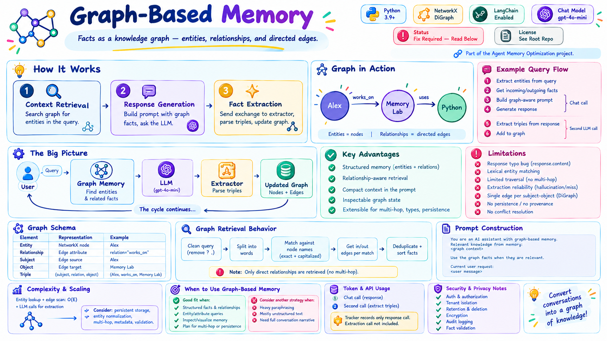
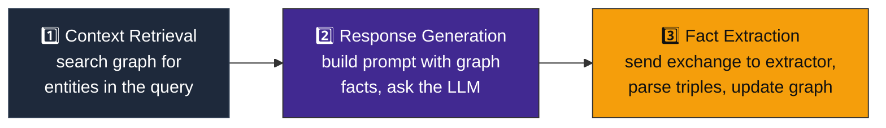
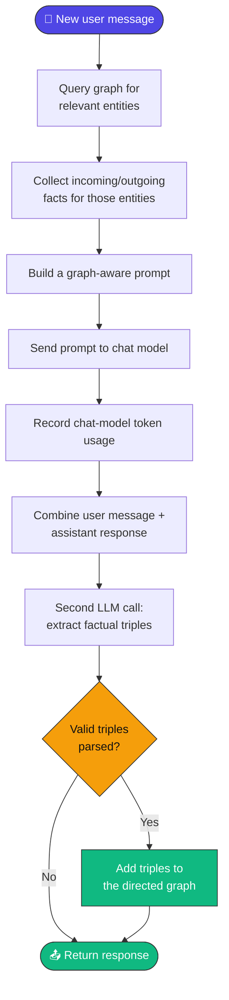
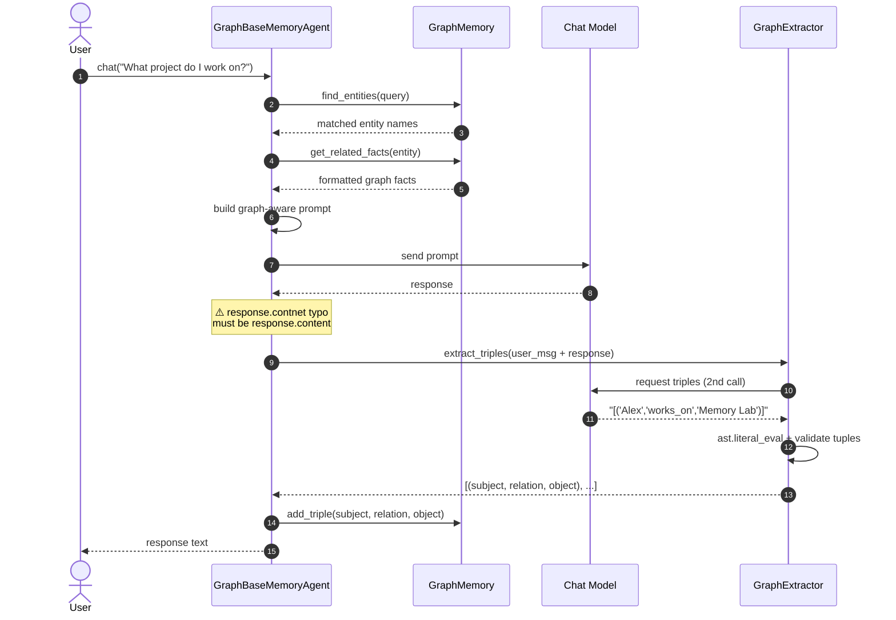
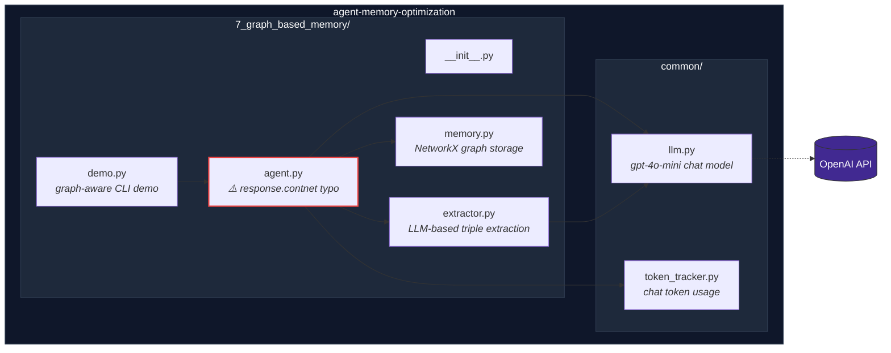
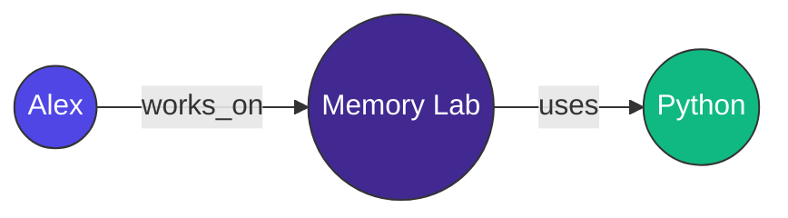
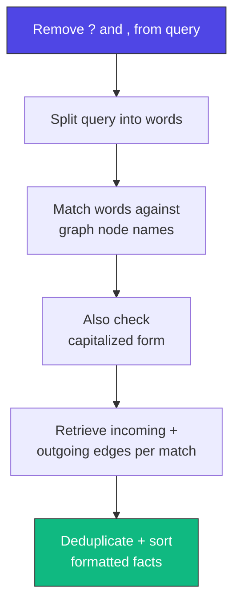
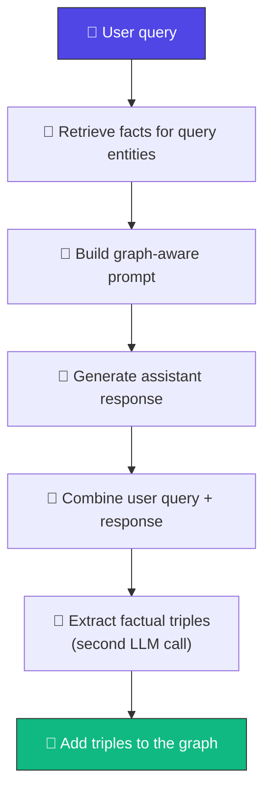
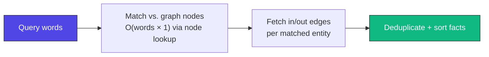
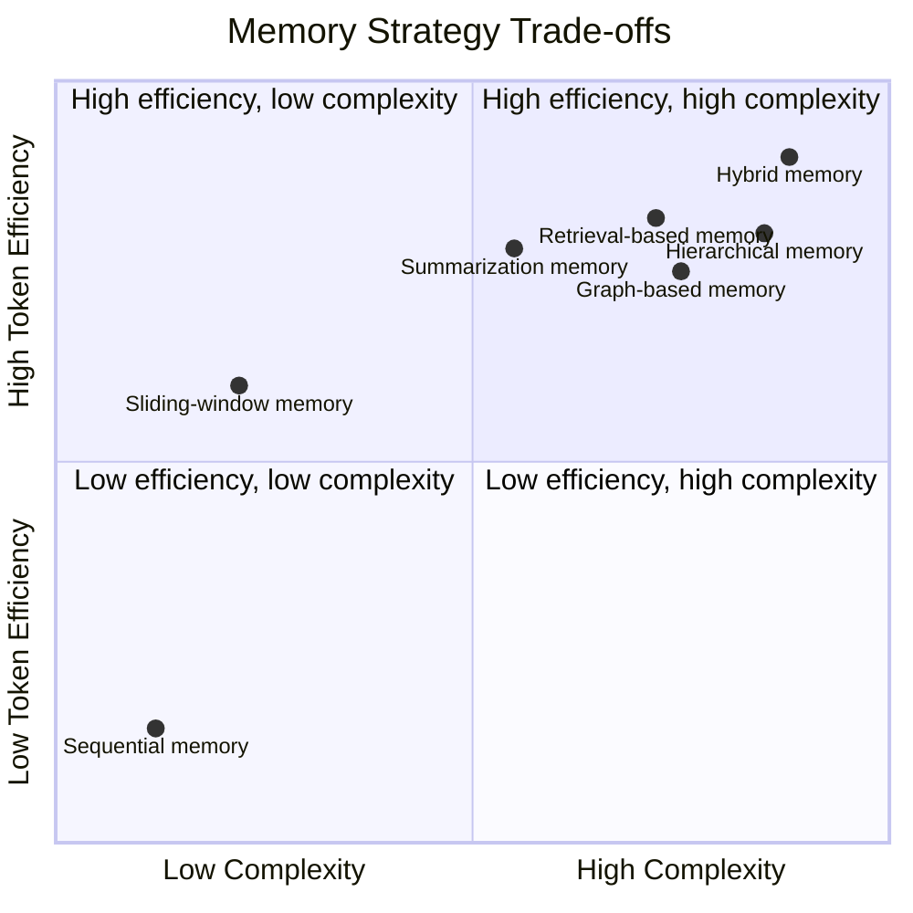

<div align="center">

# 🕸️ Graph-Based Memory

### Facts as a knowledge graph — entities, relationships, and directed edges.

[](https://www.python.org/)
[](https://networkx.org/)
[](https://www.langchain.com/)
[](https://platform.openai.com/docs/guides/text-generation)
[](#-important-implementation-note)
[](#-license)

*Part of the [Agent Memory Optimization](https://github.com/paras160500/agent-memory-optimization) project.*



</div>

---


## 📖 Table of Contents

- [Overview](#-overview)
- [How It Works](#️-how-it-works)
- [Architecture](#-architecture)
- [Graph Schema](#-graph-schema)
- [Graph Retrieval Behavior](#-graph-retrieval-behavior)
- [Prompt Construction](#-prompt-construction)
- [Memory Lifecycle](#-memory-lifecycle)
- [Characteristics](#-characteristics)
- [Advantages & Limitations](#️-advantages--limitations)
- [Project Structure](#-project-structure)
- [Requirements](#-requirements)
- [Installation](#-installation)
- [Required Fix Before Running](#-required-fix-before-running)
- [Running the Demo](#-running-the-demo)
- [Usage as a Python Module](#-usage-as-a-python-module)
- [Memory API](#-memory-api)
- [Extractor API](#-extractor-api)
- [Agent API](#-agent-api)
- [Complexity & Scaling](#-complexity--scaling)
- [Comparison with Other Memory Strategies](#-comparison-with-other-memory-strategies)
- [When to Use Graph-Based Memory](#-when-to-use-graph-based-memory)
- [Token & API Usage](#-token--api-usage)
- [Security & Privacy Notes](#-security--privacy-notes)
- [References](#-references)

---

## 🔍 Overview

**Graph-based memory** extracts factual relationships from each interaction and stores them as directed **subject–relation–object** triples in a knowledge graph — instead of retaining the full conversation transcript.

> 💡 **Core idea:** *Convert conversation facts into a graph so related information can be retrieved through entities and relationships.*

When a user asks a question, the agent identifies graph entities mentioned in the query, retrieves their incoming and outgoing relationships, and supplies the resulting facts to the language model.

---

## ⚙️ How It Works

The system has **three main stages**:



### 🔁 Request Flow



> 📝 The graph stores entities as **nodes** and relationships as **directed edges**. Because the implementation uses `nx.DiGraph`, adding the same subject–object edge again **updates** its `relation` attribute rather than creating a parallel edge.

### 🔁 Sequence of a Graph-Aware Chat Turn



---

## 🏗️ Architecture



---

## 🗺️ Graph Schema

| Graph element | Representation | Example |
| --- | --- | --- |
| Entity | NetworkX node | `Alex` |
| Relationship | Directed edge attribute | `relation="works_on"` |
| Subject | Edge source | `Alex` |
| Object | Edge target | `Memory Lab` |
| Triple | Subject, relation, object | `Alex, works_on, Memory Lab` |

**Example graph after two extracted triples:**



> ⚠️ Because the implementation uses `nx.DiGraph`, **two relationships between the same subject and object share one edge**. Adding a later triple with the same endpoints can silently replace the existing `relation` attribute. Use `nx.MultiDiGraph` if parallel relationships must be preserved.

---

## 🔎 Graph Retrieval Behavior

Retrieval is **entity-driven**, not embedding-driven:



Given these triples:

```python
memory.add_triple("Alex", "works_on", "Memory Lab")
memory.add_triple("Memory Lab", "uses", "Python")
```

A query containing `Alex` retrieves:

```text
Alex --[works_on]--> Memory Lab
```

> ⚠️ It does **not** automatically traverse from `Alex` through `Memory Lab` to also surface the `uses → Python` relationship. Multi-hop traversal would need to be added explicitly.

---

## 🧩 Prompt Construction

```text
You are an AI assistant with graph-based memory.
Relevant knowledge from memory:
<graph context>
Use the graph facts when they are relevant.
Current user request:
<user message>
```

Graph facts are formatted from direct relationships attached to entities found in the query. The prompt does **not** include the complete graph, similarity scores, extraction history, or provenance metadata.

**Possible `get_context()` outputs:**

| Situation | Output |
| --- | --- |
| Empty graph | `Knowledge graph is empty.` |
| No matching entities | `No relevant entities were found in the knowledge graph` |
| Matching entities found | `### Facts Retrievedfrom knowledge Graph:`<br/>`Alex --[works_on]--> AI Memory Project` |

---

## 🔄 Memory Lifecycle



> 📝 The graph updates **after** the response, so newly extracted facts are available to *later* queries — not to the request that created them.

---

## 📊 Characteristics

| Aspect | Behavior |
| --- | --- |
| 🧩 Memory strategy | Entity–relationship knowledge graph |
| 📦 Stored unit | Directed `(subject, relation, object)` triple |
| 🕸️ Graph type | NetworkX `DiGraph` |
| 🔎 Query matching | Exact word matching against node names, with capitalization fallback |
| 🔗 Retrieval | Incoming and outgoing edges for matched entities |
| 🧩 Fact extraction | Separate LLM call returning a Python list of tuples |
| 🤖 Chat model | `gpt-4o-mini` |
| ⏳ Persistence | None; graph is stored in memory only |
| 🔢 Token monitoring | Tracks the response-model context and usage metadata |
| 🎯 Best suited for | Structured facts, entity relationships, graph-memory experiments |

---

## ⚖️ Advantages & Limitations

<table>
<tr>
<td valign="top" width="50%">

### ✅ Advantages

- **Structured memory** — facts as explicit entities/relationships, not raw transcript
- **Relationship-aware retrieval** — pulls facts connected via incoming/outgoing edges
- **Compact context** — prompt holds selected graph facts, not full history
- **Inspectable state** — nodes, edges, relations, counts all directly viewable
- **Extensible foundation** — room for multi-hop traversal, typed entities, metadata, persistence

</td>
<td valign="top" width="50%">

### ⚠️ Limitations

- 🐛 **Response typo bug** — `response.contnet` → `response.content`
- **Lexical entity matching** — synonyms/paraphrases may miss the entity
- **Limited traversal** — only direct edges, no multi-hop neighborhoods
- **Extraction reliability** — a second LLM call can hallucinate or miss triples
- **Strict parser format** — only accepts a Python list of 3-tuples
- **Edge overwriting** — `DiGraph` allows one edge per subject–object pair
- **No persistence** — the graph disappears at process end
- **No provenance** — triples don't record source message, time, or confidence
- **No conflict resolution** — contradictory facts stored without validation

</td>
</tr>
</table>

---

## 📁 Project Structure

```
7_graph_based_memory/
├── __init__.py
├── agent.py        # Graph-aware chat agent
├── demo.py         # Interactive command-line demonstration
├── extractor.py    # LLM-based triple extraction
└── memory.py       # NetworkX graph storage and context retrieval
```

The agent also uses shared modules from the repository root:

```
common/
├── llm.py           # Configures the gpt-4o-mini chat model
└── token_tracker.py # Estimates and reports chat-model token usage
```

---

## 📋 Requirements

- 🐍 Python 3.9 or later
- 🔑 An OpenAI API key
- 📦 The dependencies listed in the repository's `requirements.txt`
- 🌐 Network access for language-model requests

The implementation uses [NetworkX](https://networkx.org/) for graph storage and [LangChain](https://www.langchain.com/) for model integration.

---

## 🚀 Installation

**1. Clone the repository and move into its root directory:**

```bash
git clone https://github.com/paras160500/agent-memory-optimization.git
cd agent-memory-optimization
```

**2. Create and activate a virtual environment:**

```bash
python -m venv .venv
source .venv/bin/activate
```

> On Windows PowerShell:
> ```powershell
> .venv\Scripts\Activate.ps1
> ```

**3. Install the project dependencies:**

```bash
pip install -r requirements.txt
```

**4. Create a `.env` file in the repository root:**

```
OPENAI_API_KEY=your_openai_api_key_here
```

The shared LLM helper loads this value and creates a deterministic `gpt-4o-mini` chat model with `temperature=0`.

---

## 🛠️ Required Fix Before Running

Update the assistant-response field in `7_graph_based_memory/agent.py`:

```python
memory_text = (
    f"User : {user_message}\n"
    f"Assistant : {response.content}"
)
```

The current source uses `response.contnet`, which does not exist on a normal LangChain response object.

---

## ▶️ Running the Demo

Run the demo from the repository root using the package/import arrangement supported by the repository:

```bash
python -m 7_graph_based_memory.demo
```

> ⚠️ **Note:** Because `7_graph_based_memory` begins with a number, some Python environments do not accept it as a conventional module name. If module execution fails, rename the directory to a valid package identifier such as `graph_based_memory`, update imports if needed, and run `python -m graph_based_memory.demo`.

The demo starts an interactive chat session. Enter `exit` or `quit` to stop.

```text
============================================================
GRAPH-BASED MEMORY
============================================================

Type 'exit' to stop
```

After each response, the demo prints the graph's node count and relationship count. The agent also prints extracted triples as they are added.

---

## 🐍 Usage as a Python Module

After applying the response typo fix and renaming the directory to a Python-valid package name if necessary:

```python
from graph_based_memory.agent import GraphBaseMemoryAgent

agent = GraphBaseMemoryAgent()

print(agent.chat("My name is Alex and I work on an AI memory project."))
print(agent.chat("What project do I work on?"))
```

The first interaction is sent to the extractor, which may produce triples such as:

```python
[
    ("Alex", "works_on", "AI memory project")
]
```

The second query can retrieve facts if the graph contains a node matching one of the query words.

**Inspect graph state:**

```python
memory = agent.get_memory()

print(f"Nodes: {memory.node_count()}")
print(f"Relationships: {memory.edge_count()}")

print(memory.get_related_facts("Alex"))
```

**Clear the graph and reset token statistics:**

```python
agent.clear_memory()
```

---

## 🧠 Memory API

| Method | Description |
| --- | --- |
| `GraphMemory()` | Creates an empty directed NetworkX graph |
| `add_triple(subject, relation, obj)` | Adds a directed edge with the supplied `relation` attribute; strings are stripped before insertion |
| `get_related_facts(entity: str) -> list[str]` | Returns formatted facts for outgoing and incoming edges connected to the entity |
| `find_entities(query: str) -> list[str]` | Splits query into words, strips basic punctuation, returns exact node-name matches (checks capitalized form too) |
| `get_context(query: str) -> str` | Builds prompt-ready graph context (see [outputs table](#-prompt-construction)) |
| `node_count() -> int` | Number of graph nodes |
| `edge_count() -> int` | Number of graph relationships |
| `clear()` | Removes every node and edge from the graph |

**Example:**

```python
memory.add_triple("Alex", "works_on", "AI Memory Project")
# Creates: Alex --[works_on]--> AI Memory Project
```

---

## 🧩 Extractor API

| Method | Description |
| --- | --- |
| `GraphExtractor()` | Creates an extractor using the shared chat model |
| `extract_triples(text: str) -> list[tuple]` | Asks the model for a Python list of `("subject", "relation", "object")` tuples; parses with `ast.literal_eval`; keeps only valid 3-tuples; returns `[]` on parse failure |

**The extractor prompt preserves facts such as:**

- 👤 People and their projects
- 🛠️ Tools and technologies
- 🎯 Preferences and properties
- 🔗 Relationships between entities

> ⚠️ The extractor is **not** a guaranteed fact verifier — its output should be validated before use in a production knowledge graph.

---

## 🤖 Agent API

`GraphBaseMemoryAgent()` creates an agent with:

- 🤖 The shared `gpt-4o-mini` chat model
- 🕸️ A `GraphMemory` instance
- 🧩 A `GraphExtractor` instance
- 🔢 A `TokenTracker` configured for `gpt-4o-mini`

| Method | Description |
| --- | --- |
| `chat(user_message: str) -> str` | Retrieves graph context, calls the chat model, extracts triples, adds valid ones to the graph, and returns the response |
| `get_memory()` | Returns the `GraphMemory` instance |
| `get_token_tracker()` | Returns the token tracker for response-model context and cumulative usage |
| `clear_memory()` | Clears the graph and resets token statistics |

> 🐛 Apply the `response.content` typo fix before using `chat()`.

---

## 📈 Complexity & Scaling

Entity lookup scans the query words and checks graph-node membership. Fact retrieval scans direct incoming/outgoing edges for each matched entity.



Triple extraction adds a **separate language-model request** after each chat response. The graph itself lives in memory — no database or external graph service.

**For larger knowledge graphs, consider:**

- 🗄️ Persistent graph storage (Neo4j or a database-backed graph)
- 🔗 Entity normalization and alias resolution
- 🕸️ Multi-hop traversal with depth limits
- 🏷️ Relation and entity types
- 📝 Provenance, timestamps, and confidence scores
- ⚖️ Contradiction detection and fact updates
- ✅ Validation pipelines before accepting extracted triples
- 🔍 Query parsing or entity linking beyond exact word matching

---

## 🔬 Comparison with Other Memory Strategies



| Strategy | Memory representation | Retrieval method | Long-range recall | Complexity | Typical use case |
| --- | --- | --- | --- | --- | --- |
| Sequential memory | Full transcript | Chronological | Excellent until context limits | 🟢 Low | Short demos and debugging |
| Sliding-window memory | Recent messages | Recency | 🔴 Low | 🟢 Low | Recent conversational continuity |
| Summarization memory | Summary + recent messages | Generated compression | 🟡 Moderate | 🟡 Medium | Long conversations with condensed history |
| Retrieval-based memory | Embedded exchanges | Semantic similarity | 🟢 High for similar text | 🟡 Medium–High | Topic and fact recall |
| Hierarchical memory | Working memory + promoted vectors | Recency + semantic retrieval | 🟢 High for promoted facts | 🔴 High | Recent plus important context |
| **Graph-based memory** | Entities and relations | Entity lookup + graph traversal | 🟢 High for represented relationships | 🟡 Medium–High | Structured facts and relationship queries |

> 📝 Graph-based memory is especially useful when the **relationships between entities** matter more than the exact wording of the original conversation.

---

## 🎯 When to Use Graph-Based Memory

**Good fit when:**
- ✅ Conversations contain structured facts and relationships
- ✅ Users ask about entities, attributes, ownership, projects, or dependencies
- ✅ The application benefits from explicit subject–relation–object representations
- ✅ You want to inspect or visualize memory as a graph
- ✅ You plan to add entity linking, multi-hop reasoning, or a persistent graph database later

**Consider a different strategy when:**
- ❌ Queries use heavy paraphrasing → **embedding-based retrieval** handles wording variation better
- ❌ Memory is mostly unstructured text → embedding retrieval is a better fit
- ❌ The conversation should be preserved as a narrative → **summarization**

Graph memory requires more extraction and schema discipline, but delivers clearer relationship-aware retrieval in return.

---

## 🔢 Token & API Usage

Each user interaction can involve:

1. 🤖 One chat-model request to answer the current user query
2. 🧩 One additional chat-model request to extract triples from the completed interaction

> ⚠️ The `TokenTracker` records usage passed from the **response-model call only**. The extractor uses the shared LLM separately and does **not** pass its usage to the agent's tracker — total reported usage may undercount the true session cost.
>
> The demo's `print_current_report([])` call reports zero messages and does not represent the actual graph-aware prompt. For accurate context reporting, pass the constructed `messages` list or expose it through the agent.

For production cost accounting, track response generation and triple extraction **separately**.

---

## 🔒 Security & Privacy Notes

> ⚠️ Graph nodes, edge labels, and extracted facts may contain personal or confidential information. The extractor also sends the **complete** user/assistant interaction to the model provider for analysis.

Before production use, add:

- 🔐 Authentication and authorization
- 🏢 Tenant isolation
- 🗓️ Retention policies and deletion controls
- 🔒 Encryption
- 📝 Provenance and audit logging
- ✅ Fact-validation safeguards

Do not send confidential or personally identifiable information to an external model provider unless your application is designed and approved to handle it.

Calling `clear_memory()` removes the local graph but does **not** undo content already sent to an external model provider or stored under provider policies.

---

## 📄 License

Refer to the [root repository](https://github.com/paras160500/agent-memory-optimization) for the project's license and contribution guidelines.

---

## 🔗 References

| # | Resource |
| --- | --- |
| 1 | [Agent Memory Optimization repository](https://github.com/paras160500/agent-memory-optimization) |
| 2 | [`GraphMemory` implementation](https://github.com/paras160500/agent-memory-optimization/blob/main/7_graph_based_memory/memory.py) |
| 3 | [`GraphExtractor` implementation](https://github.com/paras160500/agent-memory-optimization/blob/main/7_graph_based_memory/extractor.py) |
| 4 | [`GraphBaseMemoryAgent` implementation](https://github.com/paras160500/agent-memory-optimization/blob/main/7_graph_based_memory/agent.py) |
| 5 | [Graph-based memory interactive demo](https://github.com/paras160500/agent-memory-optimization/blob/main/7_graph_based_memory/demo.py) |
| 6 | [NetworkX official website](https://networkx.org/) |
| 7 | [LangChain official website](https://www.langchain.com/) |
| 8 | [OpenAI text generation documentation](https://platform.openai.com/docs/guides/text-generation) |

<div align="center">

---

**⭐ Part of the [Agent Memory Optimization](https://github.com/paras160500/agent-memory-optimization) project ⭐**

</div>