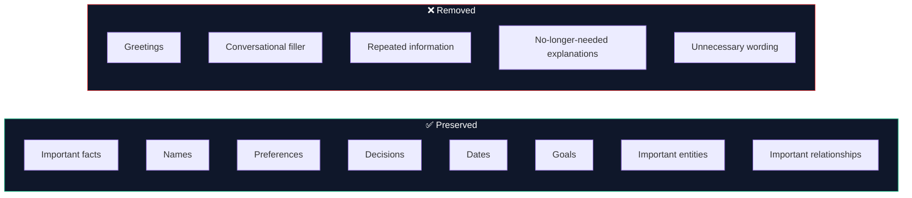
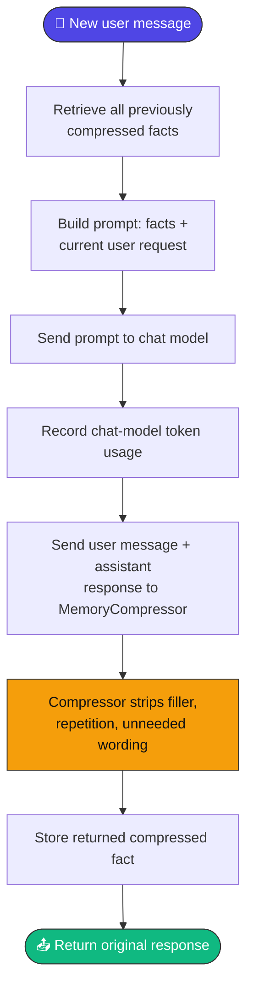
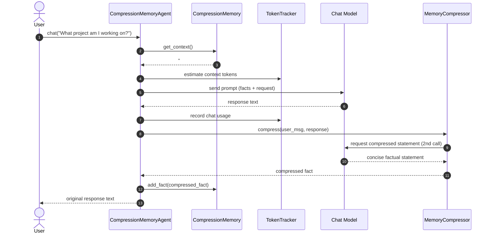
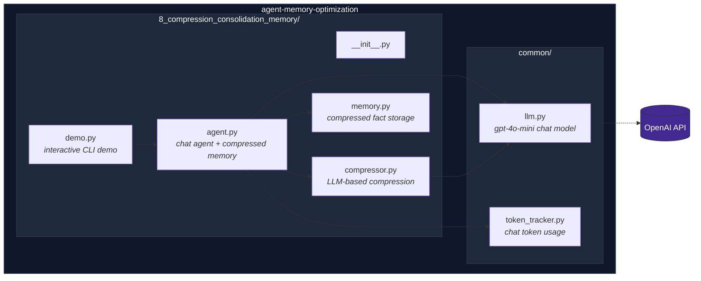
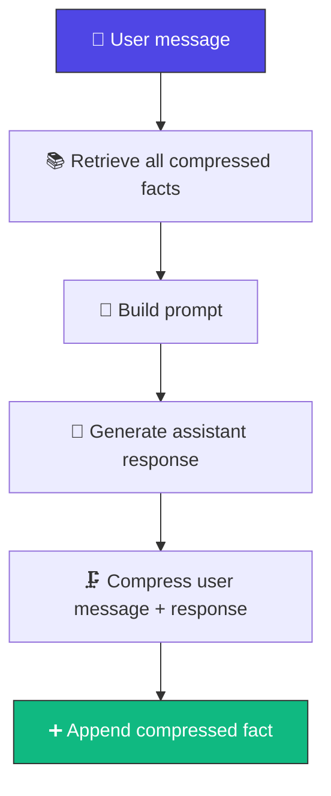
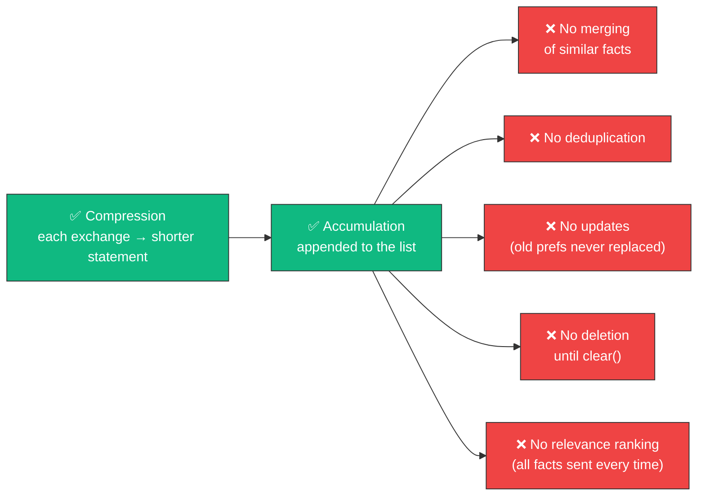
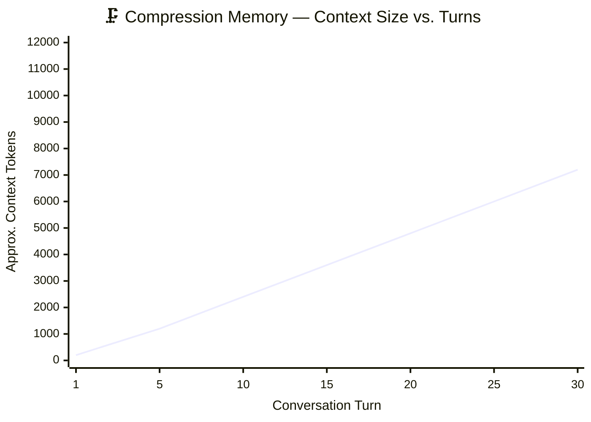
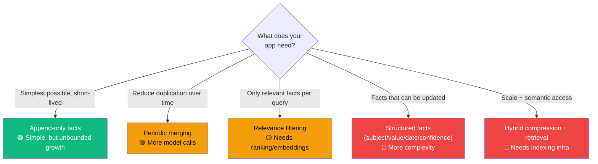

<div align="center">

# 🗜️ Compression & Consolidation Memory

### Turn every exchange into a dense factual statement — not a transcript.

[](https://www.python.org/)
[](https://www.langchain.com/)
[](https://platform.openai.com/docs/guides/text-generation)
[-F59E0B?style=for-the-badge)](#-compression-and-consolidation-semantics)
[](#-license)

*Part of the [Agent Memory Optimization](https://github.com/paras160500/agent-memory-optimization) project.*


</div>

---

## 📖 Table of Contents

- [Overview](#-overview)
- [What the Compressor Preserves](#-what-the-compressor-preserves)
- [How It Works](#️-how-it-works)
- [Architecture](#-architecture)
- [Prompt Construction](#-prompt-construction)
- [Memory Lifecycle](#-memory-lifecycle)
- [Compression and Consolidation Semantics](#-compression-and-consolidation-semantics)
- [Characteristics](#-characteristics)
- [Advantages & Limitations](#️-advantages--limitations)
- [Project Structure](#-project-structure)
- [Requirements](#-requirements)
- [Installation](#-installation)
- [Running the Demo](#-running-the-demo)
- [Usage as a Python Module](#-usage-as-a-python-module)
- [Memory API](#-memory-api)
- [Compressor API](#-compressor-api)
- [Agent API](#-agent-api)
- [Complexity & Scaling](#-complexity--scaling)
- [Choosing a Consolidation Strategy](#-choosing-a-consolidation-strategy)
- [Comparison with Other Memory Strategies](#-comparison-with-other-memory-strategies)
- [When to Use Compression and Consolidation Memory](#-when-to-use-compression-and-consolidation-memory)
- [Token & API Usage](#-token--api-usage)
- [Security & Privacy Notes](#-security--privacy-notes)
- [References](#-references)

---

## 🔍 Overview

**Compression and consolidation memory** converts each interaction into a **compact factual statement** before storing it for future context — instead of retaining complete user/assistant messages.

> 💡 **Core idea:** *Compress each conversation exchange into a dense factual memory and use the compressed memories in future prompts.*

A dedicated language-model call strips conversational filler and preserves the information that actually matters: facts, names, preferences, decisions, dates, goals, entities, and relationships.

---

## 🎯 What the Compressor Preserves



The compressor returns **only** the compressed factual statement — nothing else.

---

## ⚙️ How It Works



> 📝 The next request receives the **accumulated compressed facts** instead of the complete conversation transcript.

### 🔁 Sequence of a Compressed Chat Turn



---

## 🏗️ Architecture



---

## 🧩 Prompt Construction

```text
You are an AI assistant with compressed memory.

Previous compressed facts:

### Compressed Factual Memory:
-fact one
-fact two

Use these facts when relevant.

Current request:
<current user message>
```

> ⚠️ **Every** stored fact is included on every request. The current implementation does not rank facts, filter by relevance, or apply a token budget before sending the prompt.

`get_context()` returns `No compressed facts in memory` when the collection is empty.

---

## 🔄 Memory Lifecycle



The stored memory is a **list of independent strings**. There is no consolidation pass that combines several facts into one summary or replaces outdated facts.

---

## ⚗️ Compression and Consolidation Semantics

Despite the module's name, the current implementation performs **compression** but only **basic accumulation** for consolidation:



> 🔧 A production consolidation layer could periodically merge facts, resolve contradictions, assign confidence and timestamps, remove stale entries, and select only relevant facts for each prompt.

---

## 📊 Characteristics

| Aspect | Behavior |
| --- | --- |
| 🧩 Memory strategy | LLM-generated factual compression |
| 📦 Stored unit | One compressed fact per interaction |
| ⏱️ Compression timing | After every assistant response |
| 🔗 Consolidation behavior | Appends each fact to one collection; no dedup or merging currently implemented |
| 🔎 Retrieval | Includes **all** stored compressed facts in every subsequent prompt |
| 🤖 Chat model | `gpt-4o-mini` |
| 💾 Storage | In-memory Python list |
| ⏳ Persistence | None; facts lost when the process ends |
| 🔢 Token monitoring | Tracks the response-model context and usage metadata |
| 🎯 Best suited for | Long conversations where factual recall matters more than raw transcript detail |

---

## ⚖️ Advantages & Limitations

<table>
<tr>
<td valign="top" width="50%">

### ✅ Advantages

- **Compact memory representation** — each exchange becomes a shorter statement
- **Reduced conversational noise** — greetings, filler, repetition removed
- **Useful fact preservation** — compressor explicitly retains important info
- **Simple implementation** — no embeddings, vector DB, or graph storage needed
- **Human-readable memory** — stored facts are plain text, easy to inspect

</td>
<td valign="top" width="50%">

### ⚠️ Limitations

- **Information loss** — compression can omit details or misstate intent
- **Additional model call** — every interaction needs a separate compression request
- **Unbounded memory growth** — all facts are appended and resent forever
- **No actual consolidation** — no merging, dedup, updates, or caps
- **No relevance filtering** — every fact is sent regardless of relevance
- **No persistence** — memory disappears at process exit
- **Potential fact conflicts** — contradictions accumulate with no resolution
- **Separate usage accounting** — compression-model usage isn't tracked

</td>
</tr>
</table>

---

## 📁 Project Structure

```
8_compression_consolidation_memory/
├── __init__.py
├── agent.py        # Chat agent using compressed factual memory
├── compressor.py   # LLM-based conversation compression
├── demo.py         # Interactive command-line demonstration
└── memory.py       # Compressed fact storage and context formatting
```

The agent also uses shared modules from the repository root:

```
common/
├── llm.py           # Configures the gpt-4o-mini chat model
└── token_tracker.py # Estimates and reports chat-model token usage
```

---

## 📋 Requirements

- 🐍 Python 3.9 or later
- 🔑 An OpenAI API key
- 📦 The dependencies listed in the repository's `requirements.txt`
- 🌐 Network access for language-model requests

The implementation uses [LangChain](https://www.langchain.com/) for model integration.

---

## 🚀 Installation

**1. Clone the repository and move into its root directory:**

```bash
git clone https://github.com/paras160500/agent-memory-optimization.git
cd agent-memory-optimization
```

**2. Create and activate a virtual environment:**

```bash
python -m venv .venv
source .venv/bin/activate
```

> On Windows PowerShell:
> ```powershell
> .venv\Scripts\Activate.ps1
> ```

**3. Install the project dependencies:**

```bash
pip install -r requirements.txt
```

**4. Create a `.env` file in the repository root:**

```
OPENAI_API_KEY=your_openai_api_key_here
```

The shared LLM helper loads this value and creates a deterministic `gpt-4o-mini` chat model with `temperature=0`.

---

## ▶️ Running the Demo

Run the demo from the repository root using the package/import arrangement supported by the repository:

```bash
python -m 8_compression_consolidation_memory.demo
```

> ⚠️ **Note:** Because `8_compression_consolidation_memory` begins with a number, some Python environments do not accept it as a conventional module name. If module execution fails, rename the directory to a valid package identifier such as `compression_consolidation_memory`, update imports if needed, and run `python -m compression_consolidation_memory.demo`.

The demo starts an interactive chat session:

```text
============================================================
COMPRESSION & CONSOLIDATION MEMORY
============================================================

Memory type: Dense factual compression
LLM: gpt-4o-mini

Type 'exit' to stop.
```

Enter `exit` or `quit` to stop. After every interaction, the demo prints the newly compressed fact and the number of facts currently stored.

> ⚠️ **Note:** The current demo calls `tracker.print_current_report([])`, so its current-context report is based on an empty list rather than the actual prompt. Use `tracker.get_current_report()` or pass the constructed message list for accurate reporting.

---

## 🐍 Usage as a Python Module

After renaming the directory to a Python-valid package name if necessary:

```python
from compression_consolidation_memory.agent import CompressionMemoryAgent

agent = CompressionMemoryAgent()

print(agent.chat("My name is Alex and I am building a customer-support bot."))
print(agent.chat("What project am I working on?"))
```

The second request receives the compressed factual memories created from earlier exchanges.

**Inspect stored compressed facts:**

```python
memory = agent.get_memory()

print(f"Stored facts: {memory.count()}")

for fact in memory.get_facts():
    print(f"- {fact}")
```

**Clear all compressed facts and reset token statistics:**

```python
agent.clear_memory()
```

**Inspect token statistics:**

```python
tracker = agent.get_token_tracker()

print(tracker.get_current_report())
print(tracker.get_total_report())
```

---

## 🧠 Memory API

| Method | Description |
| --- | --- |
| `CompressionMemory()` | Creates an empty collection of compressed factual statements |
| `add_fact(compressed_fact: str)` | Appends a compressed fact to the collection |
| `get_facts() -> list[str]` | Returns every stored compressed fact in insertion order |
| `get_context() -> str` | Returns prompt-ready memory context (`"No compressed facts in memory"` if empty) |
| `count() -> int` | Returns the number of stored compressed facts |
| `clear()` | Removes every compressed fact |

---

## 🗜️ Compressor API

| Method | Description |
| --- | --- |
| `MemoryCompressor()` | Creates a compressor using the shared `gpt-4o-mini` configuration |
| `compress(user_message, ai_message) -> str` | Combines the exchange, sends it to the compression prompt, and returns the stripped response text |

> ⚠️ The method does **not** validate the output, enforce a maximum length, deduplicate facts, or preserve structured metadata.

---

## 🤖 Agent API

`CompressionMemoryAgent()` creates an agent with:

- 🤖 The shared `gpt-4o-mini` chat model
- 🗜️ A `CompressionMemory` instance
- ✍️ A `MemoryCompressor` instance
- 🔢 A `TokenTracker` configured for `gpt-4o-mini`

| Method | Description |
| --- | --- |
| `chat(user_message: str) -> str` | Retrieves compressed context, calls the chat model, compresses the completed exchange, stores the new fact, and returns the original assistant response |
| `get_memory()` | Returns the `CompressionMemory` instance |
| `get_token_tracker()` | Returns the token tracker for current and cumulative chat-model usage |
| `clear_memory()` | Clears all compressed facts and resets token statistics |

> 📝 The compressor runs **after** the response is generated — the current interaction's compressed fact is available only to later requests.

---

## 📈 Complexity & Scaling

Let `F` be the number of stored facts and `L` the average fact length. Constructing the memory context is approximately `O(F × L)`, since every fact is joined into the prompt on every request.



> 📝 Each interaction needs **one chat-model request plus one compression-model request**. The prompt still grows as facts accumulate — but should grow more slowly than a raw transcript if compression is effective, since filler and repetition are stripped before storage.

**For longer-running applications, consider:**

- 🔢 A maximum number of facts
- 🔁 Periodic consolidation into a smaller set
- 🔎 Relevance retrieval or embeddings
- 🧹 Fact deduplication
- 🗓️ Timestamps and confidence scores
- 🎛️ Explicit user-controlled memory deletion
- 🗄️ Persistent storage with retention policies

---

## 🎚️ Choosing a Consolidation Strategy



| Strategy | Behavior | Benefits | Trade-offs |
| --- | --- | --- | --- |
| Append-only facts *(current)* | Store every compressed fact | Simplest, preserves more source material | Memory and prompts grow indefinitely |
| Periodic merging | Combine several facts on a schedule | Reduces duplication and prompt size | Extra model calls, may lose detail |
| Relevance filtering | Include only facts related to the query | Controls prompt size | Requires ranking or embeddings |
| Structured facts | Store fields like subject, value, date, confidence | Supports updates and conflict resolution | More implementation complexity |
| Hybrid compression + retrieval | Compress facts, then retrieve relevant ones | Scales better, preserves semantic access | Requires indexing and retrieval infra |

---

## 🔬 Comparison with Other Memory Strategies


| Strategy | Stored representation | Retrieval behavior | Long-range recall | Token efficiency | Complexity |
| --- | --- | --- | --- | --- | --- |
| Sequential memory | Full transcript | Sends everything | Excellent until context limits | 🔴 Low | 🟢 Low |
| Sliding-window memory | Recent messages | Recency-based | 🔴 Low | 🟡 Medium–High | 🟢 Low |
| Summarization memory | Summary + recent messages | Generated compression | 🟡 Moderate | 🟢 High | 🟡 Medium |
| Retrieval-based memory | Embedded exchanges | Semantic similarity | 🟢 High for related text | 🟢 High | 🟡 Medium–High |
| Graph-based memory | Entities and relations | Entity and graph lookup | 🟢 High for represented relationships | 🟢 High | 🟡 Medium–High |
| **Compression memory** | Compressed factual statements | Sends all compressed facts | 🟡 Moderate–High | 🟡 Higher than raw history, but unbounded | 🟢 Low–Medium |

---

## 🎯 When to Use Compression and Consolidation Memory

**Good fit when:**
- ✅ The application mainly needs factual recall, not exact dialogue
- ✅ You want a simple, human-readable memory format
- ✅ Removing conversational filler can meaningfully shrink context size
- ✅ You're prototyping compression before adding retrieval or structured storage
- ✅ An additional compression model call is acceptable

**Consider a different strategy when:**
- ❌ The conversation needs one coherent narrative → **summarization**
- ❌ Only relevant historical facts should enter the prompt → **retrieval memory**
- ❌ Explicit relationships and multi-hop queries are central → **graph memory**

---

## 🔢 Token & API Usage

Each user interaction can involve:

1. 🤖 One chat-model request to answer the current request
2. 🗜️ One additional chat-model request to compress the completed exchange

> ⚠️ The agent's `TokenTracker` estimates and records usage for the **response-model call only**. The compressor uses the shared LLM independently and does **not** pass its usage to the agent tracker — the tracker may undercount true session cost.
>
> The demo's `print_current_report([])` call reports an empty context rather than the actual prompt. For accurate context reporting, pass the prompt message list or expose it from the agent.

For production cost accounting, track response generation and compression requests **separately**.

---

## 🔒 Security & Privacy Notes

> ⚠️ Compressed facts may contain personal, confidential, or sensitive information **even after** conversational filler is removed. Compression is **not** anonymization and should not be treated as a privacy filter.

Before production use, add:

- 🔐 Authentication and authorization
- 🗓️ Retention policies and deletion controls
- 🔒 Encryption and persistence safeguards
- 📝 Audit logging
- 🎛️ Ways for users to inspect, correct, or delete stored facts

Do not send confidential or personally identifiable information to an external model provider unless your application is designed and approved to handle it.

Calling `clear_memory()` removes the local in-memory facts but does **not** undo content already sent to an external model provider or stored under provider policies.

---

## 📄 License

Refer to the [root repository](https://github.com/paras160500/agent-memory-optimization) for the project's license and contribution guidelines.

---

## 🔗 References

| # | Resource |
| --- | --- |
| 1 | [Agent Memory Optimization repository](https://github.com/paras160500/agent-memory-optimization) |
| 2 | [`CompressionMemory` implementation](https://github.com/paras160500/agent-memory-optimization/blob/main/8_compression_consolidation_memory/memory.py) |
| 3 | [`MemoryCompressor` implementation](https://github.com/paras160500/agent-memory-optimization/blob/main/8_compression_consolidation_memory/compressor.py) |
| 4 | [`CompressionMemoryAgent` implementation](https://github.com/paras160500/agent-memory-optimization/blob/main/8_compression_consolidation_memory/agent.py) |
| 5 | [Compression and consolidation memory interactive demo](https://github.com/paras160500/agent-memory-optimization/blob/main/8_compression_consolidation_memory/demo.py) |
| 6 | [LangChain official website](https://www.langchain.com/) |
| 7 | [OpenAI text generation documentation](https://platform.openai.com/docs/guides/text-generation) |

<div align="center">

---

**⭐ Part of the [Agent Memory Optimization](https://github.com/paras160500/agent-memory-optimization) project ⭐**

</div>