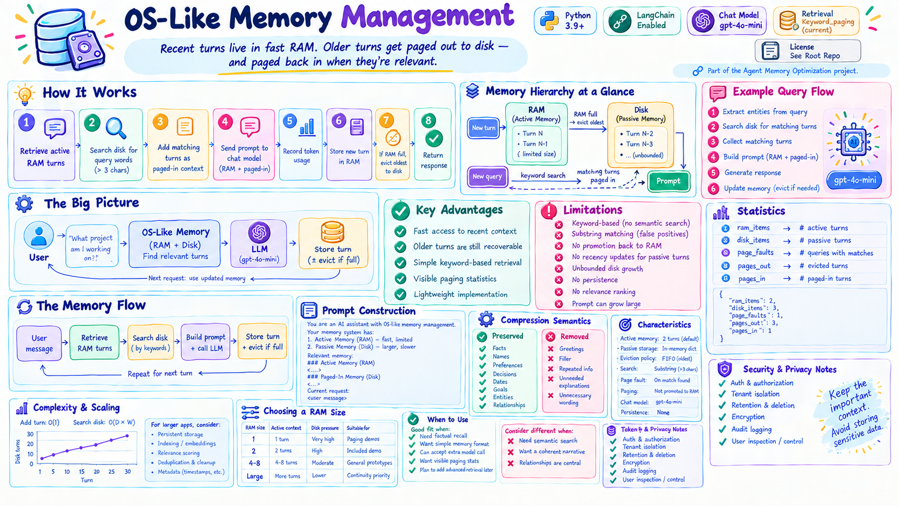
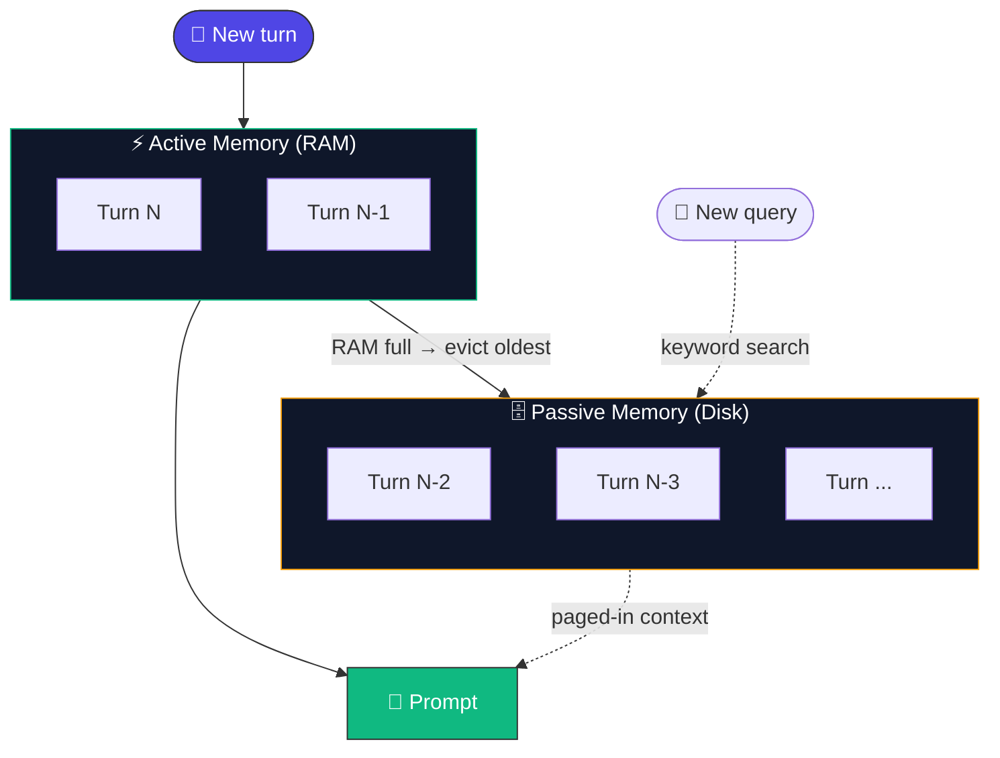
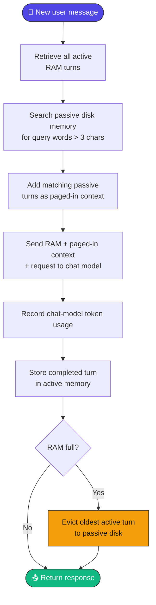
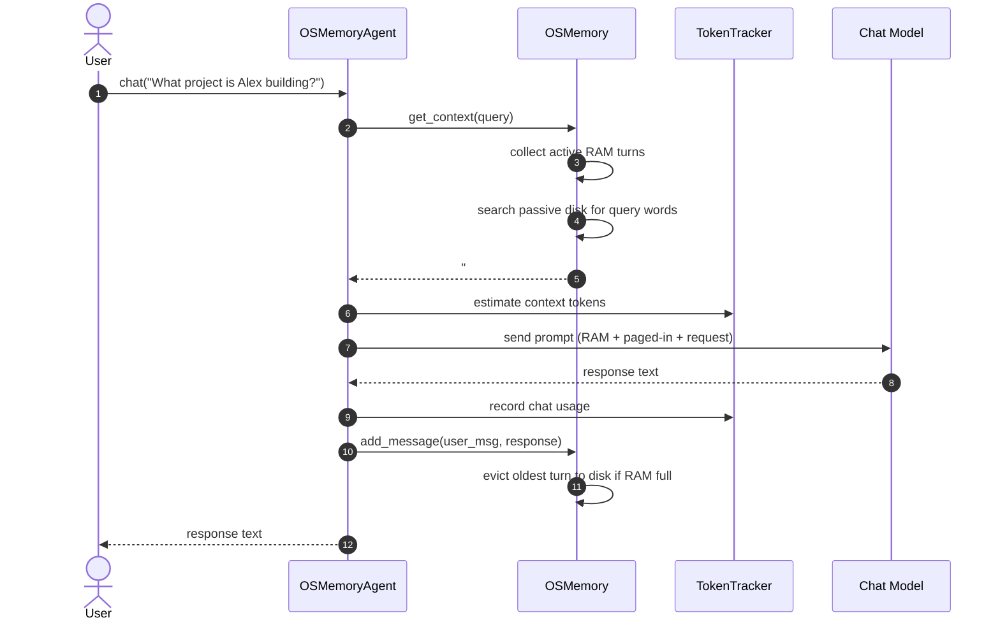
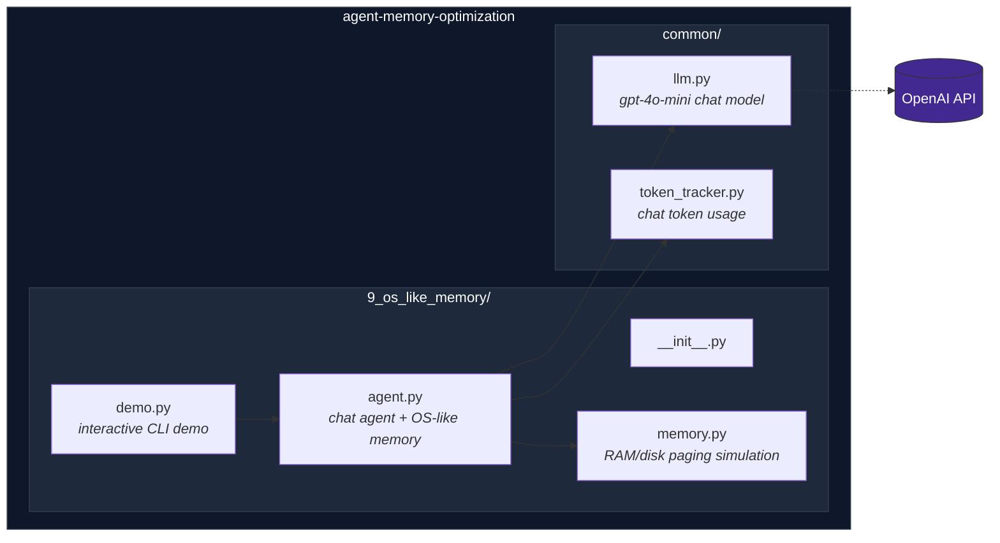
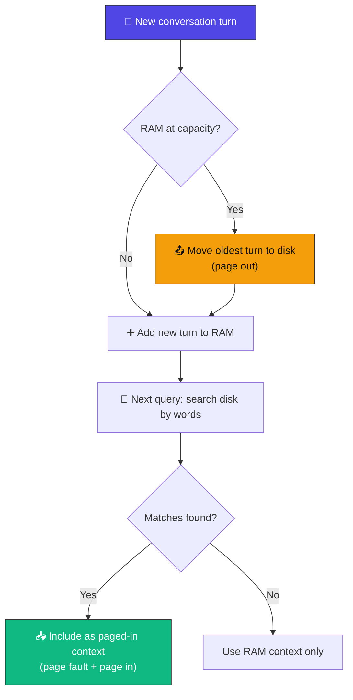
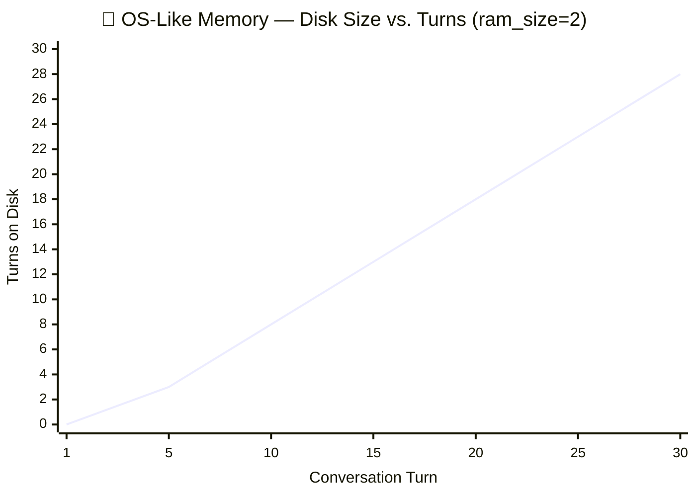
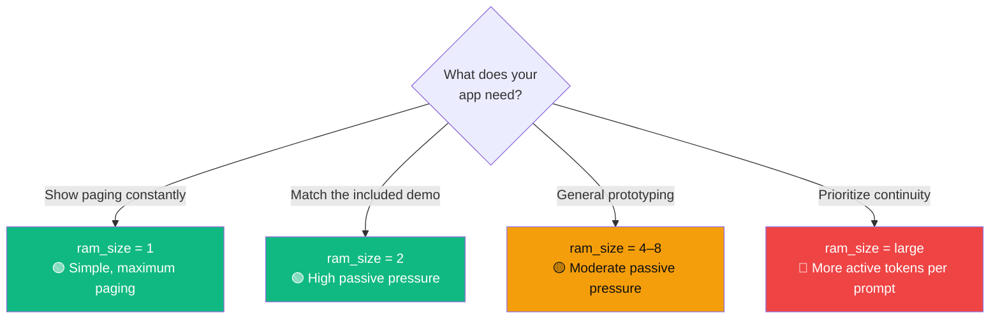
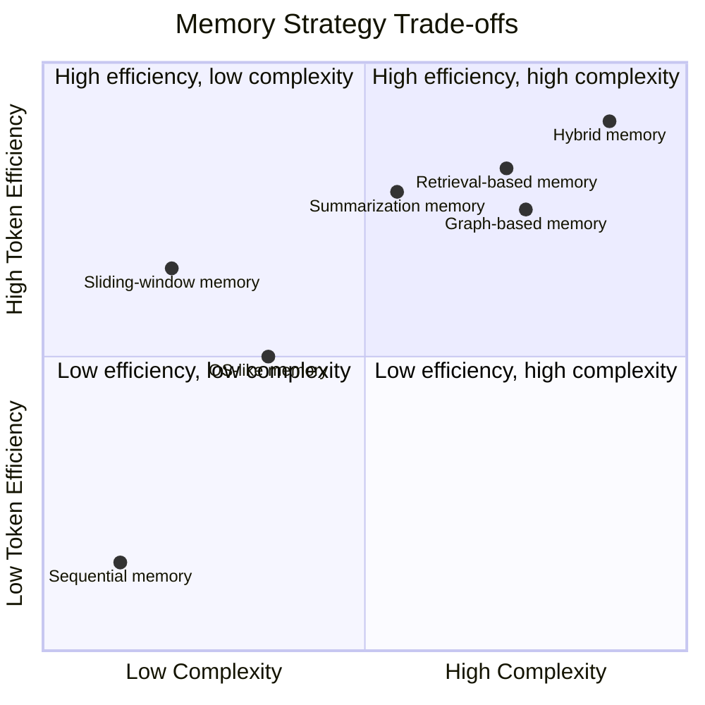

<div align="center">

# 💽 OS-Like Memory Management

### Recent turns live in fast RAM. Older turns get paged out to disk — and paged back in when they're relevant.

[](https://www.python.org/)
[](https://www.langchain.com/)
[](https://platform.openai.com/docs/guides/text-generation)
[-F59E0B?style=for-the-badge)](#-paging-lifecycle)
[](#-license)

*Part of the [Agent Memory Optimization](https://github.com/paras160500/agent-memory-optimization) project.*



</div>

---

## 📖 Table of Contents

- [Overview](#-overview)
- [Memory Hierarchy at a Glance](#-memory-hierarchy-at-a-glance)
- [How It Works](#️-how-it-works)
- [Architecture](#-architecture)
- [Prompt Construction](#-prompt-construction)
- [Paging Lifecycle](#-paging-lifecycle)
- [Search Behavior](#-search-behavior)
- [Statistics](#-statistics)
- [Characteristics](#-characteristics)
- [Advantages & Limitations](#️-advantages--limitations)
- [Project Structure](#-project-structure)
- [Requirements](#-requirements)
- [Installation](#-installation)
- [Running the Demo](#-running-the-demo)
- [Usage as a Python Module](#-usage-as-a-python-module)
- [Memory API](#-memory-api)
- [Agent API](#-agent-api)
- [Complexity & Scaling](#-complexity--scaling)
- [Choosing a RAM Size](#-choosing-a-ram-size)
- [Comparison with Other Memory Strategies](#-comparison-with-other-memory-strategies)
- [When to Use OS-Like Memory](#-when-to-use-os-like-memory)
- [Token & API Usage](#-token--api-usage)
- [Security & Privacy Notes](#-security--privacy-notes)
- [References](#-references)

---

## 🔍 Overview

**OS-like memory management** models a conversation's memory the way an operating system models physical memory: a small, fast **active** tier and a larger, slower **passive** tier.

> 💡 **Core idea:** *Keep recent context in fast, limited memory and page older context from larger passive storage when it is relevant.*

Recent conversation turns stay in simulated **RAM** for instant access. Once RAM fills up, the oldest turn is evicted to simulated **disk**. When a new query arrives, the system scans disk for matching words and pages any hits back into the current prompt — without ever promoting them into RAM.

---

## 🧠 Memory Hierarchy at a Glance



RAM is bounded, fast, and always included. Disk is unbounded, slower to search, and only included when a query's words happen to match.

---

## ⚙️ How It Works

For every user request, the agent follows this flow:



### 🔁 Sequence of a Paged Chat Turn



---

## 🏗️ Architecture



---

## 🧩 Prompt Construction

```text
You are an AI assistant with OS-like memory management.

Your memory system has:

1. Active Memory (RAM)
- Fast
- Limited capacity

2. Passive Memory (Disk)
- Larger capacity
- Used when information is paged out

Relevant memory:
### Active Memory (RAM)
User: ...
AI: ...

### Paged-In Memory (Disk)
(Paged in from Turn 0):
User: ...
AI: ...

Use the available memory when answering.

Current request:
<current user message>
```

> ⚠️ The system never passes raw memory structures to the model — only formatted text. `get_context()` includes **every** RAM turn plus **every** matching disk turn, with no cap or ranking.

---

## 🔄 Paging Lifecycle



With `ram_size=2`, the state evolves like this:

| Event | RAM | Disk |
| --- | --- | --- |
| Add turn 0 | Turn 0 | Empty |
| Add turn 1 | Turn 0, Turn 1 | Empty |
| Add turn 2 | Turn 1, Turn 2 | Turn 0 |
| Add turn 3 | Turn 2, Turn 3 | Turn 0, Turn 1 |

> 📝 A passive match creates a **page fault** and adds the matching turn to the current prompt. The matching turn stays in passive storage — the current implementation does **not** promote it back into RAM.

---

## 🔎 Search Behavior

Passive-memory search is intentionally simple:


A query like:

```text
What project is Alex building?
```

may match stored text containing `project` or `Alex`, provided that turn has already been paged out.

> ⚠️ This is **not** semantic retrieval. A synonym or paraphrase can miss a relevant turn entirely, and a short common word embedded in unrelated text can produce a false-positive match.

---

## 📊 Statistics

The implementation tracks five counters:

| Counter | Meaning |
| --- | --- |
| 🧮 `ram_items` | Number of turns currently active in RAM |
| 🗄️ `disk_items` | Number of turns currently stored on simulated disk |
| ⚠️ `page_faults` | Number of context requests that found at least one passive match |
| 📤 `pages_out` | Number of turns evicted from RAM to disk |
| 📥 `pages_in` | Number of passive turns included in paged-in context |

```python
{
    "ram_items": 2,
    "disk_items": 3,
    "page_faults": 1,
    "pages_out": 3,
    "pages_in": 1,
}
```

> 📝 `pages_in` counts matching **turns**, not unique page-fault **events** — a single query can increment it more than once if several disk turns match.

---

## 📊 Characteristics

| Aspect | Behavior |
| --- | --- |
| 🧩 Memory strategy | Active recent turns plus passive paged-out turns |
| ⚡ Active-memory default | `2` conversation turns |
| 🗄️ Passive storage | In-memory Python dictionary |
| 🔁 Eviction policy | Oldest active turn first (FIFO/LRU for append-only access) |
| 🔎 Passive retrieval | Case-insensitive substring matching for query words longer than 3 characters |
| ⚠️ Page fault | Recorded when one or more passive turns match the query |
| 📥 Page in | Adds matching passive turns to the prompt; does **not** reinsert them into RAM |
| 🤖 Chat model | `gpt-4o-mini` |
| ⏳ Persistence | None; memory is lost when the process ends |
| 🔢 Token monitoring | Tracks estimated chat context and provider usage metadata |
| 🎯 Best suited for | Memory-management demonstrations and bounded-context prototypes |

---

## ⚖️ Advantages & Limitations

<table>
<tr>
<td valign="top" width="50%">

### ✅ Advantages

- **Clear memory hierarchy** — recent and older information are represented separately
- **Bounded active context** — RAM capacity limits the always-available recent context
- **Older information is retained** — evicted turns remain available in passive memory
- **Observable paging behavior** — evictions, page faults, pages out, and pages in are reported
- **Simple implementation** — standard Python collections, no database or embedding service
- **Useful educational model** — demonstrates limited capacity, eviction, passive storage, demand retrieval

</td>
<td valign="top" width="50%">

### ⚠️ Limitations

- **Keyword-based retrieval** — passive memory isn't semantically searched; synonyms may not match
- **Substring matching** — a query word can match any substring, producing false positives
- **No true page-in promotion** — retrieved disk turns aren't moved back into RAM
- **No access recency updates** — reading a passive turn doesn't change its eviction priority
- **Unbounded passive storage** — disk simulation grows indefinitely during the process lifetime
- **No persistence** — both memory levels disappear when the process exits
- **No relevance ranking** — all matching passive turns are included, with no limit
- **Prompt growth** — a query may page in many old turns and create a large prompt
- **Turn-level granularity** — cannot independently evict or retrieve parts of an exchange

</td>
</tr>
</table>

---

## 📁 Project Structure

```
9_os_like_memory/
├── __init__.py
├── agent.py        # Chat agent using OS-like memory context
├── demo.py         # Interactive command-line demonstration
└── memory.py       # Active/passive memory and paging simulation
```

The agent also uses shared modules from the repository root:

```
common/
├── llm.py           # Configures the gpt-4o-mini chat model
└── token_tracker.py # Estimates and reports chat-model token usage
```

---

## 📋 Requirements

- 🐍 Python 3.9 or later
- 🔑 An OpenAI API key
- 📦 The dependencies listed in the repository's `requirements.txt`
- 🌐 Network access for language-model requests

The implementation uses [LangChain](https://www.langchain.com/) for model integration and Python's `collections.deque` for active-memory management.

---

## 🚀 Installation

**1. Clone the repository and move into its root directory:**

```bash
git clone https://github.com/paras160500/agent-memory-optimization.git
cd agent-memory-optimization
```

**2. Create and activate a virtual environment:**

```bash
python -m venv .venv
source .venv/bin/activate
```

> On Windows PowerShell:
> ```powershell
> .venv\Scripts\Activate.ps1
> ```

**3. Install the project dependencies:**

```bash
pip install -r requirements.txt
```

**4. Create a `.env` file in the repository root:**

```
OPENAI_API_KEY=your_openai_api_key_here
```

The shared LLM helper loads this value and creates a deterministic `gpt-4o-mini` chat model with `temperature=0`.

---

## ▶️ Running the Demo

Run the demo from the repository root using the package/import arrangement supported by the repository:

```bash
python -m 9_os_like_memory.demo
```

> ⚠️ **Note:** Because `9_os_like_memory` begins with a number, some Python environments do not accept it as a conventional module name. If module execution fails, rename the directory to a valid package identifier such as `os_like_memory`, update imports if needed, and run `python -m os_like_memory.demo`.

The demo initializes the agent with a RAM capacity of two turns:

```text
============================================================
OS-LIKE MEMORY MANAGEMENT
============================================================

RAM capacity: 2 turns
Passive storage: Disk simulation
Paging policy: LRU
LLM: gpt-4o-mini

Type 'exit' to stop.
```

Enter `exit` or `quit` to stop. During the session, the demo reports RAM items, disk items, page faults, pages out, and pages in.

> ⚠️ **Note:** The current demo calls `tracker.print_current_report([])`, so its current-context report is based on an empty list rather than the actual prompt. Use `tracker.get_current_report()` or pass the constructed message list for accurate reporting.

---

## 🐍 Usage as a Python Module

After renaming the directory to a Python-valid package name if necessary:

```python
from os_like_memory.agent import OSMemoryAgent

agent = OSMemoryAgent(ram_size=2)

print(agent.chat("My name is Alex."))
print(agent.chat("I am building a support bot."))
print(agent.chat("What do you know about my project?"))
```

The third request may retrieve older turns from passive memory if its words match the stored text.

**Configure the active-memory capacity:**

```python
agent = OSMemoryAgent(ram_size=4)
```

**Inspect memory and paging statistics:**

```python
memory = agent.get_memory()

print(memory.get_statistics())
print(memory.ram_count())
print(memory.disk_count())
```

**Inspect the active and passive stores directly:**

```python
print(list(memory.active_memory))
print(memory.passive_memory)
```

**Clear both memory levels and reset token statistics:**

```python
agent.clear_memory()
```

---

## 🧠 Memory API

| Method | Description |
| --- | --- |
| `OSMemory(ram_size: int = 2)` | Creates an OS-like memory manager with a bounded active-memory deque and an empty passive-memory dictionary |
| `add_message(user_message, ai_message)` | Creates a turn and places it in active memory; evicts the oldest turn to passive memory first if RAM is full |
| `search_passive_memory(query: str) -> list` | Searches passive-memory text using query words longer than 3 characters (case-insensitive substring match) |
| `get_context(query: str) -> str` | Builds the complete prompt-ready context: all RAM turns plus matching passive turns |
| `ram_count() -> int` | Returns the number of active-memory turns |
| `disk_count() -> int` | Returns the number of passive-memory turns |
| `get_statistics() -> dict` | Returns `ram_items`, `disk_items`, `page_faults`, `pages_out`, `pages_in` |
| `clear()` | Clears active memory, passive memory, the turn counter, and all paging statistics |

Each stored turn has the format:

```text
User: <user message>
AI: <assistant message>
```

`search_passive_memory` returns results as:

```python
[(turn_id, turn_data), ...]
```

> ⚠️ `add_message` increments `pages_out` on eviction; `get_context` increments `page_faults` and `pages_in` on a passive match.

---

## 🤖 Agent API

`OSMemoryAgent(ram_size: int = 2)` creates an agent with:

- 🤖 The shared `gpt-4o-mini` chat model
- 💽 An `OSMemory` instance
- 🔢 A `TokenTracker` configured for `gpt-4o-mini`

| Method | Description |
| --- | --- |
| `chat(user_message: str) -> str` | Retrieves active + relevant passive context, calls the chat model, records usage, stores the completed turn, returns the response |
| `get_memory()` | Returns the `OSMemory` instance |
| `get_token_tracker()` | Returns the token tracker for current and cumulative chat-model usage |
| `clear_memory()` | Clears the memory hierarchy and resets token statistics |

---

## 📈 Complexity & Scaling

Adding a turn is approximately `O(1)` for the deque operation and dictionary insertion. Passive search scans every disk turn and checks every qualifying query word, so its cost grows with passive-memory size and query length: roughly `O(D × W)` where `D` is the number of disk turns and `W` is the number of qualifying query words.



> 📝 Disk grows without bound as the conversation continues — RAM stays fixed at `ram_size`, but every eviction adds one more turn to the passive dictionary, and every one of those turns is scanned on every future query.

**For larger applications, consider:**

- 🔢 A bounded or persistent disk store
- 🔎 Full-text indexing
- 🧠 Semantic embeddings or vector search
- 📊 Relevance scoring and top-k retrieval
- 🔁 Page-in promotion or recency updates
- 👤 Per-user or per-session namespaces
- 🗓️ Metadata such as timestamps and importance

---

## 🎚️ Choosing a RAM Size



| RAM size | Active context | Passive storage pressure | Suitable for |
| --- | --- | --- | --- |
| `1` | One recent turn | Very high | Paging demonstrations |
| `2` | Two recent turns | High | The included demo |
| `4–8` | Several recent turns | Moderate | General conversational prototypes |
| Large values | More recent context | Lower | Applications prioritizing continuity over bounded prompts |

A smaller RAM size demonstrates paging more frequently but forces heavier reliance on keyword-based passive retrieval. A larger size preserves more recent conversation in every prompt but increases active context tokens.

---

## 🔬 Comparison with Other Memory Strategies



| Strategy | Active context | Older-memory access | Retrieval method | Complexity | Typical use case |
| --- | --- | --- | --- | --- | --- |
| Sequential memory | Complete history | Always included | Chronological | 🟢 Low | Short demos and debugging |
| Sliding-window memory | Recent messages | Discarded | Recency | 🟢 Low | Bounded recent context |
| Summarization memory | Summary plus recent messages | Compressed | Generated summary | 🟡 Medium | Long conversations |
| Retrieval-based memory | Query-selected memories | Stored as vectors | Semantic similarity | 🟡 Medium–High | Topic and fact recall |
| Graph-based memory | Query-selected graph facts | Structured relationships | Entity lookup | 🟡 Medium–High | Relationship queries |
| **OS-like memory** | Recent RAM plus paged disk turns | Stored passive turns | Keyword search | 🟢 Low–Medium | Memory hierarchy experiments |

---

## 🎯 When to Use OS-Like Memory

**Good fit when:**
- ✅ You want to demonstrate memory hierarchy and paging concepts
- ✅ Recent turns should be immediately available while older turns remain recoverable
- ✅ You need a lightweight alternative to vector retrieval for a prototype
- ✅ You want visible statistics for evictions, page faults, and page-ins
- ✅ You plan to replace keyword search with a more advanced retrieval layer later

**Consider a different strategy when:**
- ❌ Users ask paraphrased questions → **semantic retrieval**
- ❌ Older context must be compressed into a coherent narrative → **summarization**
- ❌ Entity relationships are central to the application → **graph memory**

---

## 🔢 Token & API Usage

Each user interaction uses **one** chat-model request. The agent's `TokenTracker` estimates the formatted prompt context and records provider usage metadata when available.

> ⚠️ The demo calls `print_current_report([])`, which reports an empty message list rather than the actual prompt. For accurate reporting, pass the constructed prompt message or use `get_current_report()` after `update_context()`.

Unlike retrieval and compression strategies, this implementation does **not** make an additional embedding or compression request. However, a query that pages in many passive turns can still create a large chat prompt.

---

## 🔒 Security & Privacy Notes

> ⚠️ Both active and passive memory contain **raw** user and assistant text. Passive storage may retain sensitive information for the entire process lifetime, even after it leaves active memory.

Before production use, add:

- 🔐 Authentication and authorization
- 🗓️ Retention policies and deletion controls
- 🔒 Encryption and persistence safeguards
- 📝 Audit logging
- 👤 Per-user isolation

Do not send confidential or personally identifiable information to an external model provider unless your application is designed and approved to handle it.

Calling `clear_memory()` removes the local active and passive memory but does **not** undo content already sent to an external model provider or stored under provider policies.

---

## 📄 License

Refer to the [root repository](https://github.com/paras160500/agent-memory-optimization) for the project's license and contribution guidelines.

---

## 🔗 References

| # | Resource |
| --- | --- |
| 1 | [Agent Memory Optimization repository](https://github.com/paras160500/agent-memory-optimization) |
| 2 | [`OSMemory` implementation](https://github.com/paras160500/agent-memory-optimization/blob/main/9_os_like_memory/memory.py) |
| 3 | [`OSMemoryAgent` implementation](https://github.com/paras160500/agent-memory-optimization/blob/main/9_os_like_memory/agent.py) |
| 4 | [OS-like memory interactive demo](https://github.com/paras160500/agent-memory-optimization/blob/main/9_os_like_memory/demo.py) |
| 5 | [LangChain official website](https://www.langchain.com/) |
| 6 | [OpenAI text generation documentation](https://platform.openai.com/docs/guides/text-generation) |

<div align="center">

---

**⭐ Part of the [Agent Memory Optimization](https://github.com/paras160500/agent-memory-optimization) project ⭐**

</div>