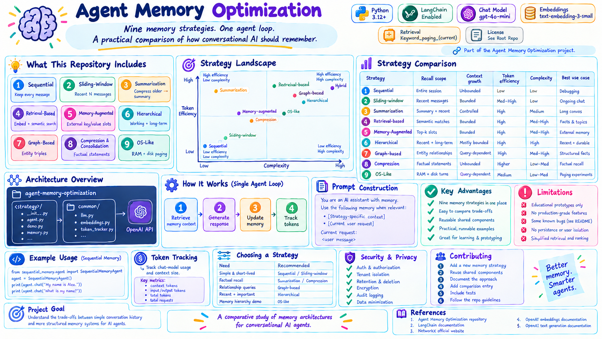
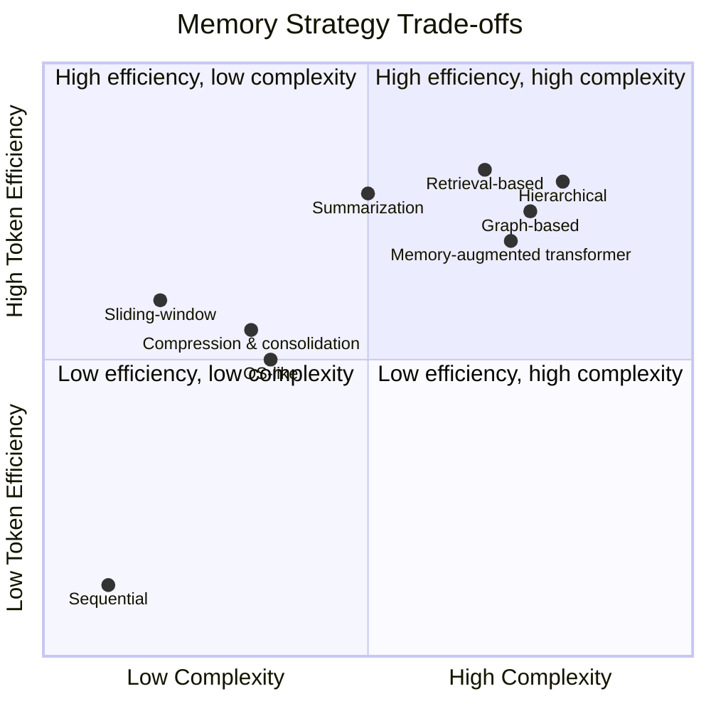
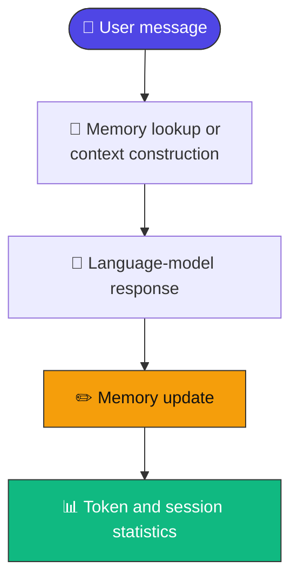
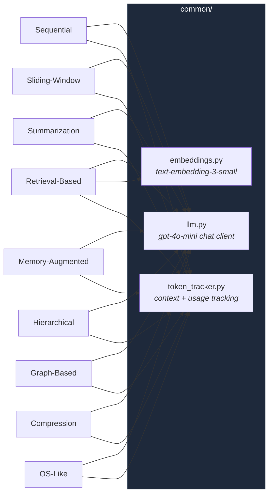

<div align="center">

# 🧠 Agent Memory Optimization

### Nine memory strategies. One agent loop. A practical comparison of how conversational AI should remember.

[](https://www.python.org/)
[](https://python.langchain.com/)
[](https://platform.openai.com/docs/guides/text-generation)
[](https://platform.openai.com/docs/guides/embeddings)
[](#-known-issues-and-prototype-limitations)
[](#-license)

*A comparative study of memory architectures for conversational AI agents.*



</div>

---

## 📖 Table of Contents

- [Overview](#-overview)
- [What This Repository Includes](#-what-this-repository-includes)
- [Strategy Landscape](#️-strategy-landscape)
- [Strategy Comparison](#-strategy-comparison)
- [Architecture Overview](#️-architecture-overview)
- [Shared Components](#-shared-components)
- [Requirements](#-requirements)
- [Installation](#-installation)
- [Running the Examples](#️-running-the-examples)
- [Quick Usage Examples](#-quick-usage-examples)
- [Token Tracking](#-token-tracking)
- [Clearing Memory](#-clearing-memory)
- [Known Issues and Prototype Limitations](#-known-issues-and-prototype-limitations)
- [Recommended Improvements for Production](#-recommended-improvements-for-production)
- [Suggested Evaluation Framework](#-suggested-evaluation-framework)
- [Repository Layout](#-repository-layout)
- [Contributing](#-contributing)
- [License](#-license)
- [References](#-references)

---

## 🔍 Overview

This repository is a **practical collection of conversational-agent memory strategies** implemented in Python — nine of them, each in its own directory, each demonstrating one way to store, select, compress, or retrieve conversation context.

> 💡 **Project goal:** *Understand the trade-offs between simple conversation history and more structured memory systems for AI agents.*

Every strategy is compared along the same dimensions: **recall, context size, token usage, latency, implementation complexity, and scalability.** None of them is a drop-in production system — each is deliberately small so the trade-offs stay visible.

---

## 🗂️ What This Repository Includes

```mermaid
graph TD
    R["🧠 Agent Memory<br/>Optimization"]
    R --> S1["1️⃣ Sequential<br/>Keep every message"]
    R --> S2["2️⃣ Sliding-Window<br/>Keep recent N messages"]
    R --> S3["3️⃣ Summarization<br/>Compress old → summary"]
    R --> S4["4️⃣ Retrieval-Based<br/>Embed + semantic search"]
    R --> S5["5️⃣ Memory-Augmented<br/>Transformer top-k slots"]
    R --> S6["6️⃣ Hierarchical<br/>Working + long-term"]
    R --> S7["7️⃣ Graph-Based<br/>Entity triples"]
    R --> S8["8️⃣ Compression &<br/>Consolidation"]
    R --> S9["9️⃣ OS-Like<br/>RAM + disk paging"]

    style R fill:#4F46E5,color:#fff,stroke:#333
    style S1 fill:#0f172a,color:#fff,stroke:#334155
    style S2 fill:#0f172a,color:#fff,stroke:#334155
    style S3 fill:#0f172a,color:#fff,stroke:#334155
    style S4 fill:#0f172a,color:#fff,stroke:#334155
    style S5 fill:#0f172a,color:#fff,stroke:#334155
    style S6 fill:#0f172a,color:#fff,stroke:#334155
    style S7 fill:#0f172a,color:#fff,stroke:#334155
    style S8 fill:#0f172a,color:#fff,stroke:#334155
    style S9 fill:#0f172a,color:#fff,stroke:#334155
```



| # | Strategy | Main idea | Retrieval or context policy |
| --- | --- | --- | --- |
| 1 | [Sequential Memory](./sequential_memory) | Keep every message | Send the complete conversation |
| 2 | [Sliding-Window Memory](./2_sliding_window_memory) | Keep a fixed number of recent messages | Send only the active window |
| 3 | [Summarization Memory](./3_summarization_memory) | Compress older messages into a summary | Send summary plus recent messages |
| 4 | [Retrieval-Based Memory](./4_retrieval_based_memory) | Embed completed exchanges | Retrieve semantically similar memories |
| 5 | [Memory-Augmented Transformer](./5_memory_augmented_transofrmer) | Attend over external key/value memory | Select top-`k` memory slots |
| 6 | [Hierarchical Memory](./6_hierarchical_memory) | Combine working and long-term memory | Keep recent context and retrieve promoted facts |
| 7 | [Graph-Based Memory](./7_graph_based_memory) | Store entities and relationships as triples | Retrieve facts connected to query entities |
| 8 | [Compression and Consolidation Memory](./8_compression_consolidation_memory) | Convert each exchange into a factual statement | Include accumulated compressed facts |
| 9 | [OS-Like Memory](./9_os_like_memory) | Simulate RAM, disk, and paging | Keep recent turns active and page older matches into context |

The repository is intended for **education, experimentation, and comparative evaluation**. The implementations are deliberately small and should be strengthened before production use.

---

## 🗺️ Strategy Landscape



---

## 📊 Strategy Comparison

| Strategy | Recall scope | Context growth | Token efficiency | Typical complexity | Best use case |
| --- | --- | --- | --- | --- | --- |
| Sequential | Entire session | 🔴 Unbounded | 🔴 Low | 🟢 Low | Short demos and debugging |
| Sliding window | Recent messages | 🟢 Bounded | 🟡 Medium–High | 🟢 Low | Simple ongoing chat |
| Summarization | Summary plus recent messages | 🟢 Controlled | 🟢 High | 🟡 Medium | Long conversations with narrative context |
| Retrieval-based | Semantically similar exchanges | 🟡 Bounded by results | 🟢 High | 🟡 Medium–High | Fact and topic recall |
| Memory-augmented transformer | Attended external slots | 🟡 Bounded by `top_k` | 🟢 High | 🟡 Medium–High | External-memory experiments |
| Hierarchical | Recent messages plus promoted long-term facts | 🟡 Mostly bounded | 🟢 High | 🔴 High | Recent continuity plus durable facts |
| Graph-based | Connected entity relationships | 🟡 Query-dependent | 🟢 High | 🟡 Medium–High | Structured facts and relationship queries |
| Compression | Compressed facts | 🔴 Unbounded unless consolidated | 🟡 Higher than raw history | 🟢 Low–Medium | Human-readable factual memory |
| OS-like | Active recent turns plus matching passive turns | 🟡 Query-dependent | 🟡 Medium | 🟢 Low–Medium | Paging and memory-hierarchy experiments |

> 📝 No single strategy wins for every application. The right choice depends on whether the system values exact history, recent continuity, semantic recall, structured relationships, predictable prompt size, or implementation simplicity.

---

## 🏗️ Architecture Overview

Every strategy follows the **same high-level agent loop** — only the memory-update step differs:



The memory-update step is where each strategy diverges:

| Strategy | Memory update behavior |
| --- | --- |
| Sequential | Appends the user and assistant messages |
| Sliding-window | Appends and trims old messages |
| Summarization | Summarizes messages outside its recent window |
| Retrieval | Embeds and stores completed exchanges |
| Memory-augmented transformer | Stores external key/value slots |
| Hierarchical | Updates working memory and selectively promotes facts |
| Graph-based | Extracts subject–relation–object triples |
| Compression | Generates and stores factual statements |
| OS-like | Pages older turns from active memory to passive storage |

---

## 🧩 Shared Components



The [`common/`](./common) directory contains utilities used by multiple strategies:

| Module | Purpose |
| --- | --- |
| 🤖 `common/llm.py` | Creates a LangChain `ChatOpenAI` client using `gpt-4o-mini` |
| 🔢 `common/embeddings.py` | Creates an `OpenAIEmbeddings` client using `text-embedding-3-small` |
| 📊 `common/token_tracker.py` | Estimates context tokens and records model usage metadata |

### 🎛️ Default models

| Setting | Value |
| --- | --- |
| Chat model | `gpt-4o-mini` |
| Embedding model | `text-embedding-3-small` |
| Embedding dimensions | `1536` |
| Chat temperature | `0` |

These values are defined in the shared modules and can be changed there if the application requires another compatible model.

---

## 📋 Requirements

- 🐍 Python **3.12 or later**, according to `pyproject.toml`
- 🔑 An OpenAI API key
- 🌐 Internet access for chat-completion and embedding requests
- 📦 The packages listed in [`requirements.txt`](./requirements.txt)

> ⚠️ The project metadata currently declares no dependencies in `pyproject.toml`; install from `requirements.txt` for the implemented examples.

---

## 🚀 Installation

**1. Clone the repository:**

```bash
git clone https://github.com/paras160500/agent-memory-optimization.git
cd agent-memory-optimization
```

**2. Create and activate a virtual environment:**

```bash
python -m venv .venv
source .venv/bin/activate
```

> On Windows PowerShell:
> ```powershell
> .venv\Scripts\Activate.ps1
> ```

**3. Install the dependencies:**

```bash
pip install -r requirements.txt
```

**4. Create a `.env` file in the repository root:**

```
OPENAI_API_KEY=your_openai_api_key_here
```

> 🔒 The `.gitignore` excludes `.env`, virtual environments, Python caches, and build artifacts. **Never commit API keys to the repository.**

---

## ▶️ Running the Examples

Each strategy includes a `demo.py` interactive command-line program. The demos generally accept user input until `exit` or `quit` is entered and print memory or token statistics during the session.

> ⚠️ **Note:** Because the directory names begin with numbers for strategies 2 through 9, they are not conventional Python package identifiers. If module execution fails, rename the directory to a valid identifier and update its relative imports.

```bash
mv 2_sliding_window_memory sliding_window_memory
python -m sliding_window_memory.demo
```

The same pattern applies to the other numbered directories:

```text
3_summarization_memory              → summarization_memory
4_retrieval_based_memory             → retrieval_based_memory
5_memory_augmented_transofrmer       → memory_augmented_transformer
6_hierarchical_memory                → hierarchical_memory
7_graph_based_memory                 → graph_based_memory
8_compression_consolidation_memory   → compression_consolidation_memory
9_os_like_memory                     → os_like_memory
```

> 📝 The spelling `transofrmer` is part of the current directory name. Renaming it to `memory_augmented_transformer` improves readability but requires updating paths consistently.

### Example

After renaming the relevant directories if necessary:

```bash
python -m sequential_memory.demo
python -m sliding_window_memory.demo
python -m summarization_memory.demo
python -m retrieval_based_memory.demo
python -m memory_augmented_transformer.demo
python -m hierarchical_memory.demo
python -m graph_based_memory.demo
python -m compression_consolidation_memory.demo
python -m os_like_memory.demo
```

---

## 🐍 Quick Usage Examples

### Sequential memory

```python
from sequential_memory.agent import SequentialMemoryAgent

agent = SequentialMemoryAgent()
print(agent.chat("My name is Alex."))
print(agent.chat("What is my name?"))
```

### Sliding-window memory

```python
from sliding_window_memory.agent import SlidingWindowMemoryAgnet

agent = SlidingWindowMemoryAgnet(window_size=4)
print(agent.chat("Keep the last few messages available."))
```

> ⚠️ The current source spells `Agent` as `Agnet` in this class name. Rename it only if you also update all imports and references.

### Summarization memory

```python
from summarization_memory.agent import SummarizationMemoryAgent

agent = SummarizationMemoryAgent(max_recent_messages=4)
print(agent.chat("I am building a customer-support bot."))
```

### Retrieval-based memory

```python
from retrieval_based_memory.agent import RetrievalMemoryAgent

agent = RetrievalMemoryAgent(top_k=3)
print(agent.chat("My project uses Python."))
```

### Graph-based memory

```python
from graph_based_memory.agent import GraphBaseMemoryAgent

agent = GraphBaseMemoryAgent()
print(agent.chat("Alex works on an AI memory project."))
```

> ⚠️ The graph-based implementation requires the `response.content` typo fix described in [Known Issues](#-known-issues-and-prototype-limitations).

---

## 🔢 Token Tracking

Most agents expose a token tracker:

```python
tracker = agent.get_token_tracker()

print(tracker.get_current_report())
print(tracker.get_total_report())
```

| Metric | Meaning |
| --- | --- |
| `context_tokens` | Estimated tokens in the current context |
| `peak_context_tokens` | Largest estimated context observed |
| `total_input_tokens` | Cumulative provider-reported input tokens |
| `total_output_tokens` | Cumulative provider-reported output tokens |
| `total_tokens` | Cumulative provider-reported total tokens |
| `total_requests` | Requests whose usage metadata was recorded |

> ⚠️ The tracker primarily measures chat-model usage. Embedding calls and secondary model calls used for summarization, compression, or graph extraction are not consistently recorded, so reported totals may be lower than the true session cost.

---

## 🧹 Clearing Memory

Most agent implementations expose:

```python
agent.clear_memory()
```

This clears the local in-memory state and resets the token tracker. **It does not delete data already sent to an external model provider** or stored according to provider policies.

---

## 🐞 Known Issues and Prototype Limitations

The examples are educational prototypes. Before running or extending them, review these known source-level issues:

| Module | Issue | Impact |
| --- | --- | --- |
| Numbered modules | Directory names are not conventional Python identifiers | `python -m ...` may fail until directories are renamed or imported through a supported package arrangement |
| `5_memory_augmented_transofrmer/agent.py` | Uses `memory_context != (...)` instead of appending to `memory_context` | Retrieved memories are calculated but not inserted into the prompt |
| `6_hierarchical_memory/retriever.py` | Uses `self.top_k = self.top_k` instead of `self.top_k = top_k` | Agent construction raises an attribute error |
| `7_graph_based_memory/agent.py` | Uses `response.contnet` instead of `response.content` | Graph extraction fails after response generation |
| Several demos | Call `print_current_report([])` | The displayed current context is reported as empty rather than the actual prompt |
| `8_compression_consolidation_memory` | Appends compressed facts without merging or deduplication | Memory and prompts grow over time |
| Retrieval and graph examples | Use in-memory lists or graphs | State is lost when the process exits |
| Retrieval examples | Scan all stored items | Search cost grows linearly with memory size |

> ⚠️ These limitations make the repository useful for comparison, but they should be addressed before using the patterns in a production system.

---

## 🏭 Recommended Improvements for Production

A production-ready memory system generally needs more than a storage strategy. Consider adding:

```mermaid
graph TD
    A["🏭 Production-ready<br/>memory system"]
    A --> B["🗄️ Persistent storage +<br/>retention/deletion policies"]
    A --> C["👤 User/tenant/session<br/>isolation"]
    A --> D["🔐 Auth around<br/>memory access"]
    A --> E["📊 Relevance thresholds<br/>+ top-k limits"]
    A --> F["🗓️ Metadata: timestamps,<br/>source, confidence, type"]
    A --> G["⚖️ Conflict resolution for<br/>changed/contradictory facts"]
    A --> H["✅ Input/output validation<br/>for generated memories"]
    A --> I["📏 Prompt-size budgets +<br/>truncation safeguards"]
    A --> J["🔎 Embedding indexes /<br/>vector databases"]
    A --> K["🔗 Entity linking +<br/>provenance for graphs"]
    A --> L["👁️ Observability: latency,<br/>tokens, retrieval quality"]
    A --> M["🧪 Tests for retrieval, trimming,<br/>promotion, extraction, clearing"]

    style A fill:#4F46E5,color:#fff,stroke:#333
```



---

## 🧪 Suggested Evaluation Framework

The strategies can be compared using the same conversation scenarios and queries. Useful evaluation dimensions include:

| Dimension | Example measurement |
| --- | --- |
| 🎯 Recall | Did the agent recover a fact mentioned several turns earlier? |
| 🔍 Precision | Were retrieved memories relevant to the current request? |
| 📏 Context size | Estimated prompt tokens per request |
| 💰 Cost | Chat, embedding, and secondary model-call usage |
| ⏱️ Latency | Time to retrieve memory and generate a response |
| 🛡️ Robustness | Behavior under long, repetitive, or contradictory conversations |
| 🔬 Explainability | Ability to inspect why a memory was selected |
| ✏️ Mutation quality | Whether important facts are added, updated, or removed correctly |

> 📝 A useful benchmark should include short conversations, long conversations, paraphrased queries, repeated facts, changed preferences, irrelevant distractors, and conflicting information.

---

## 📁 Repository Layout

```
agent-memory-optimization/
├── sequential_memory/
├── 2_sliding_window_memory/
├── 3_summarization_memory/
├── 4_retrieval_based_memory/
├── 5_memory_augmented_transofrmer/
├── 6_hierarchical_memory/
├── 7_graph_based_memory/
├── 8_compression_consolidation_memory/
├── 9_os_like_memory/
├── common/
│   ├── embeddings.py
│   ├── llm.py
│   └── token_tracker.py
├── requirements.txt
├── pyproject.toml
├── .gitignore
└── README.md
```

---

## 🤝 Contributing

Contributions are welcome. When adding a new memory strategy:

1. 📁 Create a self-contained directory with memory, agent, and demo modules.
2. ♻️ Reuse the shared model and token-tracking utilities where appropriate.
3. 📝 Document the strategy's context policy, data structures, and limitations.
4. 📊 Add a comparison entry to the root README.
5. 🧪 Include tests for empty memory, repeated turns, long conversations, and clearing state.
6. 🗓️ Document any external services, environment variables, and persistence requirements.

---

## 📄 License

Refer to the repository for the project's license and contribution guidelines.

---

## 🔗 References

| # | Resource |
| --- | --- |
| 1 | [Agent Memory Optimization repository](https://github.com/paras160500/agent-memory-optimization) |
| 2 | [LangChain documentation](https://python.langchain.com/) |
| 3 | [NetworkX official website](https://networkx.org/) |
| 4 | [OpenAI embeddings documentation](https://platform.openai.com/docs/guides/embeddings) |
| 5 | [OpenAI text generation documentation](https://platform.openai.com/docs/guides/text-generation) |

<div align="center">

---

**🧠 A comparative study of memory architectures for conversational AI agents. 🧠**

</div>
