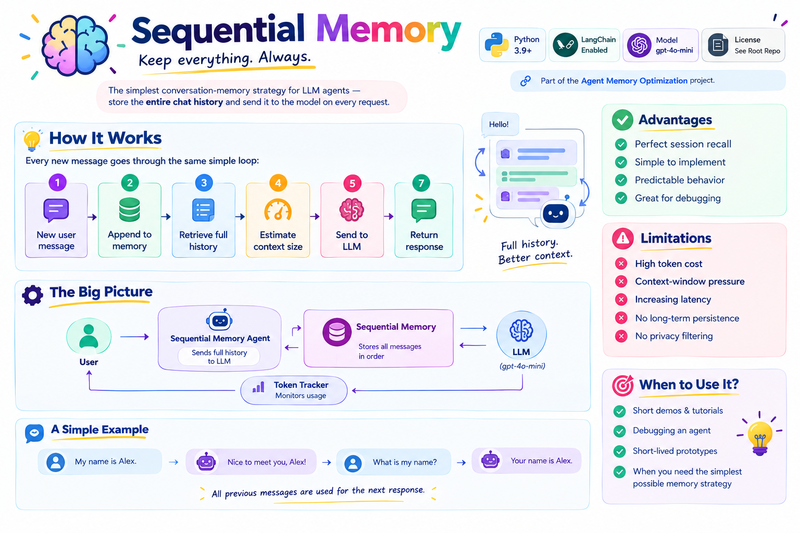
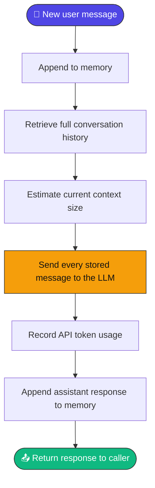
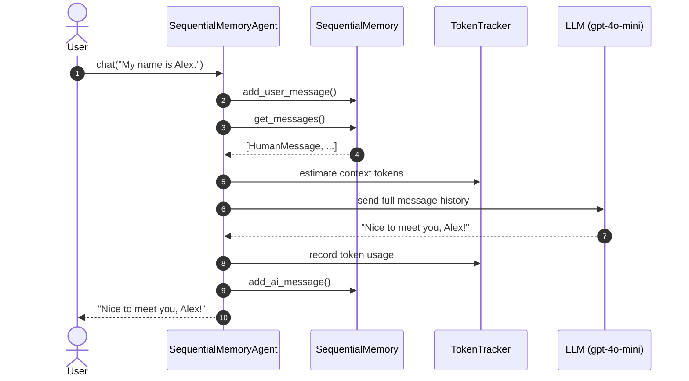
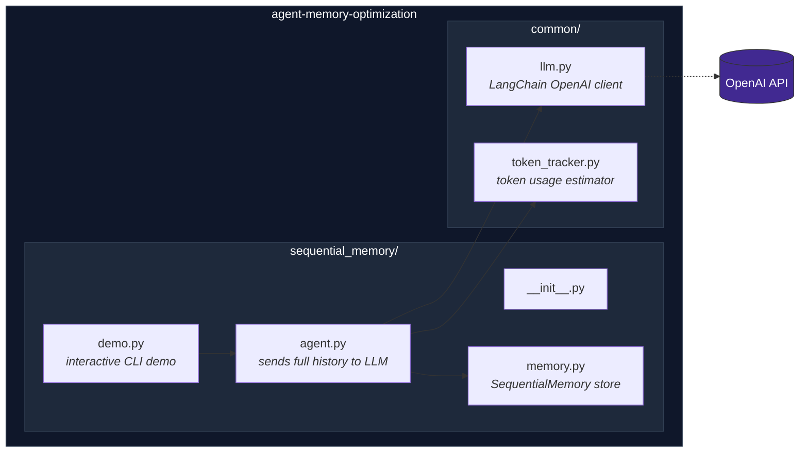
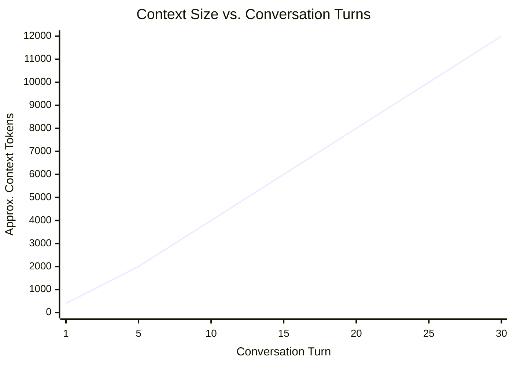
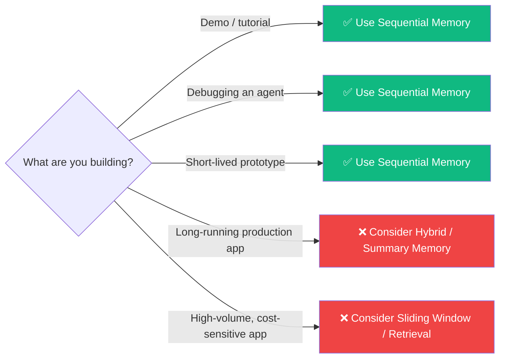
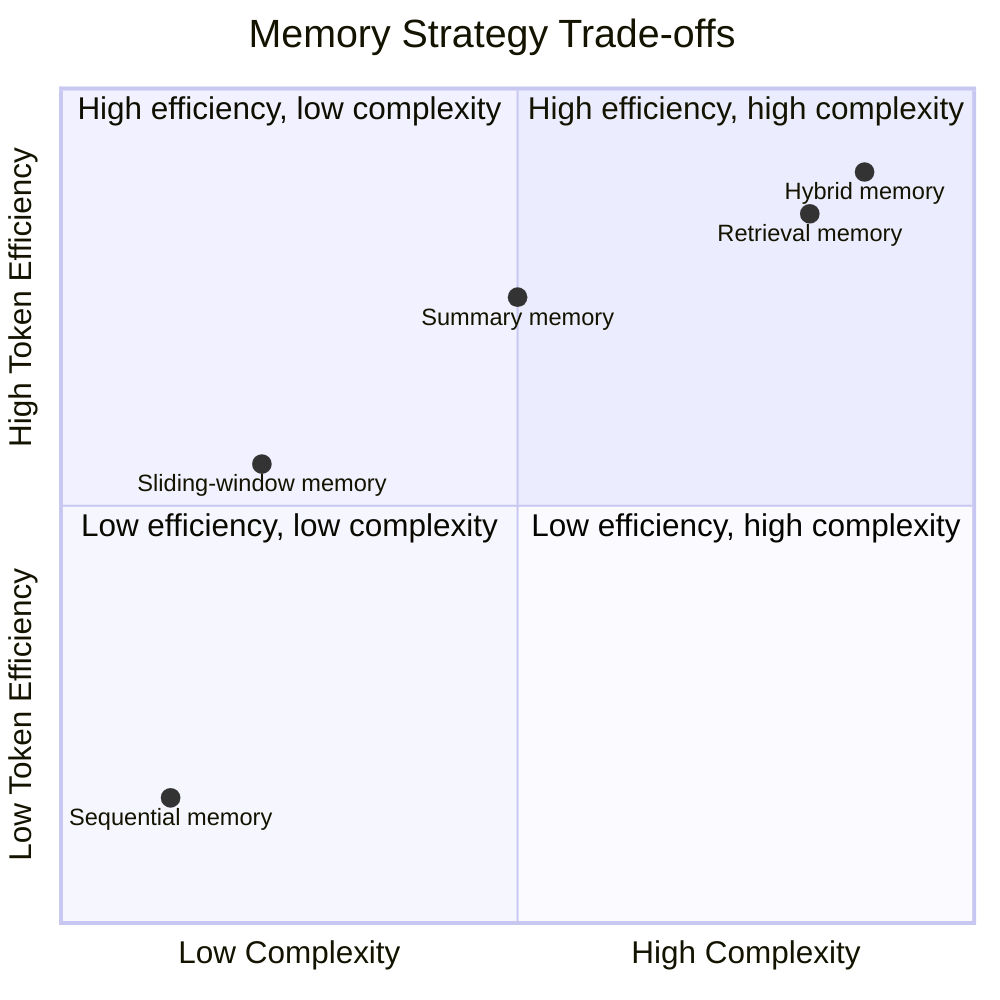

<div align="center">

# 🧠 Sequential Memory

### The simplest conversation-memory strategy for LLM agents — keep *everything*.

[](https://www.python.org/)
[](https://www.langchain.com/)
[](https://platform.openai.com/docs/guides/text-generation)
[](#-license)

*Part of the [Agent Memory Optimization](https://github.com/paras160500/agent-memory-optimization) project.*



</div>

---

## 📖 Table of Contents

- [Overview](#-overview)
- [How It Works](#️-how-it-works)
- [Architecture](#-architecture)
- [Characteristics](#-characteristics)
- [Advantages & Limitations](#️-advantages--limitations)
- [Project Structure](#-project-structure)
- [Requirements](#-requirements)
- [Installation](#-installation)
- [Running the Demo](#-running-the-demo)
- [Usage as a Python Module](#-usage-as-a-python-module)
- [Memory API](#-memory-api)
- [Agent API](#-agent-api)
- [Complexity & Scaling](#-complexity--scaling)
- [When to Use Sequential Memory](#-when-to-use-sequential-memory)
- [Comparison with Optimized Strategies](#-comparison-with-optimized-strategies)
- [Security & Privacy Notes](#-security--privacy-notes)
- [References](#-references)

---

## 🔍 Overview

**Sequential Memory** is the most direct memory implementation for a conversational agent: every user message and assistant response is appended to a list, in chronological order, and the **entire history is sent to the model on every request**.

> 💡 **Core idea:** *Keep everything. Store the entire conversation history.*

It provides **perfect recall** within the active session — nothing is summarized, filtered, embedded, or dropped — at the cost of ever-growing context size.

---

## ⚙️ How It Works

Every time the agent receives a new user message, it walks through the same seven-step loop:



Because nothing is ever trimmed, the model can reference **any earlier turn** that still fits inside its context window.

### 🔁 Sequence of a Conversation



---

## 🏗️ Architecture



---

## 📊 Characteristics

| Aspect | Behavior |
| --- | --- |
| 🧩 Memory strategy | Full chronological conversation history |
| 📦 Storage format | LangChain `HumanMessage` and `AIMessage` objects |
| 🔎 Retrieval | Returns all messages in insertion order |
| 📈 Context growth | Increases with every conversation turn |
| 💾 Persistence | In-memory only; lost when the process ends |
| 🔢 Token monitoring | Estimates context tokens and records API usage |
| 🤖 Default model | `gpt-4o-mini` |
| 🎯 Best suited for | Short demos, simple bots, prototypes, debugging |

---

## ⚖️ Advantages & Limitations

<table>
<tr>
<td valign="top" width="50%">

### ✅ Advantages

- **Perfect session recall** — earlier messages stay available until the context window is reached
- **Simple implementation** — easy to understand, test, and extend
- **Predictable behavior** — every request uses the same chronological model
- **Great for debugging** — the full interaction history is easy to inspect

</td>
<td valign="top" width="50%">

### ⚠️ Limitations

- **High token cost** — every request resends the whole history
- **Context-window pressure** — long chats can exceed the max context length
- **Increasing latency** — larger prompts take longer to process
- **No long-term persistence** — nothing is saved to disk or a database
- **No privacy filtering** — sensitive content stays live until cleared

</td>
</tr>
</table>

---

## 📁 Project Structure

```
sequential_memory/
├── __init__.py
├── agent.py       # Agent that sends the complete history to the LLM
├── demo.py        # Interactive command-line demonstration
└── memory.py      # SequentialMemory implementation
```

The agent also depends on shared modules in the repository root:

```
common/
├── llm.py           # Creates the configured LangChain OpenAI chat model
└── token_tracker.py # Estimates and reports token usage
```

---

## 📋 Requirements

- 🐍 Python 3.9 or later
- 🔑 An OpenAI API key
- 📦 The dependencies listed in the repository's `requirements.txt`

The implementation uses [LangChain](https://www.langchain.com/) message types and `langchain-openai` for model access.

---

## 🚀 Installation

**1. Clone the repository and move into its root directory:**

```bash
git clone https://github.com/paras160500/agent-memory-optimization.git
cd agent-memory-optimization
```

**2. Create and activate a virtual environment:**

```bash
python -m venv .venv
source .venv/bin/activate
```

> On Windows PowerShell, use:
> ```powershell
> .venv\Scripts\Activate.ps1
> ```

**3. Install the project dependencies:**

```bash
pip install -r requirements.txt
```

**4. Create a `.env` file in the repository root and add your API key:**

```
OPENAI_API_KEY=your_openai_api_key_here
```

The shared LLM helper loads this value with `python-dotenv` and creates a deterministic `gpt-4o-mini` chat model with `temperature=0`.

---

## ▶️ Running the Demo

Run the module from the **repository root**:

```bash
python -m sequential_memory.demo
```

The demo starts an interactive chat session. Enter `exit` or `quit` to stop.

```text
============================================================
SEQUENTIAL MEMORY
============================================================

You : My name is Alex.

AI : Nice to meet you, Alex!

You : What is my name?

AI : Your name is Alex.
```

After each response, the demo prints the current number of messages and estimated context tokens. When the session ends, it prints cumulative request and token statistics.

---

## 🐍 Usage as a Python Module

```python
from sequential_memory.agent import SequentialMemoryAgent

agent = SequentialMemoryAgent()

response = agent.chat("My name is Alex.")
print(response)

response = agent.chat("What is my name?")
print(response)
```

**Retrieve the complete conversation history:**

```python
messages = agent.get_memory()

for message in messages:
    print(f"{message.type}: {message.content}")
```

**Clear the conversation and reset token statistics:**

```python
agent.clear_memory()
```

**Inspect token statistics:**

```python
tracker = agent.get_token_tracker()
print(tracker.get_current_report())
print(tracker.get_total_report())
```

---

## 🧠 Memory API

| Method | Description |
| --- | --- |
| `SequentialMemory()` | Creates an empty in-memory message store |
| `add_user_message(message: str)` | Appends a user message as a LangChain `HumanMessage` |
| `add_ai_message(message: str)` | Appends an assistant message as a LangChain `AIMessage` |
| `get_messages() -> list` | Returns all stored messages in chronological order |
| `clear()` | Removes all stored messages |

---

## 🤖 Agent API

| Method | Description |
| --- | --- |
| `SequentialMemoryAgent()` | Creates an agent with a language model, a new `SequentialMemory` instance, and a `TokenTracker` |
| `chat(user_message: str) -> str` | Adds the user message, sends the complete history to the model, stores the response, and returns it |
| `get_memory()` | Returns the agent's complete conversation history |
| `get_token_tracker()` | Returns the token tracker used to inspect current and cumulative usage |
| `clear_memory()` | Clears both the conversation history and token statistics |

---

## 📈 Complexity & Scaling

If a conversation contains `n` turns with an average of `m` tokens per turn, the context sent with the next request grows approximately as:

```
O(n × m)
```

The append operation itself is trivial — but the **prompt sent to the model grows without bound** as the conversation continues.



This behavior is fine for short conversations. For longer sessions, consider a **sliding window**, **summarization**, **retrieval-based memory**, or a **hybrid approach**.

---

## 🎯 When to Use Sequential Memory



**Good fit when:**
- ✅ You're demonstrating how conversational memory works
- ✅ Conversations are short and context limits aren't a concern
- ✅ You need the simplest possible implementation
- ✅ You're debugging an agent and want to inspect every message
- ✅ You're building a prototype before comparing optimized strategies

**Not ideal for:** long-running production conversations, high-volume applications, or apps with strict token-cost requirements.

---

## 🔬 Comparison with Optimized Strategies



| Strategy | Retained information | Token efficiency | Implementation complexity | Typical use case |
| --- | --- | --- | --- | --- |
| **Sequential memory** | Everything | 🔴 Low | 🟢 Low | Short demos and debugging |
| **Sliding-window memory** | Most recent turns | 🟡 Medium–High | 🟢 Low | Ongoing chats with bounded context |
| **Summary memory** | Condensed older context | 🟢 High | 🟡 Medium | Long conversations |
| **Retrieval memory** | Relevant historical items | 🟢 High | 🔴 High | Knowledge-heavy assistants |
| **Hybrid memory** | Recent turns + selected history | 🟢 High | 🔴 High | Production conversational agents |

---

## 🔒 Security & Privacy Notes

> ⚠️ The memory object retains **all** messages in process memory.

- Do not send confidential or personally identifiable information to the model unless your application is designed and approved to handle it.
- Call `clear_memory()` when a session should be discarded.
- Add durable storage, access controls, and retention policies before using this pattern in a production system.

---

## 📄 License

Refer to the [root repository](https://github.com/paras160500/agent-memory-optimization) for the project's license and contribution guidelines.

---

## 🔗 References

| # | Resource |
| --- | --- |
| 1 | [Agent Memory Optimization repository](https://github.com/paras160500/agent-memory-optimization) |
| 2 | [`SequentialMemory` implementation](https://github.com/paras160500/agent-memory-optimization/blob/main/sequential_memory/memory.py) |
| 3 | [`SequentialMemoryAgent` implementation](https://github.com/paras160500/agent-memory-optimization/blob/main/sequential_memory/agent.py) |
| 4 | [Sequential memory interactive demo](https://github.com/paras160500/agent-memory-optimization/blob/main/sequential_memory/demo.py) |
| 5 | [LangChain official website](https://www.langchain.com/) |
| 6 | [OpenAI text generation documentation](https://platform.openai.com/docs/guides/text-generation) |

<div align="center">

---

**⭐ Part of the [Agent Memory Optimization](https://github.com/paras160500/agent-memory-optimization) project ⭐**

</div>